------

<strong style="color:#e67c86;">C++逐梦之旅</strong>

# 算法时间复杂度和空间复杂度

[时间复杂度和空间复杂度](https://zhuanlan.zhihu.com/p/50479555)

# C++数据结构博客

[数据结构](https://www.cnblogs.com/QG-whz/p/5170418.html#_label0)

# 设计模式

## 工厂模式和策略模式的不同

搬运：https://cloud.tencent.com/developer/article/1873154

初学这两个设计模式时感觉很相似，细细一想，略有不同。

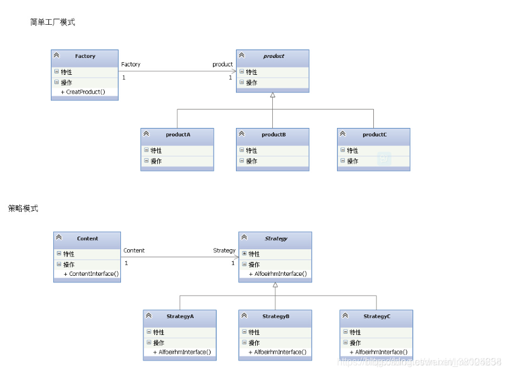

### 简单工厂模式

   简单工厂模式客户端传一个条件进工厂类，工厂类根据条件生成相应的对象并返回给客户端。实质是由一个工厂类根据传入的参数，动态决定应该创建并且返回哪一个产品类（这些产品类继承自一个父类或接口）的实例。

   那么也就是说：

   1、有已知的产品类

   2、你无法准确的知道编译哪个产品类

   3、需要在运行时决定创建哪个产品类

   4、产品类不多

   很明显看出，在创建对象上的灵活性高，但是工厂类只能创建可能会使用到的产品类，假如新添了产品类就得修改工厂类，这样就会违反开闭原则。

### 策略模式

客户端创建一个Context对象a，创建策略对象并当做参数传递给a，然后客户端使用a方法通过某种方法得到想要的值返回给客户端。

  策略模式是行为型模式，它定义了一系列的算法，并将每一个算法封装起来，而且使它们还可以相互替换。策略模式让算法独立于使用它的客户而独立变化。

  在一段代码里，使用了逻辑控制（if-else,swich-case）来决定算法，算法有相似的方法和函数，就可以选择策略模式。

  那么也就是说：

  1、某方法里有多个条件语句，条件语句代码块里有许多行为过程。

  2、其算法能封装到策略类

  2、算法随意切换

  3、算法与客户端隔离

   这样一来，通过选择对应的策略类，作为参数传到Content类里，在运行时配置对应的算法。

### 差异

如果在适合用策略模式的情况下用简单工厂模式，如果新增加策略就要修改工厂类，而这个可能会导致其他错误和比较繁琐，而如果使用了策略模式，只要将新增加的策略当做参数传递到Context类中即可。

- 用途不一样  工厂是创建型模式,它的作用就是创建对象；  策略是行为型模式,它的作用是让一个对象在许多行为中选择一种行为;
-  关注点不一样  <strong style="color:red;">一个关注对象创建  一个关注行为的封装</strong> 
-  解决不同的问题  工厂模式是创建型的设计模式，它接受指令，创建出符合要求的实例；它主要解决的是资源的统一分发，将对象的创建完全独立出来，让对象的创建和具体的使用客户无关。主要应用在多[数据库](https://cloud.tencent.com/solution/database?from=10680)选择，类库文件加载等。  策略模式是为了解决的是策略的切换与扩展，更简洁的说是定义策略族，分别封装起来，让他们之间可以相互替换，策略模式让策略的变化独立于使用策略的客户。 
-  工厂相当于黑盒子，策略相当于白盒子；

**代码角度：**

先写一个人的接口类，有eat，run，wear 3个方法：

```java
public interface People {
 
    public void eat();
 
    public void run();
 
    public void wear();
}
```

 分别写两个实现类，一个是小明的实现类，一个是小红的实现类:

```java
public class Xiaoming implements People{
 
    @Override
    public void eat() {
        System.out.println("小明吃饭");
    }
 
    @Override
    public void run() {
        System.out.println("小明跑步");
    }
 
    @Override
    public void wear() {
        System.out.println("小明穿衣");
    }
}
 
 
public class Xiaohong implements People{
 
    @Override
    public void eat() {
        System.out.println("小红吃饭");
    }
 
    @Override
    public void run() {
        System.out.println("小红跑步");
    }
 
    @Override
    public void wear() {
        System.out.println("小红穿衣");
    }
}
```

简单工厂模式的代码：

```java
public class PeopleFactory {
 
    public People getPeople(String name){
        if(name.equals("Xiaoming")){
            return new Xiaoming();
        }else if(name.equals("Xiaohong")){
            return new Xiaohong();
        }
        return null;
    }
}
```

再来看下策略模式的代码:

```java
public class StrategySign {
 
    private People people;
 
    public StrategySign(People people){
        this.people = people;
    }
 
    public StrategySign(String name){
        if(name.equals("Xiaoming")){
            this.people = new Xiaoming();
        }else if(name.equals("Xiaohong")){
            this.people = new Xiaohong();
        }
    }
 
    public void run(){
        people.run();
    }
}
```

 策略模式的两种构造方法都可以用，我多写了一种是为了让大家看到和工厂模式的区别和联系

然后我们通过测试类运行两种模式：

```java
@Test
    public void testSign(){
        PeopleFactory peopleFactory = new PeopleFactory();
        People people = peopleFactory.getPeople("Xiaohong");
        System.out.print("工厂模式-------------"); people.run();
        StrategySign strategySign = new StrategySign("Xiaohong");
        System.out.print("策略模式-------------");strategySign.run();
    }
```

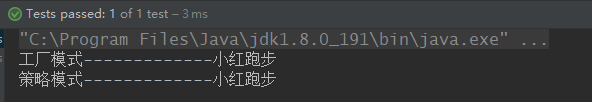

##  工厂模式

工厂模式和简单工厂模式的主要区别在于工厂也要首先写一个接口，然后每个工场单独写类继承抽象工场。这样才能满足“开放-封闭”原则。

```cpp
#include <iostream>
#include <string>

using namespace std;

class Oper {
public:
    int num1_;
    int num2_;
public:
    virtual int getRes() = 0;
};

class Add : public Oper {
public:
    int getRes() override {
        return num1_ + num2_;
    }
};

class Sub : public Oper {
public:
    int getRes() override {
        return num1_ - num2_;
    }
};

class IFactory {
public:
    virtual Oper* createOperation() = 0;
};

class AddFactory : public IFactory {
public:
    Oper* createOperation() {
        return new Add();
    }
};

class SubFactory : public IFactory {
public:
    Oper* createOperation() {
        return new Sub();
    }
};

int main() {
    IFactory* fac = new AddFactory();
    auto add = fac->createOperation();
    add->num1_ = 2;
    add->num2_ = 3;
    cout << add->getRes() << endl;
    return 0;
}
```

## 单例模式

单例模式实现了一个类只能有一个实例化对象这一功能，通过将构造函数私有化实现。在共有方法中提供一个get_instance函数获取单例对象，下面给出一种简单实现方式：

```Cpp
class MyClass {
public:
	static MyClass *get_instance()
	{
		static MyClass instance;
		return &instance;
	}
	void foo() {
		cout << "yes" << endl;
	}
private:
	MyClass() {}; // 这里要加{}
};

int main() {
	MyClass::get_instance()->foo();
	return 0;
}
```

上面这种算懒汉模式。下面再给出一种懒汉模式和饿汉模式：

```cpp
#include <iostream>
#include <string>
#include <mutex>

using namespace std;

// thread-safe Lazy Man Mode
class SingletonLazy {
private:
    static SingletonLazy* instance_;
    static mutex mtx_;
    SingletonLazy(){};
public:
    static SingletonLazy* getInstance() {
        if (instance_ == nullptr) {
            {
                lock_guard<mutex> lk(mtx_);
                if (instance_ == nullptr) { // double-check
                    instance_ = new SingletonLazy;
                }
            }
        }
        return instance_;
    }
};
SingletonLazy* SingletonLazy::instance_ = nullptr;
mutex SingletonLazy::mtx_;

// Hungry Mode
class SingletonHungry {
private:
    static SingletonHungry* instance_;
    SingletonHungry() {}
public:
    static SingletonHungry* getInstance() {
        return instance_;
    }
};

SingletonHungry* SingletonHungry::instance_ = new SingletonHungry;

int main() {
    auto ins1 = SingletonLazy::getInstance();
    auto ins2 = SingletonLazy::getInstance();
    return 0;
}
```


## 观察者模式

观察者模式的另外一个名称更好理解，即发布-订阅模式。这里有四个类，两个抽象类，两个具体类。通知者有一个订阅它的所有观察者的list，当通知者话题更新时遍历list让观察者update，观察者再跟新自己这边的state和订阅的state一致。

```cpp
#include <iostream>
#include <string>
#include <list>
#include <algorithm>

using namespace std;

// abstract observer
class Observer {
public:
    virtual void update() = 0;
};

// abstract notifier
class Subject {
protected:
    list<Observer*> obsList_;
public:
    void add(Observer* obs) {
        obsList_.push_back(obs);
    }
    void remove(Observer* obs) {
        obsList_.remove(obs);
    }
    void notify() {
        for_each(obsList_.begin(), obsList_.end(), [](Observer* obs){
            obs->update();
        });
    }
};

class ConcreteSubject : public Subject {
private:
    string subjectState_;
public:
    string getState() {return subjectState_;}
    string setState(string state) {subjectState_ = state;} 
};

class ConcreteObserver : public Observer {
private:
    string name_;
    string observerState_;
    ConcreteSubject* subject_;
public:
    ConcreteObserver(ConcreteSubject* subject, string name) : subject_(subject), name_(name) {}
    void update() override {
        observerState_ = subject_->getState();
        cout << "observer:" << name_ << " " << "state:" << observerState_ << endl;
    }
};

int main() {
    ConcreteSubject* s = new ConcreteSubject();
    s->add(new ConcreteObserver(s, "Bob"));
    s->add(new ConcreteObserver(s, "John"));
    s->add(new ConcreteObserver(s, "Ketty"));

    s->setState("ABC");
    s->notify();
 
    s->setState("Boom!");
    s->notify();
    return 0;
}
```

打印结果：

```cpp
observer:Bob state:ABC
observer:John state:ABC
observer:Ketty state:ABC
observer:Bob state:Boom!
observer:John state:Boom!
observer:Ketty state:Boom!
```

## 装饰模式

装饰模式适用于对操作顺序有要求的场景下。

```cpp
#include <iostream>
#include <string>

using namespace std;

class Component {
public:
    virtual void operation() = 0;
};

class ConcreteComponent : public Component {
public:
    void operation() override {
        cout << "the concrete operation" << endl;
    }
};

class Decorator : public Component {
protected:
    Component* component_;
public:
    void setComponent(Component* component) {
        component_ = component;
    }
    void operation() override {
        if (component_ == nullptr) return;
        component_->operation();
    }
};

class ConcreteDecoratorA : public Decorator {
private:
    string addedState_;
public:
    void operation() override {
        Decorator::operation();
        addedState_ = "New state";
        cout << "Concrete decorator for A" << endl;
    }
};

class ConcreteDecoratorB : public Decorator {
public:
    void operation() override {
        Decorator::operation();
        addBehavior();
        cout << "Concrete decorator for B" << endl;
    }
public:
    void addBehavior() {}
};

int main() {
    ConcreteComponent* c = new ConcreteComponent();
    ConcreteDecoratorA* d1 = new ConcreteDecoratorA();
    ConcreteDecoratorB* d2 = new ConcreteDecoratorB();
    d1->setComponent(c); 
    d2->setComponent(d1);
    d2->operation();
    return 0;
}
```

打印结果：

```cpp
the concrete operation
Concrete decorator for A
Concrete decorator for B
```

**这里可以理解为用d1包装c，再用d2包装d1**，然后d2调用operation时时从内到外的过程，先执行c的operation再执行d1的再执行d2的。

## 切勿在头文件中定义static变量

定义全局变量时使用static，意味着该变量的作用域只限于定义它的源文件中，其它源文件不能访问。既然这种定义方式出现在头文件中，那么可以很自然地**推测：包含了该头文件的所有源文件中都定义了这些变量，即该头文件被包含了多少次，这些变量就定义了多少次**。

假如将上面两行代码的static去掉，编译的时候就会出现变量重定义的错误，这进一步证实了上面的推测，因为没有static的话变量的作用域是全局的，定义了两个以上的同名变量就会出现该错误。

推测终究是推测，要真正证实这个推测还要通过写代码来验证。**验证的方式是：在头文件中使用static定义变量，在多个源文件中包含该头文件，然后在每个源文件中输出变量的地址，同时在一个源文件中改变变量的值并输出，在另一个源文件中也输出。如果每个源文件的输出都不同，则推测得证；否则推测是错误的**。

### 验证

下面是定义变量的头文件的代码：

```cpp
//Header.h
#pragma once

static int g_int = 3;
```

接下来在另一个头文件中声明两个测试函数：

```cpp
//Functions.h
#pragma once

void TestSource1();
void TestSource2();
```

分别在两个源文件中定义这两个测试函数：

```cpp
//Source1.cpp
#include <stdio.h>
#include "Header.h"

void TestSource1() {

    wprintf(L"g_int's address in Source1.cpp: %08x\n", &g_int);
    g_int = 5;
    wprintf(L"g_int's value in Source1.cpp: %d\n", g_int);
}
//Source2.cpp
#include <stdio.h>
#include "Header.h"

void TestSource2() {

    wprintf(L"g_int's address in Source2.cpp: %08x\n", &g_int);
    wprintf(L"g_int's value in Source2.cpp: %d\n", g_int);
}
```

最后在main函数中调用这两个测试函数：

```cpp
//Main.cpp
#include "Functions.h"

int wmain() {

    TestSource1();
    TestSource2();
}
```

运行该程序：

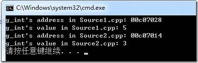

可以看到，虽然在代码中好像使用了相同的变量，但是实际上使用的是不同的变量，在每个源文件中都有单独的变量。所以，在头文件中定义static变量会造成变量多次定义，造成内存空间的浪费，而且也不是真正的全局变量。应该避免使用这种定义方式。

## 不要在cpp内声明非static的全局函数

如果你要在多个cpp中复用该函数，就把它的声明提到头文件里去，否则cpp内部声明需加上 static修饰。不然容易重名。

## 类内函数体外只能定义全局变量和对象，不能执行语句或调用函数

## 为什么很多项目的h文件函数声明前面都加extern

`extern int test();`如果这样函数的声明中带有关键字extern，仅仅是暗示这个函数可能在别的源文件里定义。加不加一样。但是对于变量来说头文件中加extern才能保证访问的是同一个全局变量。如果是在头文件中直接 `int a;`，如果有多个cpp引用这个头文件会提示重复定义，因此一般头文件中的变量都是带extern的。

## 不要在头文件中定义变量

/*module1.h*/
int a = 1; /* 在模块1的.h文件中定义int a */

/*module1.c*/
\#include "module1.h" /*在模块1中包含模块1的.h文件*/

/*module2.c*/
\#include "module1.h" /*在模块2中包含模块1的.h文件*/

/*module3.c*/
\#include "module1.h" /*在模块3中包含模块1的.h文件*/
以上的结果是在模块1、2、3中都定义了整型变量a，a在不同的模块中对应不同的地址单元，因为一旦包含.h,则定义一个a，编译器为之分配内存。换句话说就是这3个a是不同的a！从来就不需要这样的设计，因此编译器会捕捉到这种现象，并告诉你已经有一个a定义过了。

这里就算module1.h中使用了条件编译ifndef，也是不能这么做的，不同源文件是看不到互相定义的宏的：

```cpp
#a.c
#define CX 1

#b.c
int main() {
#ifdef CX
//不会被执行 因为看不到这个宏
#endif
}
```

## h文件中如果要写函数实现请加inline

最好别直接在h中写全局函数的实现，如果不加inline会报multi definition。

## 不要在构造函数中初始化“重要”变量

这个问题看来简单，刚在QT编程中就犯了这么一个错，在窗口构造函数中初始化一个指针数组而没有在类变量中声明，导致构造函数执行完毕后数组销毁，后续程序又用到了指针，造成空指针得严重错误系统崩溃！

## C++中拷贝赋值函数的形参能否进行值传递

不能。如果是这种情况下，调用拷贝构造函数的时候，首先要将实参传递给形参，传递的时候又要调用拷贝构造函数...如此循环，无法完成拷贝，栈也会满。

## C++中静态成员变量要在类外部再定义或初始化

```Cpp
class A
{
public:
    static int a;
};
int A::a=0;
```

为什么要在类的外部进行定义的原因:

1. 在类中，只是声明了静态变量，并没有定义。

2. 声明只是表明了变量的数据类型和属性，并不分配内存；定义则是需要分配内存的。   注意：如果在类里面这么写int a; 那么是既声明了变量，也定义了变量，两者合在一起了。

3. 静态成员是“类级别”的，也就是它和类的地位等同，而普通成员是“对象（实例）级别”的。   类级别的成员，先于该类任何对象的存在而存在，它被该类所有的对象共享。

4. 现在，咱们假定要实例化该类的一个对象，那么会发生什么事情呢？  

 静态成员肯定要出现在这个对象里面的，对吧？这时候才去定义那个静态成员吗？这显然是不合适的。  

 因为，比如有另外一个线程也要创建该类的对象，那么也要按照这个方式去定义那个静态成员。  

 这会产生两种可能的情况：   

 A. 重复定义；    

 B. 就算不产生重复定义的情况，也会产生竞争，从而造成死锁的问题，以至于对象无法创建。      

很显然，编译器不能这么干。那么很合理的解决办法，就是事先在类的外部把它定义好，然后再供所有的对象共享。      

当然这样做，还是有可能产生线程安全的问题，但不管怎么说对象是创建好了，而这种线程安全问题，可以在编程中予以解决。

## 头文件中为什么只声明不定义，而类定义又可以放在头文件中

首先要了解几个基本概念：

**编译单元**
对于c语言，每一个.c文件就是一个编译单元。仅仅从编译来说，各个编译单元之间没有联系

**未解决符号表**
提供了在该编译单元引用，但是定义不在本编译单元的符号的地址（拥有者是编译单元）

**导出符号表**
提供了本编译单元具有定义，而且可以提供给其他编译单元使用的符号和地址（拥有者是编译单元）

**.c文件被编译后每个编译单元都会生成两张表，未解决符号表和导出符号表**

**链接**
链接的时候每个编译单元就会向其他的编译单元的导出符号表查找自己未解决符号表中的符号。

如果在其他编译单元查到未解决符号表中的符号，就汇报

没有找到的话，哪些未解决的符号就会进入未解决符号表。

**extern**
extern就是告诉编译器这个符号的定义在别的编译单元中，符号会放在未解决符号表中

**static**
static就是告诉编译器这个变量或函数的符号只在该编译单元中使用，不放在导出符号表中。也就是链接的时候看不到

**对于类来说，链接的时候默认为内部链接，是static；而函数默认为外部链接，函数名会放到导出符号表中**，所以函数想只在内部调用时，添加修饰符static

**【问题】：**

一般头文件只声明不定义的原因

假如有一个头文件中有变量的定义，当这个头文件被多个.c文件包含的时候，**在链接的时候就会在不同的编译单元导出符号表中查找出重复的定义**，就会报错

类可以定义在头文件中的原因

**类的定义默认是static，内部链接，在其他的编译单元不可见，即使被重复包含**

# 标准库

## std::copy()

**std::copy是C++标准库中的算法接口，主要用于两个容器间的复制，其效率要优于自己用for循环逐个复制。**
copy只负责复制，不负责申请空间，所以复制前必须有足够的空间。

```Cpp
std::copy(start, end, std::back_inserter(container));
```

```Cpp
int main() {
	vector<int> v;
	v.resize(5);
	int a[] = { 1,2,3,4,5 };
	std::copy(a, a + 5, v.begin());
	for (auto i : v) {
		cout << i << endl;
	}
	return 0;
}
```

## std::search()

std::search在头文件`<algorithm>`中定义，用于查找满足另一个序列的条件(如果未定义此谓词，则等于)的子序列。一个应用为在http报文中快速查找`\r\n`的位置：

```Cpp
int main() {
	const char s[] = "\r\n";
	vector<char> buffer = { 'a','b','d','\r','\n' ,'c'};
	auto it = std::search(buffer.begin(), buffer.end(), s, s + 2);
	cout << *(it + 2) << endl;
	return 0;
}
```

打印值为'c'。

## std::find()

这个标准库函数和`std::search()`很像，可用于查找容器中是否存在某个特定值：

```Cpp
int searchValue = 42;
vector<int>::const_iterator result= find(vec.begin(), vec.end(), searchValue);
if(result == vec.end()) {
    cout << "没找到" << endl;
} else {
    doSth(*result);
}
```

## std::forward()

std::forward通常是用于完美转发的，它会将输入的参数原封不动地传递到下一个函数中，这个“原封不动”指的是，如果输入的参数是左值，那么传递给下一个函数的参数的也是左值；如果输入的参数是右值，那么传递给下一个函数的参数的也是右值。

```cpp
#include <iostream>
#include <string>
#include <utility>

void foo(std::string& param) {
  std::cout << "std::string& version" << std::endl;
}
void foo(std::string&& param) {
  std::cout << "std::string&& version" << std::endl;
}

template<typename T>
void wrapper(T&& param) {
  // foo(param); 
  foo(std::forward<T>(param));
}

int main() {
  std::string foo("foo");
  wrapper(foo);
  wrapper(foo + "bar");
}
```

在wrapper这个函数中，param是一个左值，但是根据模板推导和引用折叠原理，wrapper可以根据实参的类型推断出不同的T。例如，当wrapper(foo)时，实参是左值，那么T就为T&，因为T&&&折叠后就是T&。当wrapper(foo+"bar")时，实参为右值，那么T就为T&&，因为T&&&&折叠后为T&&。这样std::forward就能根据不同的T的类型将param这个左值变化为合理的类型，当实参为左值时，wrapper函数内部foo的构造函数传入的就是左值，最终调用拷贝构造函数。当实参为右值时，wrapper函数内部foo的构造函数传入的就是右值，最终调用移动构造函数。这样，我们只写了一个wrapper就实现了对不同类型实参的传递，不会改变其类型。如果wrapper内部的foo中没有std::forward，那么foo始终会调用拷贝构造函数，而不会调用移动构造函数，也就没有起到完美转发的作用。

## std::advance()

advance() 函数定义在`<iterator>`头文件，并位于 std 命名空间中。

advance() 函数用于将迭代器前进（或者后退）指定长度的距离，其语法格式如下：

```cpp
template <class InputIterator, class Distance>
void advance (InputIterator& it, Distance n);
```

其中 it 指的是目标迭代器，n 通常为一个整数。

需要注意的是，如果 it 为输入迭代器或者前向迭代器，则 n 必须为一个正数，即表示将 it 右移（前进） n 个位置；反之，如果 it 为双向迭代器或者随机访问迭代器，则 n 为正数时表示将 it 右移（前进） n 个位置，n 为负数时表示将 it 左移（后退） n 个位置。

另外，根据 it 类型是否为随机访问迭代器，advance() 函数底层采用了不同的实现机制：

- 当 it 为随机访问迭代器时，由于该类型迭代器支持 p+n 或者 p-n（其中 p 就是一个随机访问迭代器）运算，advance() 函数底层采用的就是 it+n 操作实现的；
- 当 it 为其他类型迭代器时，它们仅支持进行 ++ 或者 -- 运算，这种情况下，advance() 函数底层是通过重复执行 n 个 ++ 或者 -- 操作实现的。

## std::future()

std::future是C++11中新增的一个并发编程工具，用于表示异步操作的结果，通常与std::promise一起使用：

```c++
#include <iostream>
#include <future>

int main() {
  // 创建一个std::promise对象，用于保存异步操作的结果
  std::promise<int> promise_obj;

  // 获取一个std::future对象，用于获取异步操作的结果
  std::future<int> future_obj = promise_obj.get_future();

  // 在另一个线程中执行异步操作，并将结果保存到promise_obj中
  std::thread th([&promise_obj]() {
    int result = 42;
    promise_obj.set_value(result);
  });

  // 获取异步操作的结果，并输出
  int result = future_obj.get();
  std::cout << "Result: " << result << std::endl;

  // 等待异步线程完成
  th.join();
  
  return 0;
}

```

在上面的代码中，我们使用std::promise对象保存了一个异步操作的结果，并使用std::future对象获取了该结果。在另一个线程中执行异步操作，并将结果保存到promise_obj中，然后在主线程中获取异步操作的结果并输出。最后，我们使用th.join()等待异步线程完成。

## std::packaged_task

std::packaged_task也是C++11中新增的一个并发编程工具，用于将函数或可调用对象包装成一个可异步执行的任务，并返回一个std::future对象来获取任务的结果。其用法如下：

```c++
#include <iostream>
#include <future>

int add(int a, int b) {
  return a + b;
}

int main() {
  // 创建一个std::packaged_task对象，将函数add包装成一个可异步执行的任务
  std::packaged_task<int(int, int)> task(add);

  // 获取一个std::future对象，用于获取任务的结果
  std::future<int> future_obj = task.get_future();

  // 在另一个线程中执行任务，并将结果保存到future_obj中
  std::thread th(std::move(task), 1, 2);

  // 获取任务的结果，并输出
  int result = future_obj.get();
  std::cout << "Result: " << result << std::endl;

  // 等待任务线程完成
  th.join();

  return 0;
}
```

在上面的代码中，我们使用std::packaged_task对象将函数add包装成一个可异步执行的任务，并使用std::future对象获取了该任务的结果。在另一个线程中执行任务，并将结果保存到future_obj中，然后在主线程中获取任务的结果并输出。最后，我们使用th.join()等待任务线程完成。

需要注意的是，std::packaged_task对象是一次性的，即任务只能执行一次。如果需要多次执行同一个任务，需要创建多个std::packaged_task对象。

# 基础语法

## 数据类型长度

> long就一定是8字节？int就一定是4字节？

一个在win下编程非常容易忽略的点，即win64下long也只有4字节！只有long long 8字节。而Unix下long有8字节。

字节数还和编译器的数据模型相关，具体如下：

| Datetype  | LP64 | ILP64 | LLP64 | ILP32 | LP32 |
| :-------- | :--- | :---- | :---- | :---- | :--- |
| char      | 8    | 8     | 8     | 8     | 8    |
| short     | 16   | 16    | 16    | 16    | 16   |
| int       | 32   | 64    | 32    | 32    | 16   |
| long      | 64   | 64    | 32    | 32    | 32   |
| long long | 64   |       |       |       |      |
| pointer   | 64   | 64    | 64    | 32    | 32   |

<strong style="color:red;">一般情况下windows64位一般使用LLP64模型</strong>

<strong style="color:red;">64位Unix，Linux使用的是LP64模型</strong>

反正最好先sizeof看下到底多大！

## 优先级

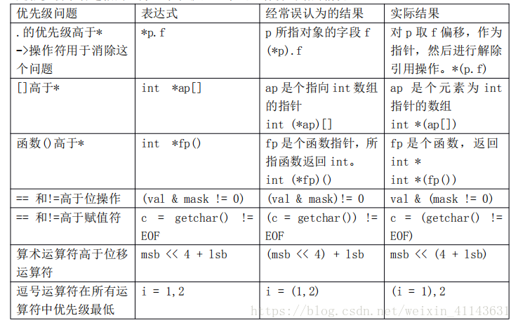

## iostream与std

iostream（包括istream和ostream）里定义了std命名空间：


其中包含了 `cin` `cout` 等，因此一般程序开头使用 `using namespace std;` 就是默认可以直接使用这个命名空间下声明的变量或函数等。自己也可以定义命名空间：

```Cpp
#include <iostream>
# include <string>

using namespace std;
namespace my_space
{
void show()
{
    cout<<"this is my space "<<endl;
}
struct Student
{
    int id = 100;
    int get_id()
    {
        return id;
    }
};
}
int main()
{
    struct my_space::Student stu;  // 不使用using namespace xx就得使用::域运算符
    cout<<stu.get_id()<<endl;
    my_space::show();
    return 0;
}
```

## sprintf语句

[sprintf](https://blog.csdn.net/wangkeyen/article/details/81942918)

sprintf就是将一系列数据（字符串、整型、浮点型等）格式化到一个字符数组**char[]**，sprintf传入的是这个数组的指针**char***。当然sprintf也是有返回值的，返回类型是**int型**，为char[]格式化后字符的个数。总结一下，sprintf和printf有点像，只不过sprintf是将打印结果保存到了char[]中而不是dos。另外，再初始化char[]时一定要给定足够的空间**防止溢出**。

## void func(T arr[])和void func(T arr)

这两种写法在函数传参时arr的含义都是相同的，在函数体内部都可以直接对arr索引操作数组，但是在函数模板中推导的类型`T`却是不相同的，前者就是`int`，而后者是`int*`。

## int main(int argc, char** argv)

这个语法在之前困扰我很久。这是血统纯正的C语法。作用：argc可以理解为在终端执行编译后的exe文件后面加的参数的个数再加1，argv是一个指针，指向一个数组，数组存储的都是指针，都指向char变量，那么argv[i]就是对argv取i偏移地址再解地址，拿到的就是一个char。多的不说，下面上例子：

```Cpp
#include<iostream>
using namespace std;

int main(int argc, char** argv)
{
	cout << "argc=" << argc << endl;
	for (int i = 0; i < argc; ++i)
	{
		cout << "argv["<<i<<"]"<<"=" << argv[i] << endl;
	}
	return 0;
}
```

编译成exe：


在该目录下打开cmd，执行：


另外，根据我的实测，`char ** argv`可以换成 `char* argv[]`，仔细一想这两者其实等价。

关于 `char ** a`和 `char *a[]`的深度谈：https://my.oschina.net/u/920274/blog/2877046

**按照C++ Primer中的解释：**

第二个形参argv是一个数组， 它的元素是指向C 风格字符串的指针： 第一个形参argc表示数组中字符串的数量。当实参传给main 函数之后， argv 的第一个元素指向程序的名字或者一个空字符串，接下来的元素依次传递命令行提供的实参。最后一个指针之后的元素值保证为0。

例如，假定main函数位于可执行文件prog 之内， 我们可以向程序传递下面的选项：

```Cpp
prog -d -o ofile dataO
```

以上面提供的命令行为例， argc 应该等于5, argv 应该包含如下的C 风格字符串：

```Cpp
argv [0] = "prog"; //或者argv [OJ 也可以指向一个空字符串
argv [1] ="-d";
argv [2] ＝ "－o";
argv [3] ＝ "ofile";
argv [4] ＝ "data0";
argv [5] = 0;
```

## C++传值与传引用

```cpp
#include<iostream>
using namespace std;
void swap(int a,int b)
{
int temp;
temp=a;
a=b;
b=temp;
}
main()
{
int a=3,b=5;
cout<< "before ‘swap’:a="<<a<<",b="<<b<<endl;
swap(a,b);
cout<<"after ‘swap’:a="<<a<<",b="<<b<<endl;
}
```

这个例子是传值调用， 意思就是 形参的改变不会影响实参的值。
你运行一下可知 主函数调用了swap函数后 a，b的值并没有发生交换。
原因是，调用swap函数时 编译器为 swap(int a,int b) 中的形参 a ， b单独分配内存空间，并接受主函数传递来的值，这块内存空间和 main（）函数中的 a ，b 不是同一内存空间。 所以在swap(int a,int b) 中 a ， b发生了交换，但main函数中a ， b没发生交换。即主调函数与被调函数的操作对象各不相同，参数仅在调用时由实参向形参传递，而不可由形参向实参传递。
要使a ，b发生交换 需要使用传址调用。程序改为如下：

```cpp
#include<iostream>
using namespace std;
void swap(int & a,int &b)
{
int temp;
temp=a;
a=b;
b=temp;
cout<<"in ‘swap’:a="<<a<<",b="<<b<<endl;
}
main()
{
int a=3,b=5;
cout<< "before ‘swap’:a="<<a<<",b="<<b<<endl;
swap(a,b);
cout<<"after ‘swap’:a="<<a<<",b="<<b<<endl;
}
```

引用可以看作是一个变量的别名，使用 引用 时 ，对于void swap(int a,int b) 编译器并没有给形参a，b分配新的内存空间，只是使 形参a，b指向了main函数中实参a，b的内存空间，他们共享同一内空间，即把地址给了形参。所以在void swap(int a,int b)函数中对这块内存的改变也就改变了实参的值。
除了使用引用，也可以使用指针。
指针方式和引用方式都属于传址调用。

## for语句的生命周期

在for语句里的变量是有生命周期的，每个迭代析构所有局部变量：

```Cpp
class A
{
public:
	A()
	{
		cout << "构造" << endl;
	}
	~A()
	{
		cout << "析构" << endl;
	}
};
int main()
{
	for (int i = 0; i < 10; i++)
	{
		A a;
	}
}
```

```Cpp
构造
析构
构造
析构
构造
析构
构造
析构
构造
析构
构造
析构
构造
析构
构造
析构
构造
析构
构造
析构

F:\FilesofPractice\Cpp\learn\ConsoleApplication1\x64\Debug\ConsoleApplication1.exe (进程 9836)已退出，返回代码为: 0。
按任意键关闭此窗口...
```

## for语句的逻辑流程

今天写了一段代码：

```cpp
#include <iostream>
using namespace std;

int main() {
	for(int i = 0;i<5;i++)
	{
	    for(int j = 0;(j<5) && (j!=i);j++)
	    {
	        cout<<j<<" ";
	    }
	}
	return 0;
}
```

打印结果：
0 0 1 0 1 2 0 1 2 3 。和想法有出入，于是再次学习了下for的判断流程，得到下面这个解答：

**只要exp2不满足则直接跳过for语句块而不是跳过一个迭代过程。**

## 范围for语句

范围for语句类似python中的for i in alist...，用于快速遍历C++数组中的元素，下面给出一个示例：

```cpp
#include<iostream>
#include<vector>
using namespace std;

int main()
{
	vector<int> ivec{ 10,20,30,50,100 };
	//范围for语句
	for (auto& r : ivec)
	{
		cout << r << endl;
	}
	return 0;
}
```

其中

```cpp
for (auto& r : ivec)
```

为范围for语句，避免了传统遍历中需要size的繁琐。
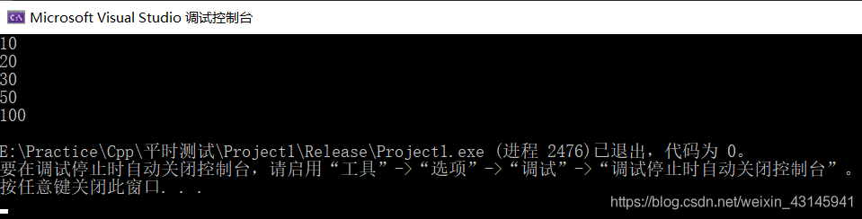

另外想讲的是这里面使用了一个$auto$关键字，这个关键字可以自动判断对象的类型，程序员可以不用去想数据类型了。

## ~和！

~是按位取反，！是逻辑取反（0或者1）

## namespace

namespace是添加制：

```Cpp
namespace dn {
	void test() {}
	string res;
}

namespace dn {
	void fcn() {}
}
```

注意不是重新定义dn，此时命名空间dn下有三个成员。

## 单引号和双引号区别

1.含义不同。 用单引号引起的一个字符实际上<strong style="color:#126bae;">代表一个整数</strong>,整数值对应于该字符在编译器采用的字符集中的序列值。而一般我们的编译器采用的都是ASCII字符集。因此's'的含义其实和十进制数115的含义是一致的。 
2.大小不同。 用单引号引起的一个字符大小就是一个字节。 而用双引号引起的字符串大小是字符的总大小+1,因为用双引号引起的字符串会在字符串末尾添加一个二进制为0的字符'\0'。

## include ""和<>区别

`include <xx>`一般用于引用系统头文件，而 `include "xx.h"`一般用于引用自己写的头文件，它会先在用户目录找h文件，找不到去系统文件找，也就是说使用 `""`完全可以替代 `<>`。

# 数组

## 数组初始化没有全部填写完自动用0填补

```Cpp
int arr[5] = {1,2,3}
//int arr[5] = {1,2,3,0,0}
```

## 数组名的两个用途

1. 可以统计整个数组在内存中的长度；
2. 可以获取数组在内存中的首地址；

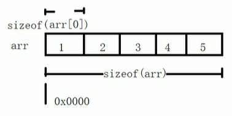

```Cpp
sizeof(arr)/sizeof(arr[0])
//数组元素个数
```

## 二维数组数据结构

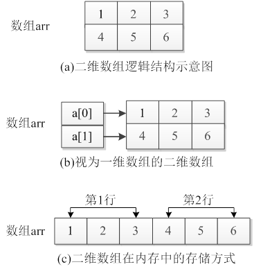

```cpp
int arr[2][3] = {{1,2,3}, {2,3,4}};
```

**第一个问题，arr[0]和arr[0]+1相差多少？**

答案：

```cpp
0x7fffffffded0
0x7fffffffded4
```

相差4个地址，也就是4个字节，一个int的大小，因此对指针直接加某个值是按照数据类型进行偏移的。

**第二个问题，`arr[0][1]`和arr[0]+1的关系？**

```cpp
int arr[2][3] = {{1,2,3}, {2,3,4}};
cout << arr[0] << endl;
cout << &arr[0][1];
```

```cpp
0x7fffffffded0
0x7fffffffded4 // &arr[0][1] == arr[0]+1 也就是arr[0][1] == *(arr[0]+1)
```

说明对指针取`p[x]`等同于`*(p + x)`

**第三个问题，如何花式取`arr[0][1]`?**

```cpp
cout << (&(*arr[0]))[1] << endl;
cout << arr[0][1] << endl;
cout << *(&(*arr[0]) + 1) << endl;
```


# 内存拷贝

## memcpy_s

这个函数指定的size单位是字节。

```Cpp
#include <iostream>
using namespace std;

struct UAVData//视景交互数据
{
	double uav_x;//无人机x轴位置
	double uav_y;//无人机y轴位置
	double uav_z;//无人机Z轴位置
	double uavYaw;//无人机偏航角
	double uavPitch;//无人机俯仰角
	double uavRoll;//无人机机滚转角
};

struct Des {
	double x1;
	double x2;
	double x3;
	double x4;
	double x5;
	double x6;
};

int main() {

	UAVData d{ 1,2,3,4,5,6 };
	Des des{ 0,0,0,0,0,0 };
	UAVData* p = &d;
	memcpy_s(&des.x1, 24, &d.uavYaw, 24);
	cout << des.x1 << endl;
	cout << des.x2 << endl;
	cout << des.x3 << endl;
	cout << des.x4 << endl;
	return 0;
}
```

结果：4 5 6 0

# 字符串

## atoi()和stoi()函数的用法和区别

相同点：
①都是C++的字符处理函数，把数字字符串转换成int输出
②头文件都是`#include<cstring>`
不同点：
①atoi()的参数是 `const char*` ,因此对于一个字符串str我们必须调用 `c_str()`的方法把这个string转换成 `const char*`类型的,而`stoi()`的参数是`const string*`,不需要转化为 `const char*`；
②stoi()会做范围检查，默认范围是在int的范围内的，如果超出范围的话则会runtime error！而atoi()不会做范围检查，如果超出范围的话，超出上界，则输出上界，超出下界，则输出下界；

## 将string类型转为任意数值类型

```Cpp
#include <iostream>
#include <sstream>
using namespace std;
template <class T>
T stringToNum(const string& str)
{
	istringstream iss(str);
	Type num;
	iss >> num;
	return num;
}
int main(int argc, char* argv[])
{
	string str("00801.2");
	cout << stringToNum<double>(str) << endl;
	system("pause");
	return 0;
}
```

输出801.2。

## 任意数值类型转化为string

```Cpp
#include <iostream>
#include <sstream>
template <class T>
std::string num_to_string(const T& num)
{
    std::stringstream ss;
    std::string str;
    ss << num;
    ss >> str;
    return str;
}

int main(int argc, char* argv[])
{
	double a = 22.2;
	cout << num_to_string(a) << endl;
	return 0;
}
```


## c_str()

string类成员函数c_str()，返回一个以null终止的c字符串，主要是为了和c语言兼容。

用法：

```Cpp
char c[20]; 
string s="1234"; 
strcpy(c,s.c_str()); 
```

这样才不会出错，c_str()返回的是一个临时指针，不能对其进行操作。

## strlen()

C 库函数 `size_t strlen(const char *str)` 计算字符串 str 的长度，直到空结束字符，**但不包括空结束字符。**

```Cpp
#include <stdio.h>
#include <string.h>

int main ()
{
   char str[50];
   int len;

   strcpy(str, "This is runoob.com");

   len = strlen(str);
   printf("|%s| 的长度是 |%d|\n", str, len);
   
   return(0);
}
```

让我们编译并运行上面的程序，这将产生以下结果：

```
|This is runoob.com| 的长度是 |18|
```

## strcmp

之前比较两个char\*字符串很容易犯如下错误： c1 == c2

这是不对的，因为这是两个指针比，那铁不相等。要比较就得用strcmp。

```Cpp
int main() {
	char src[] = {'g','u','d'}; // 如果{'g','u','d','\0'} strcmp结果就为0
	cout << sizeof src << endl;
	string s = "gud";
	char* des = const_cast<char*>(s.c_str());
	cout << strcmp(src, des) << endl;
	return 0;
}
```

## to_string

这个函数可以将数字转为字符串，值得注意的是，浮点数2.5会转成2.50000（若只想要2.5就需要使用substr方法了），整数将不变。

```Cpp
cout << to_string(2001)<< endl;
```

## 字符串切片substr

str.substr(pos,len) pos为str开始切片的位置，len为切片的长度。

## string::size_type

string 类及其他大多数标准库类型都定义了几种配套的类型。这些配套类型体现了标准库类型**与机器无关**的特性， 类型size_type即是其中的一种。在具体使用的时候，通过作用域操作符来表明名字size_type 是在类string定义的。它是一个无符号类型的值，而且能足够存放下任何string对象的大小。

## 判断一个string是否在另一个string中

```Cpp
string::size_type string::find(string &);
```

一个不在的例子，用find的结果和string::npos做对比，相等就是不在：

```Cpp
int main() {
	string src = "ddmultipart/form-data; boundary=----WebKitFormBoundary3CATSQsQeRMvXot5";
	string d = "multipart/form-dat111a";
	cout << (src.find(d) == string::npos) << endl;
	return 0;
}
// 打印1
```

一个在的例子，find的结果为一个整型，为字符串起始位置：

```Cpp
int main() {
	string src = "dddmultipart/form-data; boundary=----WebKitFormBoundary3CATSQsQeRMvXot5";
	string d = "multipart/form-data";
	cout << src.find(d)  << endl;
	return 0;
}
// 打印3
```

# 指针

## const int * 与 int * const

const int * ptr = &i 表示ptr指向一个常数i，不能通过指针改变该数，而int *const ptr = &i 指的是该指针的值是一个定值，不能被修改（即地址不能被修改）。

```cpp
#include<iostream>
using namespace std;

int main()
{
	int i = 45;
	int* const ptr = &i;
	*ptr = 8;
	cout << i;
	return 0;
}
```

打印结果为8。
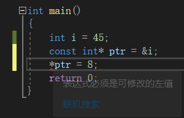
报错，ptr不能修改i值。

## void*

今日在看别人代码时见如下语句：

```Cpp
bool Create(void *pData,unsigned int size,bool bOwnerShip=false);//创建DSM对象
```

第一个参数为`void*`：

这个意思是void指针，它可以指向任意类型的数据，就是说可以用任意类型的指针对void指针赋值。例如：

```Cpp
int *a；
void *p；
p=a；
```

如果要将 void 指针 p 赋给其他类型的指针，则需要强制类型转换，就本例而言：`a=(int*)p`。

## 空指针和野指针

<strong style="color:red;">空指针</strong>：`指针变量指向内存中编号为0的空间`

用途：`初始化指针变量`

注意：`空指针指向的内存是不可以访问的，不能*p=100`

<strong style="color:red;">野指针</strong>：`指针变量指向非法的内存空间`

 ```Cpp
int * p = (int *)0x1100;//直接定义一个不知道是否能访问的空间
cout<<*p<<endl;
 ```

## 指针和数组

```Cpp
int arr[10] = {1,2,3,4,5,6,7,8,9,10};
int * p = arr;
for(int i=0;i<10;i++)
{
    cout<<*p<<endl;
    p++;
}
```

回顾：a++ 和 ++a的相同点都是给a+1，不同点是a++是先参加程序的运行再+1，而++a则是先+1再参加程序的运行。

## 指针和函数

```Cpp
void swap(int * a,int * b)
{
    int t = *a;
    *a = *b;
    *b = t;
}
```

```Cpp
int a = 10;
int * p1 = &a;
int b = 20;
int * p2 = &b;
swap(p1,p2)  //a和b的值交换了
```

案例：写一个对无序数组冒泡排序的函数（对数组直接操作）

```Cpp
void bubbleSort(int * arr,int len)//参数1数组首地址，参数2长度
{
    //函数第一个参数int * arr也可以替换为int arr[]
    for(int i = 0;i<len-1;i++)
    {
        for(int j = 0;j<len-i-1;j++)
        {
            if(arr[j]>arr[j+1])
            {
                int t = arr[j];
                arr[j] = arr[j+1];
                arr[j+1] = t;
            }
        }
    }
}

int main()
{
	int arr[10] = {4,2,5,6,1,2,4,7,8,3};
    int len = sizeof(arr)/sizeof(arr[0]);
    bubbleSort(arr,len);
    for(int i = 0;i<len;i++)
    {
        cout<<arr[i]<<endl;
    }
}
```

## 对指针取索引的含义

含义为取指针偏移量指向的对象的解引用。

```Cpp
void func(char * arr)
{
	cout << arr[2] << endl;
}
void func(int * arr)
{
	cout << arr[0] << endl;
}
int main()
{
	char str[] = "john";
	func(str); // 打印为h
	cout << "" << endl;
	int arr[] = { 1,2,3,4 };
	func(arr); // 打印为1
	cout << "" << endl;
	int a = 4;
	func(&a); // 打印为4，但是如果func(int*arr)函数打印arr[1]就是一个未知数
	return 0;
}
```

结果上来讲：arr[1]与 `*(arr+1)`一致。

在函数形参中指明指针的方式有两种：

`int * arr`, `int arr[]`：

```Cpp
void func(int arr[])
{
	//arr[1] = 10;
	cout << arr[0] << endl;
}
int main()
{
	int arr[] = { 1,2,3,4 }; // 数组存储在一段连续空间
	int a = 2;
    // func(arr);
	func(&a);
	/*for (int i = 0; i < 4; i++)
	{
		cout << arr[i] << endl;
	}*/
}
```

可以把一个整形值看为长度为一的数组，`int arr[]`表明arr是一个指针，指向一段连续存储空间，长度为1的时候就是变量，长度大于1就是数组。

## int  \*\*

`int **ptr `表示ptr是一个指针，指向一个数组，数组内部存储的还是指针，指向 `int` 类型。这里int可以换成其他类型。

两个\*号的被称为二级指针，顾名思义，它指向一个指针：

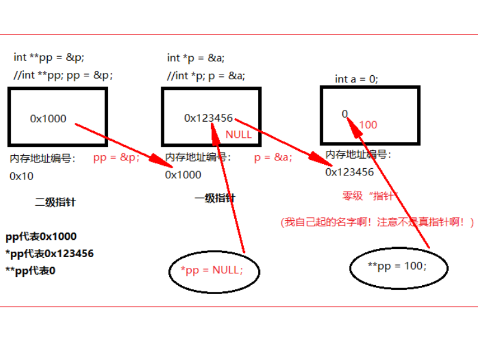

## 函数指针

[函数指针](http://c.biancheng.net/view/228.html)

```cpp
#include<iostream>
using namespace std;
double max(double, double);
```

```cpp
#include "head.h"
#include<iostream>
using namespace std;

double max(double num1, double num2)
{
	if (num1 <= num2)
	{
		return num2;
	}
	else
	{
		return num1;
	}
}
```

```cpp
#include<iostream>
#include "head.h"
using namespace std;


int main()
{
	double result;
	double (*fun)(double, double);
	fun = max;
	result = (*fun)(3.2, 4.5);
	cout << result << endl;
	return 0;
}
```

函数指针用得少，但是让封装性更好，可以用函数指针数组来达到这一点。

```cpp
double result;
double (*fun[1])(double, double);
fun[0] = max;
result = (*fun[0])(3.2, 4.5);
cout << result << endl;
return 0;
```

## 多维数组指针的含义

```cpp
#include<iostream>
using namespace std;

void fcn(double (*ptr)[2]);
int main()
{
	double array[3][2] = { {2,3},{4,5},{6,7} };
	fcn(array);
	return 0;
}

void fcn(double (*ptr)[2])
{
	cout << *(*ptr+1) << endl;
}
```

打印结果为3。double (*ptr)[2]指的是这是一个指向2个元素的数组的指针，记住这个括号必须打，如果是double * ptr[2]指的是这是一个装有两个指向double类型变量的指针数组。

## 智能指针

智能指针的行为类似常规指针， 重要的区别是它负责自动释放所指向的对象。新的标准阵提供了两种智能指针（实际上有三种）：

- **shared_ptr**:允许多个指针指向同一个对象
- **unique_ptr**：该指针“独占”所指向的对象
- **weak_ptr**：它是一种弱引用，指向`shared_ptr`所管理的对象

### shared_ptr

智能指针是模板，当创建一个智能指针时，必须提供额外的信息一指针可以指向的类型。

```Cpp
shared_ptr<string> p1;
shared_ptr<list<int>> p2;
```

`shared_ptr`和`unique_ptr`支持的操作：

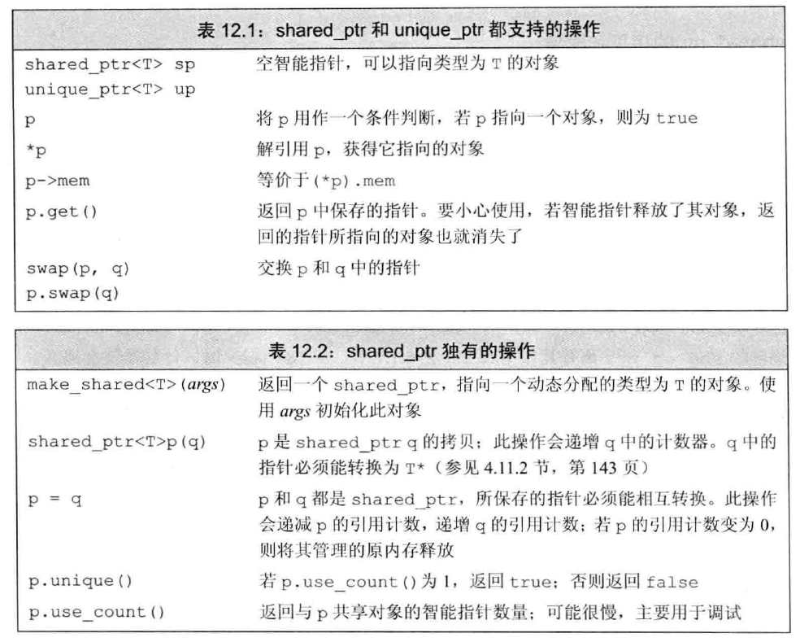

#### 自己实现shared_ptr

自己也可以动手实现一个简单的shared_ptr:

```Cpp
#include <iostream>
using namespace std;

class Data {
public:
	int a = 12;
	int b = 13;
};

template <class T>
class MySharedPtr {
public:
	MySharedPtr(T *data = nullptr) {
		data_ = data;
		if (data) {
			count_ = new int(1);
		}
		else {
			count_ = new int(0);
		}
	}

	MySharedPtr(const MySharedPtr &ptr) {
		if (this != &ptr) {
			data_ = ptr.data_;
			count_ = ptr.count_;
			(*count_)++;
		}
	}

	MySharedPtr& operator=(const MySharedPtr &ptr) {
		if (ptr.data_ == data_) {
			return *this;
		}
		if(data_) {
			if (--(*count_) == 0) {
				cout << "释放内存" << endl;
				delete data_;
				delete count_;
			}
		}
		data_ = ptr.data_;
		count_ = ptr.count_;
		(*count_)++;
		return *this;
	}

	T& operator*() {
		if (data_) {
			return *data_;
		}
	}

	T* operator->() { // 这里重载->实现利用智能指针对象像“指针”一样调用data_的成员 m->a相当于(m.operator->())->a 
		if (data_) {
			return data_;
		}
	}

	~MySharedPtr() {
		if (--(*count_) == 0) {
			cout << "释放内存" << endl;
			delete data_;
			delete count_;
		}
	}

	int use_count() {
		return *count_;
	}

private:
	// 这里数据和计数都用指针的形式 方便智能指针管理同一个内存和操作同一个计数
	T *data_;
	int *count_;
};

int main() {
	{
		MySharedPtr<Data> m_ptr(new Data);
		MySharedPtr<Data> m_ptr2(m_ptr);
		cout << m_ptr.use_count() << endl;
		cout << (*m_ptr2).a << endl;
		cout << m_ptr->a << endl;
		MySharedPtr<Data> m_ptr3(new Data);
		m_ptr = m_ptr3;
		m_ptr2 = m_ptr3;
		cout << m_ptr.use_count() << endl;
	}
}

```

打印结果：

2
12
12
释放内存
3
释放内存

#### make_shared函数

最安全的分配和使用动态内存的方法是调用一个名为`make_shared` 的标准库函数。此函数在动态内存中分配一个对象并初始化它，返回指向此对象的`shared_ptr` 。这相当于原来的`new`操作。

```Cpp
shared_ptr<int> p3 = make_shared<int>(42) ;
auto p6 = make_shared<vector<string>>() ;
```

调用`make_shared<string>`时传递的参数必须与string的某个构造函数相匹配，调用`make shared<int>` 时传递的参数必须能用米初始化一个int ，依此类推。

- 我们可以认为每个shared_ptr 都有一个关联的计数器，通常称其为引用计数（ reference count ） 。无论何时我们拷贝一个shared_ptr ，计数器都会递增。
- 当指向一个对象的最后一个shared_ptr 被销毁时， shared_ptr 类会自动销毁此对象。它是通过另一个特殊的成员函数一一析构函数（ destructor ）完成销毁工作的。（智能指针相当于是一个类对象）
- 当动态对象不再被使用时， shared_ptr 类会自动释放动态对象， 这一特性使得动态内存的使用变得非常容易。但是，对于一块内存， shared_ptr 类保证只要有任何shared_ptr 对象引用它，它就不会被释放掉。

```Cpp
shared_ptr<Foo> factory(T arg){
    return make_shared<Foo>(arg);
}

shared_ptr<Foo> use_factory(T arg){       // 1
    shared_ptr<Foo> p = factory(arg);
    return p;
}

void use_factory(T arg){      // 2
    shared_ptr<Foo> p = factory(arg);
}
```

第一个函数结束后对象不会被释放，因为拷贝了一份。第二个函数结束后会释放（计数为0）；

> 不要混合使用普通指针和智能指针
>

#### make_shared和shared_ptr()初始化智能指针的区别

make_shared只有一次内存申请，而shared_ptr(new xxx)会涉及到两次内存申请，第一次是new，第二次是申请shared_ptr的控制块，比如ref_count等，而前者直接一次申请完所有的内存块。但是make_shared在类的构造函数私有时无法使用。总的来说，make_shared的效率更高。

#### 案例分析

**案例一**

```cpp
int main()
{
    auto data_ = std::shared_ptr<char>(new char[3], [](char* p) {delete[]p; });
    data_.get()[2] = 'c';
    cout << data_.use_count() << endl;
    auto dataNew = std::shared_ptr<char>(new char[6], [](char* p) {delete[]p; });
    dataNew.get()[2] = 'd';
    cout << dataNew.use_count() << endl;
    data_ = dataNew;

    cout << data_.use_count() << endl;
    cout << dataNew.use_count() << endl;

    printf("%x\n", data_.get());
    printf("%x\n", dataNew.get());

    return 0;
}
```

打印结果：

```c++
1
1
2  // 此时data_已经抛弃原来掌管的内存转而和dataNew共享一块内存了！ 也就是说原来那块内存已经被释放了！
2
6c714940
6c714940
```

打开vs的内存管理进行debug：

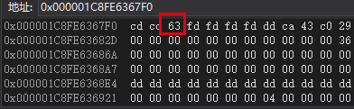

断点目前在：

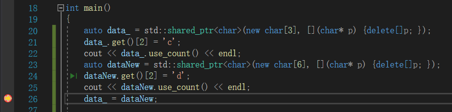

往下走一步：

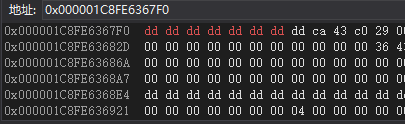

智能指针已经自动释放堆空间了。

**案例二**

```cpp
class A {
public:
    ~A() {
        cout << "析构" << endl;
    }
};
unordered_map<int, shared_ptr<A>> m;
void func() {
    shared_ptr<A> sp = make_shared<A>();
    m[0] = sp;
}

int main()
{
    func();
    func();
    return 0;
}
```

这里调用两次func，在第二次调用func到`m[0] = sp;`时，原先在堆上的内存将会释放。

而如果是new，第二次m[0]将填入新new出来的指针，而第一个new出来的指针程序员将永远获得不了，也就无法释放内存，导致内存泄漏。

### unique_ptr

一个unique_ptr “拥有”它所指向的对象。与shared_ptr 不同，某个时刻只能有一个unique_ptr 指向一个给定对象。当unique_ptr 被销毁时，它所指向的对象也被销毁。

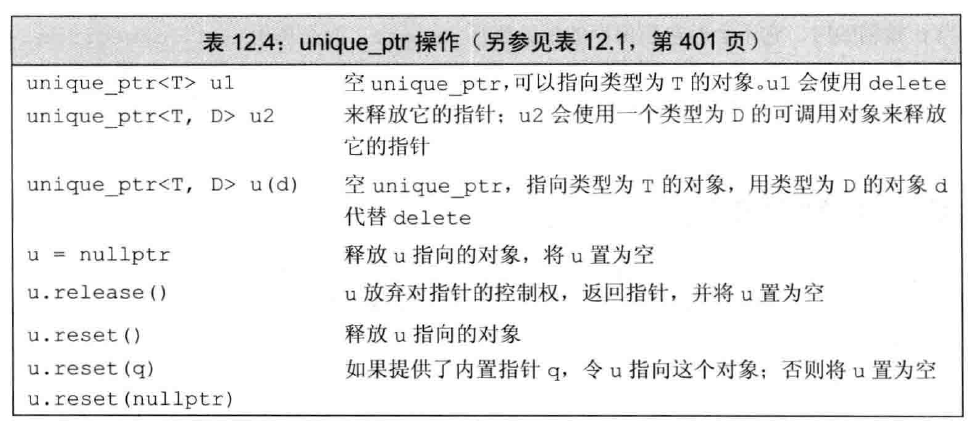

虽然我们不能拷贝或赋值unique_ptr ，但可以通过调用release 或reset 将指针的所有权从一个（非const) unique_ptr 转移给另一个unique。

### weak_ptr

weak_ptr 是一种不控制所指向对象生存期的智能指针，它指向由一个shared_ptr 管理的对象。

> 将一个weak_ptr 绑定到一个shared_ptr 不会改变shared_ptr 的引用计数

一旦最后一个指向对象的shared_ptr 被销毁，对象就会被释放。即使有weak_ptr 指向对象，对象也还是会被释放。

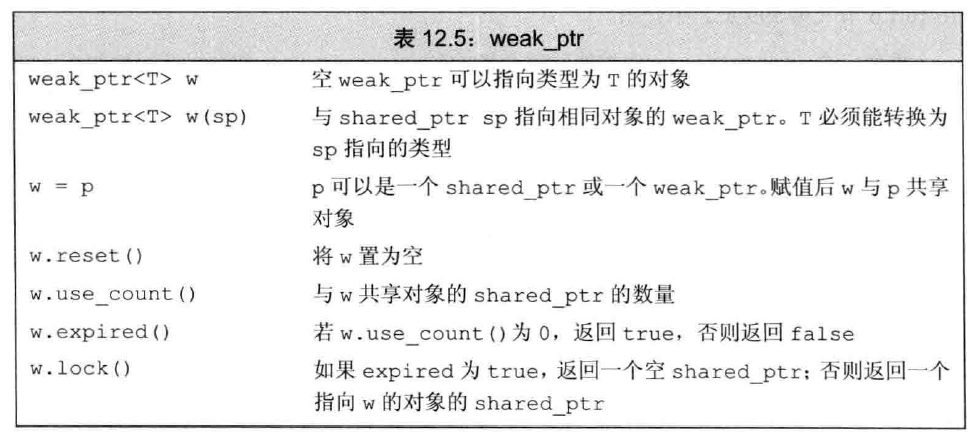

当我们创建一个weak_ptr 时， 要用一个shared_ptr 来初始化它：

```Cpp
auto p = make_shared<int>(42);
weak_ptr<int> wp(p); // wp弱共享p；p的引用计数未改变；
```

## 二级指针的作用

二级指针就是一个指针，指向的还是一个指针。

对于一个swap函数，我们知道传入两个值a,b的指针在函数内部即可实现对a,b 本尊的修改，而非拷贝的修改。如果我们本身就想修改一个指针的指向呢？如果还是像如下这种传递：

```c++
void func(int* a) {
    static int b = 3;
    a = &b;
}

int main() {
    int num = 2;
    int* a = &num;
    func(a);
    cout << *a << endl; // 打印结果还是2
}
```

上面这个例子在传入指针的时候指针其实是**一份拷贝传入**的，如果想修改传入的这个主函数指针的指向，那么就需要套娃，使用二级指针：

```c++
void func(int** a) {
    static int b = 3;
    *a = &b;
}

int main() {
    int num = 2;
    int* a = &num;
    func(&a);
    cout << *a << endl; // 打印结果3
}
```

其实解决这种问题还有一种做法，就是传入指针的引用，往往需要配合typedef关键字：

```c++
#include <iostream>
#include <vector>
using namespace std;

typedef int* ptr;

void func1(ptr& pp) {
	static int b = 4;
	pp = &b;
}

int main() {
	int num = 2;
	int* a = &num;
	func1(a);
	cout << *a << endl; // 打印结果4
}
```

此时func1传入的指针不会进行拷贝，就是“本尊”。

## 返回局部变量指针

```c++
#include <iostream>
#include <vector>
using namespace std;


int* func1() {
	int a = 2;
	return &a;
}

int main() {
	int* b = func1();
	cout << *b << endl;
	cout << *b << endl;
}
```

这段代码输出：

```
2
2059910112
```

可以看到，在第二次使用b时才有问题，原因不是很清楚，先记录一下。

如果想从函数内部返回一个指针，返回new出来的就行了。

# 变量

## 左移和右移

不管有符号还是无符号，如果是右移，如果最高位为1，那么在右移的过程中最高位会一直补充1，如果最高位为0，则移动的过程左边一直补充0。有符号负数的最高位为1，所以右移的过程中会一直补充1，所以不能用右移来计数1的个数，会死循环。而左移不会出现补充1的情况，只会补充0。

## 未初始化变量的初始化

- 栈中的变量（函数体中的自动变量）以及堆中的变量（动态内存）会保有不确定的值
- 全局变量和静态变量（包括局部静态变量）会自动初始化为0

## 一行同时声明定义多个变量

```Cpp
int ptr1 = 0, ptr2 = 0;
```

而不是像python一样的语法。

## constexpr

常量表达式是指值不会改变并且在编译过程就能得到计算结果的表达式。

C++11规定，允许将变量声明为constexpr类型以便由编译器来验证变量的值是否是一个常量表达式。

```Cpp
constexpr int mf = 20; // 20 是一个常量表达式
constexpr int limit = mf + 1; // mf+1是常量表达式
constexpr int sz = size(); // 只有当size是一个constexpr函数时才是一条正确的声明语句
```

那么为什么要用常量表达式呢，用常量表达式会有什么好处：
 1.允许一些计算只在编译时进行一次，而不是每次程序运行时；

 2.编译器可以进行尺度更大的优化；

 3.可以用在需求编译期间常量的上下文，例如数组长度等；

## decltype类型指示符

有时会遇到这种情况：希望从表达式的类型推断出要定义的变量的类型，但是不想用该表达式的值初始化变量。为了满足这一要求，C++11新标准引入了第二种类型说明符`decltype`,它的作用是选择并返回操作数的数据类型。在此过程中，编译器分析表达式并得到它的类型，却不实际计算表达式的值。

`decltype(f()) sum = x;`

## 正确理解extern

其实这个问题老生常谈了。

`extern int i;`只是对变量的声明而非定义，但是 `int i;`却是同时声明加定义。所以在一个cpp中定义了一个全局变量，想在另一个文件中使用就要显示地声明而不定义一个变量。

## 顶层const和底层constd

```Cpp
const int * p = &a;
//常量指针
//特点：指针的指向可以修改，但是指针指向的值不可以改
*p = 20;//错误
p = &b;//正确
```

```Cpp
int * const p = &a;
//指针常量
//指针的指向不可以改，指针指向的值可以改
*p = 20;//正确
p = &b;//错误
```

```Cpp
const int * const p = &a;
//特点：指针指向和指针指向的值都不能改
```

记忆：看const后面接什么，接\*说明解运算不能做，接p说明指针指向不能变。

**用名词顶层cost(top-level const)表示指针本身是个常量，而用名词底层const(low-level const).表示指针所指的对象是一个常量。**

## static关键字

[static用法和意义深度好文](https://blog.csdn.net/chenyijun/article/details/81938287?utm_medium=distribute.pc_aggpage_search_result.none-task-blog-2~all~baidu_landing_v2~default-1-81938287.nonecase&utm_term=c%20%20%20new%20static&spm=1000.2123.3001.4430)
static一般用来声明静态变量、静态函数。
声明静态变量时又分为：

 - 声明局部静态变量：例如在函数中声明静态变量，函数在第一次调用时为该静态变量开辟内存，之后再调用时就不再执行声明语句，而普通局部变量会再次声明变量。
 - 声明全局静态变量：静态的全局变量只能在该cpp文件下使用即便是在其他文件使用extern也无法获取。

声明静态函数：

 - 类中的静态函数：不需要实例化即可调用，使用::获取。
 - 普通静态函数：只能在该文件内使用，其他文件可以命名相同名字的函数。

另外，在类中也常常定义静态变量，这样的好处是所有实例化对象都拥有相同的静态变量，在某些情况下很方便。

对于函数定义和代码块之外的变量声明， static修改标识符的链接属性，由默认的 external变为 internal,作用域和存储类型不改变，这些符号只能在声明它们的源文件中访问。

类中的静态变量定义在类外且不能加static：

```Cpp
class A {
public:
	static int f;

	int m;
};
int A::f = 2; // 不加static

int main() {
	A a;
	cout << a.f << endl;
	return 0;
}
```

## new用法

在C++ 中，用new/delete操作符取代malloc/free

 - 申请一个对象：

```cpp
int * p = new int;
```

释放：

```cpp
delete p;
```

delete后将内存交还给内存管理器。
注意：

1. new 的返回值直接就是对象指针，不用再转换。
2. new的时候可以设置初始值

```cpp
new int(12);
```

 - 申请多个对象（例如申请1024个int对象）

```cpp
int * p = new int[1024];
```

释放：

```cpp
delete [] p;
```

1. 注意[]指定对象个数。
2. 如果new的时候用了[]，则释放的时候使用delete []操作符。

eg：

```cpp
##include<iostream>
using namespace std;

int main()
{
	int* p = new int[1024];
	for (int i = 0; i < 1024; i++)
	{
		p[i] = i + 1;
	}
	cout << p[0] << endl;
	delete [] p;
	return 0;
}
```

在delete [] p处加断点调试，观察p指向的内存，如下图所示：

观察到p指向的1024个内存地址都已经赋值成功（这里注意高位高地址小端模式）。

 - new 对象

new一个对象：

```cpp
Student * stu = new Student;
```

new多个对象:

```cpp
Student * stu = new Student[500];for(int i = 0;i < 500;i ++){	st.[i].id = i + 1;}
```

delete 后指针的值其实没有变，但是可能已经交给其他应用程序使用了。

## 正向迭代器和反向迭代器

c.begin() 返回一个迭代器，它指向**容器c的第一个元素**
c.end() 返回一个迭代器，它指向**容器c的最后一个元素的下一个位置**
c.rbegin() 返回一个逆序迭代器，它指向**容器c的最后一个元素**
c.rend() 返回一个逆序迭代器，它指向**容器c的第一个元素前面的位置**

这里注意，**反向迭代器依旧使用的是++操作**。

## size_t

`size_t`是为了方便系统之间的移植而定义的，它是一个无符号整型，在32位系统上定义为：`unsigned int`；在64位系统上定义为`unsigned long`。`size_t`一般用来计数，`sizeof`操作符的结果类型是`size_t`，该类型保证能容纳实现所建立的最大对象的字节大小。它的意义大致是“适用于内存中可容纳的数据项目的个数的无符号整数类型”所以，它在数组下标和内存管理函数之类的地方广泛使用。

## 枚举enum

枚举是 C 语言中的一种基本数据类型，它可以让数据更简洁，更易读。

枚举语法定义格式为：

```
enum　枚举名　{枚举元素1,枚举元素2,……};
```

接下来我们举个例子，比如：一星期有 7 天，如果不用枚举，我们需要使用 #define 来为每个整数定义一个别名：

```c
#define MON  1
#define TUE  2
#define WED  3
#define THU  4
#define FRI  5
#define SAT  6
#define SUN  7
```

这个看起来代码量就比较多，接下来我们看看使用枚举的方式：

```c
enum DAY
{
      MON=1, TUE, WED, THU, FRI, SAT, SUN
};
```

这样看起来是不是更简洁了。

**注意：**第一个枚举成员的默认值为整型的 0，后续枚举成员的值在前一个成员上加 1。我们在这个实例中把第一个枚举成员的值定义为 1，第二个就为 2，以此类推。

可以在定义枚举类型时改变枚举元素的值：

```c
enum season {spring, summer=3, autumn, winter};
```

没有指定值的枚举元素，其值为前一元素加 1。也就说 spring 的值为 0，summer 的值为 3，autumn 的值为 4，winter 的值为 5。

**枚举变量的定义**：

我们可以通过以下三种方式来定义枚举变量

**1、先定义枚举类型，再定义枚举变量**

```c
enum DAY
{
      MON=1, TUE, WED, THU, FRI, SAT, SUN
};
enum DAY day;
```

**2、定义枚举类型的同时定义枚举变量**

```c
enum DAY
{
      MON=1, TUE, WED, THU, FRI, SAT, SUN
} day;
```

**3、省略枚举名称，直接定义枚举变量**

```c
enum
{
      MON=1, TUE, WED, THU, FRI, SAT, SUN
} day;
```

**实例：**

```Cpp
#include <stdio.h>
 
enum DAY
{
      MON=1, TUE, WED, THU, FRI, SAT, SUN
};
 
int main()
{
    enum DAY day;
    day = WED;
    printf("%d",day);
    return 0;
}
```

以上实例输出结果为：3

在C 语言中，枚举类型是被当做 int 或者 unsigned int 类型来处理的，所以按照 C 语言规范是没有办法遍历枚举类型的。

不过在一些特殊的情况下，枚举类型必须连续是可以实现有条件的遍历。

以下实例使用 for 来遍历枚举的元素：

```Cpp
#include <stdio.h>
 
enum DAY
{
      MON=1, TUE, WED, THU, FRI, SAT, SUN
} day;
int main()
{
    // 遍历枚举元素
    for (day = MON; day <= SUN; day++) {
        printf("枚举元素：%d \n", day);
    }
}
```

以上实例输出结果为：

```
枚举元素：1 
枚举元素：2 
枚举元素：3 
枚举元素：4 
枚举元素：5 
枚举元素：6 
枚举元素：7
```

以下枚举类型不连续，这种枚举无法遍历。

```Cpp
enum
{
    ENUM_0,
    ENUM_10 = 10,
    ENUM_11
};
```

枚举在 switch 中的使用：

```Cpp
#include <stdio.h>
#include <stdlib.h>
int main()
{
 
    enum color { red=1, green, blue };
 
    enum  color favorite_color;
 
    /* 用户输入数字来选择颜色 */
    printf("请输入你喜欢的颜色: (1. red, 2. green, 3. blue): ");
    scanf("%u", &favorite_color);
 
    /* 输出结果 */
    switch (favorite_color)
    {
    case red:
        printf("你喜欢的颜色是红色");
        break;
    case green:
        printf("你喜欢的颜色是绿色");
        break;
    case blue:
        printf("你喜欢的颜色是蓝色");
        break;
    default:
        printf("你没有选择你喜欢的颜色");
    }
 
    return 0;
}
```

以上实例输出结果为：

```
请输入你喜欢的颜色: (1. red, 2. green, 3. blue): 1
你喜欢的颜色是红色
```

**将整数转换为枚举**：

```Cpp
#include <stdio.h>
#include <stdlib.h>
 
int main()
{
 
    enum day
    {
        saturday,
        sunday,
        monday,
        tuesday,
        wednesday,
        thursday,
        friday
    } workday;
 
    int a = 1;
    enum day weekend;
    weekend = ( enum day ) a;  //类型转换
    //weekend = a; //错误
    printf("weekend:%d",weekend);
    return 0;
}
```

以上实例输出结果为：

```
weekend:1
```

## 类型转换

### static_cast

任何具有明确定义的类型转换，只要不包含底层const ，都可以使用static_cast 。

```Cpp
double slope= static_cast<double> (j) / i;
```

一般来说，如果编译器发现一个较大的算术类型试图赋值给较小的类型，就会给出警告信息。但是当我们执行了显式的类型转换后，警告信息就会被关闭了。

需要注意的是，static_cast 不能用于无关类型之间的转换，因为这些转换都是有风险的，例如：

- 两个具体类型指针之间的转换，例如`int *`转`double *`、`Student *`转`int *`等。不同类型的数据存储格式不一样，长度也不一样，用 A 类型的指针指向 B 类型的数据后，会按照 A 类型的方式来处理数据：如果是读取操作，可能会得到一堆没有意义的值；如果是写入操作，可能会使 B 类型的数据遭到破坏，当再次以 B 类型的方式读取数据时会得到一堆没有意义的值。
- int 和指针之间的转换。将一个具体的地址赋值给指针变量是非常危险的，因为该地址上的内存可能没有分配，也可能没有读写权限，恰好是可用内存反而是小概率事件。

### const_cast

const_cast只能改变运算对象的底层const:

```Cpp
const char* pc;
char* p = const_cast<char*>(pc); // 正确：但是通过p写值是未定义的行为
```

const_cast可以去掉const性质，要记住，只有const_cast能改变表达式的常量属性，使用其他形式的类型转换都将引起编译器的报错。

### reinterpret_cast

它提供了较低层次上类型的重新解释：

```Cpp
int* p;
char* pc = reinterpret_cast<char*>(p);
```

但是在自己写网络编程定义消息体后发送，对方收到的可能就是个char\*，此时利用这个底层转化将其转为对应消息体格式的指针然后就可以直接取指针指向的各种资源的值了。

```Cpp
struct Command{
    int a;
    int b;
}
```

`reinterpret_cast<Command*> c_ptr`，之后 `c_ptr->a`即可获得对应值了。

1. 该函数将一个类型的指针转换为另一个类型的指针 .
2. 这种转换不用修改指针变量值存放格式(不改变指针变量值),只需在编译时重新解释指针的类型就可做到.
3. reinterpret_cast可以将指针值转换为一个整型数,但不能用于非指针类型的转换。

```Cpp
double d=9.2; 
double* pd = &d; 
int *pi = reinterpret_cast<int*>(pd); //相当于int *pi = (int*)pd; 
//不相关的类的指针的类型转换 
class A{}; 
class B{}; 
A* pa = new A; 
B* pb = reinterpret_cast<B*>(pa); //相当于B* pb = (B*)pa; 
//指针转换为整数 
long l = reinterpret_cast<long>(pi); //相当于long l = (long)pi;
```

### dynamic_cast

它用于将一个指向派生类的基类指针或引用转换为派生类的指针或引用，注意dynamic_cast转换符只能用于含有虚函数的类，其表达式为dynamic_cast<类型>(表达式)，其中的类型是指把表达式要转换成的目标类型，比如含有虚函数的基类B和从基类B派生出的派生类D，则`B *pb; D *pd, md; pb=&md; pd=dynamic<D*>(pb);` 最后一条语句表示把指向派生类D的基类指针pb转换为派生类D的指针，然后将这个指针赋给派生类D的指针pd，有人可能会觉得这样做没有意义，既然指针pd要指向派生类为什么不pd=&md;这样做更直接呢？

**因为有些时候我们需要强制转换，比如如果指向派生类的基类指针B想访问派生类D中的除虚函数之外的成员时就需要把该指针转换为指向派生类D的指针，以达到访问派生类D中特有的成员的目的**，比如派生类D中含有特有的成员函数g()，这时可以这样来访问该成员`dynamic_cast<D*>(pb)->g();`因为dynamic_cast转换后的结果是一个指向派生类的指针，所以可以这样访问派生类中特有的成员。但是该语句不影响原来的指针的类型，即基类指针pb仍然是指向基类B的。

> 这个函数直到我真正在项目中有需求使用了才理解了！

# 函数

## Lambda函数与表达式

[Lambda表达式教程](https://www.runoob.com/cplusplus/cpp-functions.html)

一个lambda表达式表示一个可调用的代码单元。我们可以将其理解为一个未命名的内联函数。与任何函数类似， 一个lambda 具有一个返回类型、一个参数列表和一个函数体。但与函数不同， lambda 可能定义在函数内部。一个lambda 表达式具有如下形式：

```Cpp
[capture list] (parameter list) -> return type { function body }
```

其中， capture list （捕获列表〉是一个lambda 所在函数中定义的局部变量的列表（通常为空）; return type 、parameter list 和function body 与任何普通函数一样，分别表示返回类型、参数列表和函数体。但是，与普通函数不同， lambda 必须使用**尾置返回**来指定返回类型。

我们可以忽略参数列表和l返回类型，但必须永远包含捕获列表和函数体:

```Cpp
auto f = [] { return 42 ; } ;
```

如果忽略返回类型， lambda 根据函数体中的代码推断出返回类型。如果函数体只是一个return 语句，则返回类型从返回的表达式的类型推断而来。否则，返回类型为void 。(**如果lambda的函数体包含任何单一return语句之外的内容，且未指定返回类型，则返回void**)

捕获列表只用于局部非static变量，lambda可以直接使用局部static变量和它所在函数之外声明的名字。

```Cpp
int main()
{
	static int a = 2;
	[]() {
		cout << a << endl;
	}();
	return 0;
} // it's OK

int main()
{
	int a = 2;
	[]() {
		cout << a << endl;
	}();
	return 0;
} // it's wrong.
```

另外一个例子：

```cpp
#include<iostream>
#include "head.h"
using namespace std;

int main()
{
	int num = 5;
	[](int &num)mutable
	{
		num = num + 1;
		cout << num << endl;
	}(num);
	cout << num << endl;
	return 0;
}
```

结果是6,6。
mutable声明，这部分可以省略。按值传递函数对象参数时，加上mutable修饰符后，可以修改按值传递进来的拷贝（注意是能修改拷贝，而不是值本身）。

如果想给匿名函数命名，则用auto关键字

```cpp
auto f = [](int &num)
{
    num = num + 1;
    cout << num << endl;
};
```

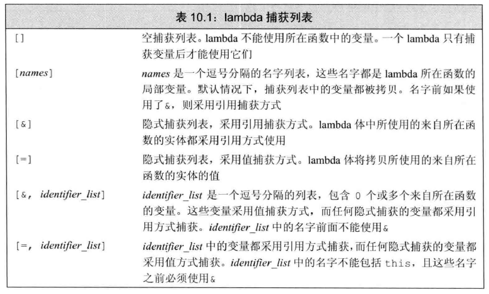

## 尾置返回类型

在C ++11新标准中还有一种可以简化func声明的方法，就是使用尾置返回类型trailing return type)。任何函数的定义都能使用尾置返回，但是这种形式对于返回类型比较复杂的函数最有效，比如返回类型是数组的指针或者数组的引用。尾置返回类型跟在形参列表后面并以一个->符号开头。为了表示函数真正的返回类型跟在形参列表之后，我们在本应该出现返回类型的地方放置一个auto:

```Cpp
auto func(int i) -> int(*) [10];
// func返回一个指向数组的指针，该数组中存储10个int型变量
```

## 函数重载

如果同一作用域内的几个函数名字相同但形参列表不同，我们称之为重载函数。当调用这些函数时，编译器会根据传递的实参类型推断想要的是哪个函数。

```cpp
#include<iostream>
using namespace std;

double sum(double, double);
double sum(double, double, double);
int main()
{
	double num1, num2, num3;
	num1 = 1.5;
	num2 = 2.3;
	num3 = 1.2;
	cout << sum(num1, num2) << endl;
	cout << sum(num1, num2, num3) << endl;
	return 0;
}

double sum(double a, double b)
{
	return a + b;
}

double sum(double c, double d, double e) 
{
	return c + d + e;
}
```

打印结果为：3.8  5。

## 列表初始化返回值

C++11新标准规定，函数可以返回花括号包围的值的列表。这样可以返回任意长度的数据了，下面给出一个返回vector的例子：

```cpp
#include<iostream>
#include <vector>
using namespace std;

vector<string> fcn();
int main()
{
	vector<string> vec;
	vec = fcn();
	for (auto& i : vec)
	{
		cout << i << endl;
	}
	return 0;
}

vector<string> fcn()
{
	return { "haha","lolo" };
}
```

打印结果为：haha  lolo。
**tip：因为数组不能被拷贝，所以函数不能返回数组。**

## 内联函数

内联函数可以避免函数调用的开销。

在函数的返回类型前面加上关键字`inline` 即可。一般来说，内联机制用于优化规模较小、流程直接、频繁调用的函数。

一般函数的代码段只有一份，放在内存中的某个位置上，当程序调用它是，指令就跳转过来；当下一次程序调用它是，指令又跳转过来；而内联函数是程序中调用几次内联函数，内联函数的代码就会复制几份放在对应的位置上。

**利：**避免了指令的来回跳转，加快程序执行速度；

**弊：**代码被多次复制，增加了代码量，占用更多的内存空间；

> **注意：**函数声明为内联，仅仅是对编译器的建议，如果函数比较复杂，编译器会将其看做普通函数。

## constexpr函数

constexpr 函数（ constexpr function ）是指能用于常量表达式的函数。定义`constexpr` 函数的方法与其他函数类似， 不过要遵循几个约定： **函数的返同类型及所有形参的类型都得是字面值类型**，而且函数体中必须有且只有**一条**`return` 语句。

constexpr函数不一定返回常量表达式。

```Cpp
constexpr size_t scale (size_t cnt) { return new sz () * cnt ; }
```

当scale 的实参是常量表达式时，它的返回值也是常量表达式：反之则不然：

```Cpp
int arr[scale(2)]; // 正确
int i = 2;  // i不是常量表达式
int a2[scale(i)]; // 错误
```

如果我们用一个非常量表达式调用scale 函数，比如int 类型的对象i ， 则返回值是一个非常量表达式。当把scale 函数用在需要常量表达式的上下文中时，由编译器负责检查函数的结果是否符合要求。如果结果恰好不是常量表达式， 编译器将发出错误信息。

## 声明返回数组指针的函数

因为数组不能被拷贝，所以函数不能返回数组。不过，函数可以返回数组的指针或引用。虽然从语法上来说， 要想定义一个返回数组的指针或引剧的函数比较烦琐，但是有一些方法可以简化这一任务， 其中最直接的方法是使用类型别名。

```Cpp
typedef int arrT[10]; // arrT时一个类型别名，它表示的类型含有10个整形的数组
using arrT = int[10]; // arrT的等价声明
arrT* func(int i);    // func返回一个指向含有10个整数的数组的指针
```

如果不想使用类型别名：

```Cpp
int (*func(int i))[4]{
	static int a[4] = {1,2,3,4};
	return &a;
}
```

或者使用尾置返回类型：

```Cpp
auto func() -> int (*)[4]{
	static int a[4] = {1,2,3,4};
	return &a;
}
```

## swap函数

该`swap()`函数用于交换两个数字。通过使用此函数，您不需要任何第三变量即可交换两个数字。

这是`swap()`C ++语言的语法：

```C++
void swap(int variable_name1, int variable_name2);
```

> 最好通过引用将值传递给变量，它将在实际位置交换变量的值。

## 变长参数模板

```cpp
#include <iostream>
using namespace std;

template<typename T, typename... Args>
void foo(T value, Args... args) {
    cout << value << endl;
    if constexpr (sizeof...(args) > 0) {
        foo(args...);
    }
}

int main()
{
    foo("hello", 1, 2, 3);
}
```

hello
1
2
3

这里采用了递归的形式解包，args在使用时必须解包！

# 结构体

[结构体](http://c.biancheng.net/view/2031.html)

## 结构体基础

<strong style="color:red;">语法</strong>：`struct 结构体名 {结构体成员列表};`

通过结构体创建变量的方式：

* struct 结构体名 变量名；
* struct 结构体名 变量名 = {成员1值， 成员2值...}；
* 定义结构体时顺便创建变量；

```Cpp
# include <string>
struct Student             // struct关键字不可省略
{
    string name;
    int age;
    int score;
}stu3;
int main()
{
    struct Student stu1; // 这里的struct关键字可以省略
    stu1.name = "Lily";
    stu1.age = 18;
    stu1.score = 86;
    struct Student stu2 = {"Bob",12,100};
    
    stu3.name = "Lisa";
    stu3.age = 17;
    stu3.score = 88;
}
```

## 结构体数组

作用：将自定义的结构体放入到数组中方便维护

<strong style="color:red;">语法</strong>：`struct 结构体名 数组名[元素个数] = {{...},{...},{...},...}`

```Cpp
# include <string>
struct Student             // struct关键字不可省略
{
    string name;
    int age;
    int score;
};
int main()
{
    struct Student stu_array[3] = 
    {
        {"Lily",18,100},
        {"Lisa",19,99},
        {"Bob",17,98}
    }
    stu_array[2].score = 60;
}
```

## 结构体指针

作用：通过指针访问结构体中的成员。

* 利用操作符 `->` 可以通过结构体指针访问结构体属性。

```Cpp
# include <string>
struct Student             // struct关键字不可省略
{
    string name;
    int age;
    int score;
};
int main()
{
    struct Student s = {"Bob",18,100};
    // struct 结构体名 * 指针名 = &结构体
    struct Student * p2s = &s; //struct关键字可以省略
    cout<<p2s->name<<endl;
}
```

## 嵌套结构体

<strong style="color:red;">作用</strong>：结构体中的成员可以是另一个结构体

例如：每个老师辅导一个学员，一个老师的结构体中，记录一个学生的结构体

```Cpp
# include <string>
struct student  // student结构体实现放在teacher前面，编译器先看到
{
    string name;
    int age;
    int score;
};
struct teacher             // struct关键字不可省略
{
    int id;
    string name;
    int age;
    struct student stu;
};

int main()
{
    struct teacher tea= {10000,"Lily",20,{"Bob",18,90}};
    cout<<tea.stu.score<<endl;
}
```


## 结构体做函数参数

```Cpp
#include <string>
struct student  
{
    string name;
    int age;
    int score;
};

void print(struct student s) // 值传递
{
    s.score = 100; //这并不会修改main中s的属性
    cout<<s.name<<endl;
}
void print2(struct * student p2s)//地址传递
{
    p2s->score = 99; //这会修改main中s的属性
    cout<<p2s->name<<endl;
}
int main()
{
    struct student s = {"Bob",12,32};
    print(s);
    print2(&s);
}
```


## 结构体中`const`使用场景

作用：用`const`来防止误操作

```Cpp
#include <string>
struct student  
{
    string name;
    int age;
    int score;
};
void print(student s) //值传递
{
    cout<<s.name<<endl;
}
print1(student * s) //将形参改为指针，可以减少内存空间，不会复制副本
{
    s->age= 100; //这可能会导致外部信息被修改，不好。
    cout<<s->name<<endl;
}
print2(const student * s) //const保证信息不被修改
{
    //s->age= 100; //如果修改会直接报错
    cout<<s->name<<endl;
}
int main()
{
    struct student s = {"Bob",15,90};
  	print(s); //拷贝量太大了！数据开销大。 
    print1(&s);
    print2(&s);   
}
```


## 共用体union以及其与结构体的区别

在C语言中，还有另外一种和结构体非常类似的语法，叫做**共用体（Union）**，它的定义格式为：

```Cpp
union 共用体名{
    成员列表
};
```

> 共用体有时也被称为联合或者联合体，这也是 Union 这个单词的本意。

结构体和共用体的区别在于：结构体的各个成员会占用不同的内存，互相之间没有影响；而共用体的所有成员占用同一段内存，修改一个成员会影响其余所有成员。

结构体占用的内存大于等于所有成员占用的内存的总和（成员之间可能会存在缝隙），**共用体占用的内存等于最长的成员占用的内存**。共用体使用了内存覆盖技术，同一时刻只能保存一个成员的值，如果对新的成员赋值，就会把原来成员的值覆盖掉。

共用体也是一种自定义类型，可以通过它来创建变量，例如：

```Cpp
union data{
    int n;
    char ch;
    double f;
};
union data a, b, c;
```

上面是先定义共用体，再创建变量，也可以在定义共用体的同时创建变量：

```Cpp
union data{
    int n;
    char ch;
    double f;
} a, b, c;
```

如果不再定义新的变量，也可以将共用体的名字省略：

```Cpp
union{
    int n;
    char ch;
    double f;
} a, b, c;
```

共用体 data 中，成员 f 占用的内存最多，为 8 个字节，所以 data 类型的变量（也就是 a、b、c）也占用 8 个字节的内存，请看下面的演示：

```Cpp
#include <stdio.h>
union data{
    int n;
    char ch;
    short m;
};
int main(){
    union data a;
    printf("%d, %d\n", sizeof(a), sizeof(union data) );
    a.n = 0x40;
    printf("%X, %c, %hX\n", a.n, a.ch, a.m);
    a.ch = '9';
    printf("%X, %c, %hX\n", a.n, a.ch, a.m);
    a.m = 0x2059;
    printf("%X, %c, %hX\n", a.n, a.ch, a.m);
    a.n = 0x3E25AD54;
    printf("%X, %c, %hX\n", a.n, a.ch, a.m);
   
    return 0;
}
```

运行结果：

```Cpp
4, 4
40, @, 40
39, 9, 39
2059, Y, 2059
3E25AD54, T, AD54
```

# 泛型算法

## bind

bind标准库函数定义在头文件functional中，可以将bind函数看作一个通用的函数适配器，它接受一个可调用对象，生成一个新的可调用对象来“适应”原对象的参数列表。

调用bind 的一般形式为：

```Cpp
auto newCallable = bind (callable, arg_list);
```

```Cpp
auto test(int a, int b) -> int {
	return a + b;
}
int main()
{
	auto f = bind(test, std::placeholders::_1, 2);
	cout << f(1) << endl;
	return 0;
}
```

arglist中的参数可能包含形如_n 的名字，其中n 是一个整数。这些参数是“占位符”，表示newCallable的参数，它们占据了传递给newCallable的参数的“位置”。数值n表示生成的可调用对象中参数的位置：\_1表示newCallable的第一个参数。

在谓词中往往需要只能有一个参数的可调用对象，通过bind将多个参数的可调用对象转为1个参数的可调用对象。

### 应用

网络编程中， 经常要使用到回调函数。 当底层的网络框架有数据过来时，往往通过回调函数来通知业务层。 这样可以使网络层只专注于 数据的收发， 而不必关心业务。

在c语言中， 回调函数的实现往往通过函数指针来实现。 但是在c++中 ， 如果回调函数是一个类的成员函数。这时想把成员函数设置给一个回调函数指针往往是不行的。

因为类的成员函数，多了一个隐含的参数this。 所以直接赋值给函数指针肯定会引起编译报错。

c++11 为我们带来了bind， 可以很好的解决这个问题：

```Cpp
#include <functional>
#include <iostream>
using namespace std::placeholders;
using namespace std;
 
class  test{
public: 
      int i = 0;
      void incr(int j){ i+=j;}
};
 
void sample(){
     test *p =new test();
      
     auto f0=bind(&test::incr,p,_1);
     f0(2);    
     cout<<p->i<<endl;
          
}
```

要注意的是bind()函数 返回的是一个function 类型的对象， 并不能简单地赋值给c语言中定义的函数指针。

例如上面的例子中，我们使用auto 直接推导了变量类型。如果要显示指定变量类型

`typedef void(*func)(int);`

`func f1 = bind(&test::incr,p,_1);`

这样是编译不过的， 必须写成function类型

`typedef function<void()> func;`

`func f1 = bind(&test::incr,p,_1);`

## std::function


## 插人迭代器

插入器是一种迭代器适配器， 它接受一个容器，生成一个迭代器，能实现向给定容器添加元素。当我们通过一个插入法代器进行赋值时，该法代器**调用容器操作**来向给定容器的指定位置插入一个元素。

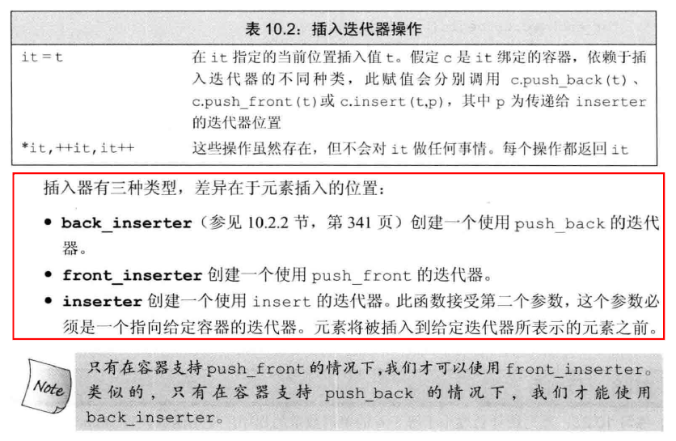

```Cpp
int main()
{
	deque<int> deq;
	auto it = front_inserter(deq);
	it = 1;
	it = 2;
	for (auto & i : deq) {
		cout << i << endl;
	}
	return 0;
}
>>> 2 
>
```

# 多线程

## thread创建后要么detach要么join

detach意思就是与创建它的线程分离，互不影响，主线程退出它仍旧运行，但要注意共享变量在主线程退出后销毁的问题。join就是等待创建的线程结束，比较好理解。

如果一个线程创建的时候既不detach也不join，那么该线程在析构的时候就会退出程序，这往往不是我们想要的结果。

```cpp
#include <iostream>
#include <thread>
#include <Windows.h>

int main()
{
    {
        std::thread([]() {
            fprintf(stdout, "thread:%d\n", std::this_thread::get_id());
        }).detach();
    }

    fprintf(stdout, "exit\n");
    Sleep(1000);
    return 0;
}
```

```cpp
exit
thread:24984
```

把detach去掉：

```cpp
#include <iostream>
#include <thread>
#include <Windows.h>

int main()
{
    {
        std::thread([]() {
            fprintf(stdout, "thread:%d\n", std::this_thread::get_id());
        });
    }

    fprintf(stdout, "exit\n");
    Sleep(1000);
    return 0;
}
```

结果：

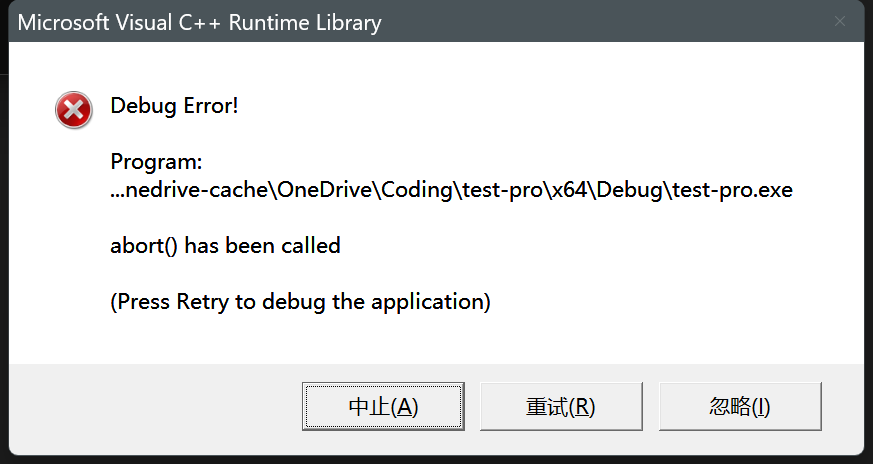

## shared_ptr多线程加锁

“因为 shared_ptr 有两个数据成员，读写操作不能原子化”使得多线程读写同一个 shared_ptr 对象需要加锁。

https://blog.csdn.net/Solstice/article/details/8547547

**但是多个线程执行shared_ptr析构是不会重复释放的。**因为shared_ptr对管理的内存是线程安全的，因为源码中

```cpp
_Atomic_word  _M_use_count;     // #shared
_Atomic_word  _M_weak_count;
析构的时候
    if (__gnu_cxx::__exchange_and_add_dispatch(&_M_use_count, -1) == 1)
    {
```

类型都是原子类型，对他们的操作都是采用原子操作来实现了 即使多个线程来减少，他仅仅判断_M_use_count为1的时候进行 -1才会释放内存。

## 声明一个thread但是不启动它，在合适的时候启动它

在C++标准库中，`std::thread` 对象在构造时就会开始执行。这意味着，一旦你声明并初始化了一个 `std::thread` 对象，它关联的函数就会立即开始运行。

如果你想声明一个 `std::thread` 但是暂时不启动它，你可以做以下几件事：

### 延迟初始化

你可以声明一个没有初始化（即默认构造）的 `std::thread` 对象，并在适当的时机用 `std::thread::operator=` 或者 `std::thread::swap` 来给它赋予实际的任务。

```c++
#include <thread>
#include <iostream>

void my_function() {
    std::cout << "Hello from thread!\n";
}

int main() {
    std::thread my_thread;  // 声明但不启动

    // ... 其他操作 ...

    my_thread = std::thread(my_function);  // 启动线程

    my_thread.join();  // 等待线程结束
}
```

### 使用 `std::optional`

你还可以使用 `std::optional` 来延迟线程的创建。

```c++
#include <thread>
#include <optional>
#include <iostream>

void my_function() {
    std::cout << "Hello from thread!\n";
}

int main() {
    std::optional<std::thread> my_optional_thread;  // 声明但不启动

    // ... 其他操作 ...

    my_optional_thread.emplace(my_function);  // 启动线程

    my_optional_thread->join();  // 等待线程结束
}
```

### 使用指针或动态分配

你也可以使用指针来动态分配线程，并在需要时通过 `new` 进行初始化。

```c++
#include <thread>
#include <iostream>

void my_function() {
    std::cout << "Hello from thread!\n";
}

int main() {
    std::thread* my_thread_ptr = nullptr;  // 声明但不启动

    // ... 其他操作 ...

    my_thread_ptr = new std::thread(my_function);  // 启动线程

    my_thread_ptr->join();  // 等待线程结束

    delete my_thread_ptr;  // 释放资源
}
```

以上三种方法都能让你在声明 `std::thread` 对象时不立即启动它，然后在适当的时机进行启动。

# 异常

## 自定义异常

可以通过继承和重载 **exception** 类来定义新的异常。下面的实例演示了如何使用 std::exception 类来实现自己的异常：

```cpp
#include <iostream>
#include <exception>
using namespace std;
 
struct MyException : public exception
{
  const char * what () const throw ()
  {
    return "C++ Exception";
  }
};
 
int main()
{
  try
  {
    throw MyException();
  }
  catch(MyException& e)
  {
    std::cout << "MyException caught" << std::endl;
    std::cout << e.what() << std::endl;
  }
  catch(std::exception& e)
  {
    //其他的错误
  }
}
```

这将产生以下结果：

```
MyException caught
C++ Exception
```

在这里，**what()** 是异常类提供的一个公共方法，它已被所有子异常类重载。这将返回异常产生的原因。

# C++核心编程

## 内存分区模型

C++程序在执行时，将内存划分为<strong style="color:red;">4个区域</strong>：

* **代码区**：存放函数体的二进制代码，由操作系统进行管理。
* **全局区**：存放全局变量和静态变量以及常量。
* **栈区**：由编译器自动分配释放，存放函数的参数值，局部变量等。
* **堆区**：由程序员分配和释放，若程序员不释放，程序结束时由操作系统回收。

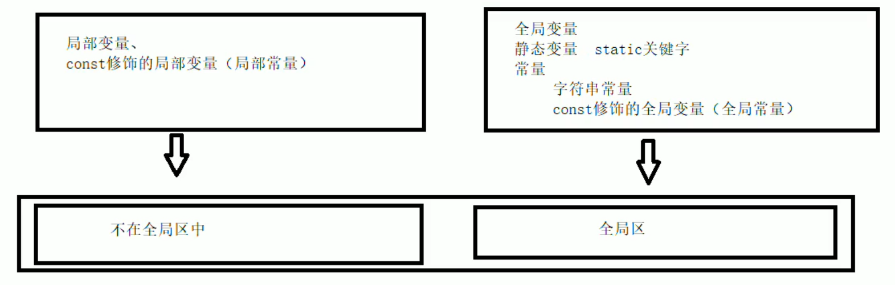

<strong style="color:red;">总结：</strong>

**`C++中在程序运行前分为全局区和代码区`**

**`代码区特点是共享和只读`**

**`全局区中存放全局变量、静态变量、常量`**

**`常量区中存放const修饰的全局常量和字符串常量`**

**堆区开辟数据**：

语法：`new 数据类型`

```Cpp
int * func()
{
    //利用new关键字 可以将数据开辟到堆区 new返回一个该数据类型的指针
    //指针本质也是局部变量，放在栈上，指针保存的数据是放在堆区的
    int * p = new int(10);
    return p;
}
int main()
{
    int * p = func();
    cout<<*p<<endl;
    delete p; //删除堆上p指向的数据 之后再次访问就是非法访问
}
```

在堆区创建数组：

```Cpp
void test()
{
    //创建10整形数据的数组，在堆区
    int * arr = new int[10];
    for(int i =0;i<10;i++)
    {
        arr[i] = i+100;
    }
    for(int i =0;i<10;i++)
    {
        cout<<arr[i]<<endl;
    }
    delete[] arr; //告诉编译器删除一组数据
}
int main()
{
    test();
}
```

## 引用

<strong style="color:red;">作用</strong>：给变量起别名

<strong style="color:red;">语法</strong>：`数据类型 &别名 = 原名`

```Cpp
int main()
{
    int a = 10;
    int &b = a;
    b = 100;
    cout<<a<<endl; // a也是100了
}
```

* **引用必须初始化**
* **引用在初始化之后，不可以改变**

```Cpp
int main()
{
    int a = 10;
    int &b = a;
    int c = 20;
    b = c;  //这并不是改变引用，只是改了a的值
}
```

**引用做函数参数**：

```Cpp
void swap(int &a, int &b)
{
    int t = 0;
    t = a;
    a = b;
    b = t;
}
int main()
{
    int a = 10;
    int b = 20;
    cout<<a<<" "<<b<<endl; // 输出10， 20
    int &c = a;
    int &d = b;
    // 别名操作和原名操作都一样，a和c等价
    swap(c,d); // 这句还可以直接写成swap(a,b)
    cout<<a<<" "<<b<<endl;// 输出20， 10
}
```

<strong style="color:red;">不要返回局部变量的引用</strong>(这与指针一致)

如果实在想返回，用 `static` 关键字将变量保存到全局区。

```Cpp
int & test()
{
    static int a = 10;//全局区上的数据在程序结束后系统释放
    return a;
}
int main()
{
    int &ref = test();
    cout<<ref<<endl; // 10
    test() = 100; //返回引用的函数可以作为左值
    cout<<ref<<endl; //100
}
```

**引用的本质**

本质：引用的本质在C++内部实现是一个<strong style="color:red;">指针常量</strong>（不能修改指向，可以修改指向的值）

```Cpp
int main()
{
    int a = 10;
    //自动转换为int * const ref = &a;
    int& ref = a;
    //内部发现ref是引用，自动转化为*ref = 20;
    ref = 20;
}
```

**常量引用**：

<strong style="color:red;">作用</strong>：主要用来修饰形参，防止误操作

```Cpp
int main()
{
    // int & ref = 10; //不允许
    //加上const之后，编译器将代码修改为 int temp = 10;const int & ref = temp;
    const int& ref = 10; // 允许
    // ref = 20; // 不允许，const只读
}
```

```Cpp
void show(int & val)
{
    val = 1000; // 可能会修改外部值，误操作
    cout<< val<<endl;
}
void show1(const int & val)
{
    //val = 1000; // 不会被修改
    cout<< val<<endl;
}
int main()
{
    int a = 100;
    show(a);
    show1(a);
}
```

## 函数提高

**函数默认参数：**

<strong style="color:red;">语法</strong>：`返回值类型 函数名(参数=默认值){}`

```Cpp
int func(int a,int b = 20,int c = 30) // 默认参数放尾部
{
    return a+b+c;
}
int main()
{
    func(10,30); // 70
}
```

如果函数声明有默认参数，则函数实现不能有默认参数：

```Cpp
int func2(int a = 10, int b = 10);
// int func2(int, int); // 应该修改成这样
int func2(int a = 10,int b = 10) // 重定义了默认参数，错误！程序二义性。虽然这里还是10和10。声明和实现只能有一个有默认参数。
{
    return a+b;
}
int main()
{
    cout<<func2(10,10)<<endl;
}
```

**函数占位参数：**

C++中函数的形参列表里可以有占位参数，用来做占位，调用函数时必须填补该位置。

<strong style="color:red;">语法</strong>：`返回值类型 函数名 (数据类型){}`

```Cpp
void func(int a, int)//第二个占位
{
    cout<<"this is func."<<endl;
}
int main()
{
    func(10,1);
}
```

占位参数也可以有默认值，`void func(int a, int = 10)`

**函数重载：**

<strong style="color:red;">作用</strong>：函数名可以相同，提高复用性

函数重载满足条件：

* 同一个作用域下
* 函数名称相同
* 函数参数**类型不同** 或者 **个数不同** 或者 **顺序不同**

注意：<strong style="color:#126bae;">函数的返回值不可以作为函数重载的条件</strong>

```Cpp
void func()
{
    cout<<"func的调用"<<endl;
}
void func(int a)
{
    cout<<"func(int a)调用";
}
void func(double a)
{
    cout<<"func(double a)调用"<<endl;
}
void func(int a,double b)
{
    cout<<"func(int a,double b)调用"<<endl;
}
void func(double a,int b)
{
    cout<<"func(double a,int b)调用"<<endl;
}
int main()
{
    //1，2个数不同；2，3类型不同；4，5顺序不同
    func(); // 1
    func(1);// 2
    func(1.0);// 3
    func(10,3.14);// 4
    func(3.12,19);// 5
}
```

函数重载可以这么理解：编译器拿着函数输入值去比对定义的多个相同名称的函数形参列表，能唯一吻合的就调用，否则程序无法执行。

## 类和对象

C++面向对象三大特性：<strong style="color:red;">封装、继承、多态</strong>

### 封装

语法：`class 类名{访问权限：属性/行为};`

```Cpp
// 设计一个圆类，求圆的周长
const double PI = 3.14;
class Circle
{
    // 访问权限
public:
    // 属性
	int m_r;
    // 行为
    double calculateZC()
    {
        return 2*PI*m_r;
    }
};
int main()
{
    //创建具体的圆
    Circle c1;
    c1.m_r = 10;
    
    cout<<c1.calculateZC()<<endl;
}
```

设计一个学生类，属性有姓名和学号，可以给姓名和学号赋值，可以显示学生的姓名和学号：

```Cpp
class Student
{
public:
    int id_num;
    string name;
    int get_id(){return id_num;}
    string get_name(){return name;}
};
int main()
{
    Student stu;
    stu.id_num = 100;
    stu.name = "校长";
    cout<<stu.get_id()<<endl;
    cout<<stu.get_name()<<endl;
    return 0;
}
```

访问权限有三种：

1. public 公共权限  <strong style="color:red;">类内类外可访问</strong>
2. protected 保护权限 <strong style="color:red;">类内可以访问，类外不可访问</strong>
3. private 私有权限 <strong style="color:red;">类内可以访问，类外不可访问</strong>

**2，3区别在继承**。保护权限在继承的时候子类也能访问。（父亲的车就属于保护权限下的成员，儿子也能拿到，但外人拿不到。父亲的银行卡密码就属于私有权限下的成员，儿子不能访问，只有父亲可以访问。）

**struct和class的区别：**

在C++中 `struct `和 `class` 的<strong style="color:red;">唯一</strong>区别就在于 <strong style="color:red;">默认访问权限不同</strong>

区别：

* `struct` 默认权限为<strong style="color:#126bae;">公共</strong>
* `class` 默认权限为<strong style="color:#126bae;">私有</strong>

用struct也能写“类”：

```Cpp
struct Student
{
    int id = 100;
    int get_id()
    {
        return id;
    }
};
int main()
{
    struct Student stu;
    cout<<stu.get_id()<<endl;
    return 0;
}
```

**将成员属性设置为私有：**

<strong style="color:#126bae;">优点1</strong>：将所有成员属性设置为私有，可以自己控制读写权限

<strong style="color:#126bae;">优点2</strong>：对于写权限，我们可以检测数据的有效性

### 对象的初始化和清理

<strong style="color:red;">构造函数</strong>：`类名(){}`

1. 构造函数，没有返回值也不写void
2. 函数名称与类名相同
3. 构造函数可以有参数，因此可以发生重载
4. 程序在调用对象时候会自动调用构造，无须手动调用而且只会调用一次

<strong style="color:red;">析构函数</strong>：`~类名(){}`

1. 析构函数，没有返回值也不写void

2. 函数名称与类名相同，在名称前加上符号

3. 析构函数<strong style="color:#126bae;">不可以有参数</strong>，因此不可以发生重载

4. 程序在对象销毁前会自动调用析构，无须手动调用而且只会调用一次

**构造函数的分类及调用：**

两种分类方式：
按参数分为：有参构造和无参构造
按类型分为：普通构造和拷贝构造

```Cpp
class Person
{
public:
    int age = 0;
    Person() // 无参构造
    {
        //...
    }
    Person(int a) // 有参构造
    {
        age = a;
    }
    ~Person()  // 析构
    {
        //...
    }
    //拷贝构造函数
    Person(const Person &p) // const让传入的拷贝数据源数据不被修改
    {
        // 将传入的人身上所有的属性，拷贝到我身上
        age = p.age;
    }
};

void test01()
{
    // 括号法(直观)
    Person p1;
    Person p2(10);
    Person p3(p2); // 拷贝构造函数
    cout<<p3.age<<endl;
    // 注意：调用默认构造函数时，不要加()
    // 编译器会认为这是一个函数的声明
    //Person p1();
    
    // 显式法
    Person p4 = Person(10); // 有参构造
    Person p5 = Person(p4); // 拷贝构造
    //Person(10)叫匿名对象 特点：当前行执行结束后，系统立即回收掉匿名对象
    
    // 注意：不要利用拷贝构造函数 初始化匿名对象
    // 编译器认为 Person(p4) 等同于 Person p4
    // Person(p4)
    
    // 隐式法
    Person p6 = 10; // 相当于 Person p6 = Person(10);
    Person p7 = p6; // 拷贝构造
}
```

**拷贝构造函数调用时机：**

C++中拷贝构造函数调用时机通第有<strong style="color:red;">三种情况</strong>

1. 使用一个已经创建完毕的对象来初始化一个新对象

2. 值传递的方式给函数参数传值

3. 以值方式返回局部对象

```Cpp
class Person
{
public:
    int age = 0;
    Person() // 无参构造
    {
        cout<<"默认构造调用"<<endl;
    }
    Person(int a) // 有参构造
    {
        age = a;
        cout<<"有参构造调用"<<endl;
    }
    ~Person()  // 析构
    {
        cout<<"析构调用"<<endl;
    }
    //拷贝构造函数
    Person(const Person &p) // const让传入的拷贝数据源数据不被修改
    {
        // 将传入的人身上所有的属性，拷贝到我身上
        age = p.age;
        cout<<"拷贝构造函数调用"<<endl;
    }
};
// 使用一个已经创建完毕的对象来初始化一个新对象
void test01()
{
    Person p1(20);
    Person p2(p1);
}
// 值传递的方式给函数参数传值
void doWork(Person p){}
void test02()
{
    Person p;
    doWork(p); // 这里发生拷贝构造
}
// 以值方式返回局部对象
void doWork2()
{
    Person p1;
    return p1; // 根据p1创建一个对象返回
}
void test03()
{
    Person p = doWork2();
}
int main()
{
    test01();// 使用一个已经创建完毕的对象来初始化一个新对象
    test02();// 值传递的方式给函数参数传值
    test03();// 以值方式返回局部对象
}
```

**构造函数调用规则：**

默认情況下，C++编译器至少给一个类添加<strong style="color:red;">3个函数</strong>

1. 默认构造函数无参，函数体为<strong style="color:#126bae;">空</strong>

2. 默认析构函数（无参，函数体为<strong style="color:#126bae;">空</strong>）

3. 默认拷贝构造函改，对<strong style="color:#126bae;">属性进行值拷贝</strong>

构造函数调用规则如下：

1. 如果用户定义有参构造函数，C++不再提供默认无参构造，但是会提供默认拷贝构造

2. 如果用户定义拷贝构造函数，C++<strong style="color:#126bae;">不会再提供其他构造函数</strong>

**深拷贝和浅拷贝（体现在指针成员变量上）：**

浅拷贝：简单的赋值拷贝操作

深拷贝：在堆区重新申请空间，进行拷贝操作

```Cpp
class Person
{
public:
    int age = 0;
    int * m_Height; //身高
    Person() // 无参构造
    {
        cout<<"默认构造调用"<<endl;
    }
    Person(int a, int height) // 有参构造
    {
        age = a;
        m_Height = new int(height);
        cout<<"有参构造调用"<<endl;
    }
    ~Person()  // 析构
    {
        cout<<"析构调用"<<endl;
        // 析构代码，将堆区开辟的数据做释放操作
        if (m_Height != NULL)
        {
            delete m_Height;
            m_Height = NULL;
        }
    }
};
void test01()
{
    Person p1(18,160);
    cout<<p1.age<<" "<<*p1.m_Height<<endl;
    Person p2(p1);
    cout<<p2.age<<" "<<*p2.m_Height<<endl;
}
int main()
{
    test01();
}
```

正常来说编译器执行会崩，因为`p1,p2`的`m_Height`都指向同一内存（<strong style="color:#126bae;">浅拷贝</strong>），在析构的时候相同的堆区内存被释放了<strong style="color:#126bae;">两次</strong>。

<strong style="color:#126bae;">深拷贝</strong>：

重新写拷贝构造函数，在拷贝时重新在堆区开辟内存使指针`m_Height`指向它并将内存对应的值设置为相应值。

```Cpp
Person(const Person &p)
{
    //默认拷贝构造函数：
    //age = p.age; m_Height = p.m_Height;
    
    //深拷贝操作
    age = p.age;
    m_Height = new int(*p.m_Height) //重点
}
```

**初始化列表：**

作用：初始化属性

语法：`构造函数():属性1(值1),属性1(值1)...{}`

```Cpp
class Person
{
public:
    int m_A;
    int m_B;
    int m_C;
    Person(int a,int b,int c);   // 必须有这句
};
Person::Person(int a,int b,int c):m_A(a),m_B(b),m_C(c){} // 初始化列表

int main()
{
    Person p(10,5,69);
    cout<<p.m_A<<" "<<p.m_B<<" "<<p.m_C<<endl;
}
```

**类对象作为类成员：**

C++类中的成员可以使另一个类的对象，我们成该成员为对象成员

```Cpp
class A{}
class B
{
    A a;
}
```

A为<strong style="color:#126bae;">对象成员</strong>

<strong style="color:red;">创建B时先有B还是先有A?</strong>

```Cpp
class Phone
{
public:
    string m_PName;
    Phone(string pName)
    {
        cout<<"手机构造调用!"<<endl;
        m_PName = pName;
    }
    ~Phone(){cout<<"Phone的析构调用!"<<endl;}
};
class Person
{
public:
    // Phone m_Phone = pName; 隐式转换法
    Person(string name,string pName):m_Name(name),m_Phone(pName)
    {
        cout<<"Person构造调用!"<<endl;
    }
    ~Person(){cout<<"Person的析构调用!"<<endl;}
	string m_Name;
    Phone m_Phone;
};
void test01()
{
    Person p("张三","iphone");
    cout<<p.m_Name<<" "<<p.m_Phone.m_PName<<endl;
}
int main()
{
    test01(); // 打印结果为手机构造先调用，之后Person构造调用。
    // 析构顺序相反，先Person，后手机
}
```

<strong style="color:#126bae;">当其他类对象作为本类成员，构造时候先构造类对象，再构造自身，析构顺序相反。</strong>

很好理解：构造一个人先要构造他的胳膊和腿，拆解一个人先拆人才得到胳膊腿。

**静态成员：**

静态成员就是在成员变量和成员函数前加上关键字 `static`,称为静态成员。

* 静态成员变量
  * 所有对象共享同一份数据
  * 在编译阶段分配内存
  * 类内声明，类外初始化

* 静态成员函数
  * 所有对象共享同一个函数
  * 静态成员函数只能访问静态成员变量

```Cpp
class Person
{
public:
    static void func()
    {
        cout<<"static void func调用！"<<endl;
        m_A = 100;// 静态成员函数可以访问静态成员变量
        // m_B = 10; //错误 静态成员函数不可以访问非静态成员变量
    }
    static int m_A; // 静态成员变量
    int m_B; // 非静态成员变量
private:
    static void func2()
    {
        cout<<"static void func2()调用！"<<endl;
    }
};
int Person::m_A = 0;
void test01()
{
    Person p;
    p.func();  // 通过对象访问
    
    Person::func(); // 通过类名访问
    // Person::func2(); //无法访问（func2私有函数）
}
int main()
{
    test01();
}
```

这个`static`函数和Python类中`@staticmethod`一致。

### C++对象模型和this指针

**成员变量和成员函数分开存储：**

```Cpp
class Person
{
    int m_A;
    static int m_B; // 静态成员变量不属于类的对象上
    void func(); // 非静态成员函数 也不属于某一个类的对象上 相当于共享代码 靠this指针区分操作
    static void func2(); // 静态成员函数 也不属于某一个类的对象上
};
int Person::m_B = 0;
void test01()
{
    Person p;
    // 空对象占用内存空间为？
    // C++编译器会给每个孔对象分配一个字节空间，是为了区分空对象占内存的位置
    // 每个空对象也应该有一个独一无二的内存地址
    cout<<"size of p= "<<sizeof(p)<<endl; // 1（字节）
}
void test02()
{
    Person p;
    // 有一个int后对象size？
    cout<<"size of p= "<<sizeof(p)<<endl; // 4（字节）
}
int main()
{
    test01();
    test02();
}
```

<strong style="color:#126bae;">只有非静态成员变量属于类的对象上！</strong>

**`this`指针概念(与Python的`self`如出一辙)：**

C++中成员变量和成员函数是分开存储的

每一个非静态成员函数只会诞生一份函数实例，也就是说多个同类型的对象会共用一块代码

那么问题是：这一块代码是如何区分哪个对象调用自己的呢？

C++通过提供特殊的对象指针，`this`指针，解决上述问题，`this`指针指向被调用的成员函数所属的对象

`this`指针是隐含每一个非静态成员函数内的一种指针

`this`指针不需要定义，直接使用即可

`this`指针的用途：

* 当形参和成员变量同名时，可用`this`指针来区分

* 在类的非静态成员函数中返回对象本身，可使用 `return *this`

```Cpp
//解决名称冲突
class Person
{
public:
    Person(int age)
    {
        age = age;   // 这里是出错原因 age = age啥事没干 所以一般成员变量用m_开头
        //解决方案2：用this指针
        // this->age = age;
    }
    int age;
};
void test01()
{
    Person p1(19);
    cout<<p1.age<<endl; // 输出可不是19喔
}
int main()
{
    test01();
}
```

```Cpp
//返回对象本身用*this
class Person
{
public:
    Person(int age)
    {
		this->age = age;
    }
    /*void PersonAddAge(Person &p)
    {
        this->age += p.age;
    }*/
    Person & PersonAddAge(Person &p)
    {
        this->age += p.age;
        return *this; // 指向对象本体！
    }
    int age;
};
void test02()
{
    Person p1(10);
    Person p2(10);
    //p2.PersonAddAge(p1); // 加个10岁 但是不允许连续add 如果返回对象就可以
    // 链式编程思想：
    p2.PersonAddAge(p1).PersonAddAge(p1); // 30
    // 如果是Person PersonAddAge(Person &p) 则p2.age=20
    // 因为p2.PersonAddAge(p1)成功对p2加了10，但是p2.PersonAddAge(p1)已经是一个拷贝了，p2.PersonAddAge(p1).PersonAddAge(p1)只是对拷贝对象加了个10，p2没变，还是20。
    
    cout<<p2.age<<endl; 
}
int main()
{
    test02();
}
```

**空指针访问成员函数：**

C++中空指针也是可以调用成员函数的，但是也要注意有没有用到 `this`指针

如果用到`this`指针，需要加以判断保证代码的健壮性

```Cpp
class Person
{
public:
	void showClassName()
    {
        cout<<"this is class"<<endl;
    }
    void showAge()
    {
        // if(this == NULL){return;} //这句可以防止空指针的问题
        cout<<"age="<<m_Age<<endl;
    }
    int m_Age;
};
void test01()
{
    Person * p = NULL;
    p->showClassName(); // 这句不会出错
    //p->showAge(); // 这句有错，调用时实际上是this->m_Age,但是this为NULL
}
int main()
{
    test01();
}
```

**`const`修饰成员函数：**

<strong style="color:red;">常函数：</strong>

1. 成员函数后加`const`后我们称为这个函数为常函数

2. 常函数内不可以修改成员属性

3. 成员属性声明时加关键字`mutable`后，在常函数中依然可以修改

<strong style="color:red;">常对象：</strong>

1. 声明对象前加`const`称该对象为常对象

2. 常对象只能调用常函数

```Cpp
class Person
{
public:
    int m_A;
    mutable int m_B; // 特殊变量，及时在常函数中，也可以修改这个值
    // this指针的本质是一个指针常量 指针的指向不可以修改
    // this 相当于 Person * const this;
    // 如果再加const，就成const Person * const this;
    // 在成员函数后面加const，修饰的是this，让指针指向的值也不可以修改
	void showPerson() const
    {
        //this->m_A = 100; // 不能修改
        this->m_B = 100; // 可以修改
    }
    void func(){};
};
void test01()
{
    Person p;
    p.showPerson();
}
void test02()
{
    const Person p; // 常对象
    //p.m_A = 100; // 不行
    p.m_B = 100; // 可以 mutable关键字
    
    // 常对象只能调用常函数
    // 很好理解，常对象不想更改内部属性值，但是非常函数是可以更改的，只有常函数不改，因此只能调用常函数
    p.showPerson();
    //p.func(); // 不能调用非常函数 
}
```

### public, private和protected继承可见性

|          | public    | protected | private |
| -------- | --------- | --------- | ------- |
| 公有继承 | public    | protected | 不可见  |
| 私有继承 | private   | private   | 不可见  |
| 保护继承 | protected | protected | 不可见  |

### 友元

<strong style="color:red;">意义：</strong>友元的目的就是让一个函数或者类访问另一个类中<strong style="color:#126bae;">私有成员</strong>

<strong style="color:red;">关键字</strong>：`friend`

友元的<strong style="color:#126bae;">三种实现</strong>：

1. 全局函数做友元 

2. 类做友元

3. 成员函数做友元

**全局函数做友元 ：**

`friend void goodGay(Building &building);`

```Cpp
class Building
{
    // 友元函数 不需要写到public里
    friend void goodGay(Building &building);
public:
    string m_SittingRoom; // 客厅
    Building()
    {
        m_SittingRoom = "客厅";
        m_BedRoom = "卧室";
    }
private:
    string m_BedRoom; // 卧室
    
};
// 全局函数
void goodGay(Building * building)
{
    cout<<"good gay正在访问"<<building->m_SittingRoom<<endl;
    cout<<"good gay正在访问"<<building->m_BedRoom<<endl; // 友元函数可以访问私有成员
}
void test01()
{
    Building building;
    goodGay(&building);
}
int main()
{
    test01();
}
```

**类做友元：**

`friend class GoodGay;`

```Cpp
class Building;
class GoodGay
{
public:
    GoodGay();
    void visit(); // 参观函数 访问Building中的属性
    Building * building;
};
class Building
{
    friend class GoodGay; // 关键 GoodGay是本类的好朋友
public:
    Building();
    string m_SittingRoom; // 客厅
private:
    string m_BedRoom; // 卧室    
};
GoodGay::GoodGay()
{
    building = new Building;
}
void GoodGay::visit()
{
    cout<<"好基友类正在访问"<<building->m_SittingRoom<<endl;
    cout<<"好基友类正在访问"<<building->m_BedRoom<<endl; // 友元可访问
}
Building::Building()
{
    m_SittingRoom = "客厅";
    m_BedRoom = "卧室";    
}
void test01()
{
    GoodGay gg;
    gg.visit();
}
int main()
{
    test01();
}
```

**成员函数做友元：**

`friend void GoodGay::visit1();`

```Cpp
class Building;
class GoodGay
{
public:
    GoodGay();
    void visit1(); // 让visit1可以访问Building中的属性
    void visit2(); // 让visit2不可以访问Building中私有成员
    Building * building;
};
class Building
{
    // 告诉编译器 GoodGay下的visit1成员函数作为本类的好朋友
    friend void GoodGay::visit1();
public:
    Building();
    string m_SittingRoom; // 客厅
private:
    string m_BedRoom; // 卧室    
};
GoodGay::GoodGay()
{
    building = new Building;
}
Building::Building()
{
    m_SittingRoom = "客厅";
    m_BedRoom = "卧室";    
}
void GoodGay::visit1()
{
    cout<<"visit1正在访问"<<building->m_SittingRoom<<endl;
    cout<<"visit1正在访问"<<building->m_BedRoom<<endl;
}
void GoodGay::visit2()
{
    cout<<"visit2正在访问"<<building->m_SittingRoom<<endl;
    //cout<<"visit2正在访问"<<building->m_BedRoom<<endl;
}
void test01()
{
    GoodGay gg;
    gg.visit1();
}
int main()
{
    test01();
}
```

### 运算符重载

<strong style="color:red;">概念</strong>：对已有运算符重新进行定义，赋予其另一种功能，以适应不同的数据类型。

**加号运算符重载：**

<strong style="color:#126bae;">作用</strong>：实现两个自动以数据类型相加的运算

```Cpp
class Person
{
public:
    int m_A;
    int m_B;
    // 通过成员函数重载 + 号
    // 本质是Person p3 = p1.operator+(p2);
    /*Person operator+(Person &p)
    {
        Person temp;
        temp.m_A = this->m_A + p.m_A;
        temp.m_B = this->m_B + p.m_B;
        return temp;
    }*/
};
// 通过全局函数重载 + 号
// 本质Person p3 = operator+(p1,p2);
Person operator+(Person &p1, Person &p2)
{
    Person temp;
    temp.m_A = p1.m_A + p2.m_A;
    temp.m_B = p1.m_B + p2.m_B;
    return temp;
}
// 运算符重载 也可以发生函数重载 Person p3 = p1 + 10;
Person operator+(Person& p1, int a)
{
    Person temp;
    temp.m_A = p1.m_A + a;
    temp.m_B = p1.m_B + a;
    return temp;
}
void test01()
{
    Person p1;
    p1.m_A = 10;
    p1.m_B = 10;
    Person p2;
    p2.m_A = 10;
    p2.m_B = 10;
    
    Person p3 = p1 + p2;
    cout<<p3.m_A<<" "<<p3.m_B<<endl;
    Person p4 = p1 + 10;
    cout<<p4.m_A<<" "<<p4.m_B<<endl;
}
int main()
{
    test01();
    return 0;
}
```

注意：内置数据类型的运算符不可能改变。

**左移运算符重载：**

解决问题：

```Cpp
Person p;
p.m_A = 10; p.m_B = 10;
cout<< p << endl;// 输出p的属性
```

```Cpp
class Person
{
public:
    int m_A;
    int m_B;
};
// 只能利用全局函数重载左移运算符
ostream & operator<<(ostream &cout,Person &p)// 本质 operator<<
{
    cout<<p.m_A<<" "<<p.m_B<<endl;
    return cout; // 链式编程思想 没有这一句只能cout<<p;
}
void test01()
{
    Person p;
    p.m_A = 10; p.m_B = 10;
    cout<<p<<endl;;
}
int main()
{
    test01();
}
```

**递增运算符重载：**

作用：实现自己的整形变量

```Cpp
class MyInteger
{
    friend ostream & operator<<(ostream &cout,MyInteger &myint);//友元
public:
    MyInteger():m_Num(0){}
    // 重载前置++运算符
    MyInteger& operator++() // 一定要返回引用，否则只能++一次
    {
        m_Num++;
        return *this; // 将自身返回
    }
    // 重载后置++运算符
    MyInteger operator++(int) // 一定返回值,因为这里是局部变量
    {
        // 先 记录当时结果 
        MyInteger temp = *this;
        // 后 递增
        m_Num++;
        // 最后将记录结果返回
        return temp;
    }
private:
    int m_Num;
};
ostream & operator<<(ostream &cout,MyInteger &myint)
{
    cout<<myint.m_Num;
    return cout; 
}
void test01()
{
    MyInteger myint;
    cout<<++myint<<endl;
}
void test02()
{
    MyInteger myint;
    cout<<myint++<<endl; // 这里可能会报错，myint++返回的不是引用，所以需要把<<的重载第二个参数&myint改成myint,相应地友元声明也需要改。但是我很疑惑，如果一个函数形参引用直接传入变量名也是可以的，为什么在这就不可以了？
    cout<<myint<<endl;
}
int main()
{
    test02();
}
```

前置递增返回引用，后置递增返回值。

**赋值运算符重载：**

C++编译器至少给一个类添加<strong style="color:red;">4个函数</strong>

1. 默认构造函数无参，函数体为空

2. 默认析构函数（无参，函数体为空）

3. 默认拷贝构造函数，对属性进行值拷贝

4. 值运算符 <strong style="color:#126bae;">operator=</strong>,对属性进行值拷贝

下面这段代码重复释放堆区，虽然有些编译器不会崩，但是不好：

```Cpp
class Person
{
public:
    Person(int age)
    {
        m_Age = new int(age);
    }
    int * m_Age;
    ~Person()
    {
        if (m_Age != NULL)
        {
            delete m_Age;
            m_Age = NULL;
        }
    }
};
void test01()
{
    Person p1(18);
    Person p2(20);
    p2 = p1;
    cout<<*p1.m_Age<<endl;
    cout<<*p2.m_Age<<endl;
}
int main()
{
    test01();
}
```

```Cpp
class Person
{
public:
    Person(int age)
    {
        m_Age = new int(age);
    }
    int * m_Age;
    ~Person()
    {
        if (m_Age != NULL)
        {
            delete m_Age;
            m_Age = NULL;
        }
    }
    Person& operator=(Person &p)
    {
        //编译器提供的是浅拷贝
        //我们应该先判断是否有属性在堆区，如果有先释放干净，然后深拷贝
        if (m_Age != NULL)
        {
            delete m_Age;
            m_Age = NULL;
        }
        // 深拷贝
        m_Age = new int(*p.m_Age);
        return *this;
    }
};
void test01()
{
    Person p1(18);
    Person p2(20);
    Person p3(22);
    //p2 = p1;
    p1 = p2 = p3;
    // 都是22
    cout<<*p1.m_Age<<endl;
    cout<<*p2.m_Age<<endl;
    cout<<*p3.m_Age<<endl;
}
int main()
{
    test01();
}
```

**关系运算符重载、函数调用运算符重载：**不再赘述。

下面给出一个小栗子用于说明const在重载中的应用：

```cpp
const Integer operator+(const Integer& other)const {
    return Integer(this->my_num + other.my_num);
}
```

这里出现了3个const，分别简要说明作用：第一个const提升了代码效率，第二个const表示函数参数对象的成员变量（num2）不会被修改，第三个const表示这个重载函数不会修改第一个加数(num1)的成员变量（num3 = num1 + num2）。
在调用重载运算符时等同于==num3 = num1.operator+(num2);==

**类成员访问运算符 -> 重载**

类成员访问运算符（ -> ）可以被重载，但它较为麻烦。它被定义用于为一个类赋予"指针"行为。运算符 -> 必须是一个成员函数。如果使用了 -> 运算符，返回类型必须是指针或者是类的对象。运算符 -> 通常与指针引用运算符 `*` 结合使用，用于实现"智能指针"的功能。这些指针是行为与正常指针相似的对象，唯一不同的是，当您通过指针访问对象时，它们会执行其他的任务。比如，当指针销毁时，或者当指针指向另一个对象时，会自动删除对象。

```Cpp
class Ptr{
   //...
   X * operator->();
};
void f(Ptr p )
{
   p->m = 10 ; // (p.operator->())->m = 10
}
```

语句 p->m 被解释为 (p.operator->())->m。同样地，下面的实例演示了如何重载类成员访问运算符 ->。

### 运算符重载的两种形式

运算符重载可以采用友元的形式或者成员函数的形式。

二者的区别。

- 当重载为成员函数时，会隐含一个 this 指针；当重载为友元函数时，不存在隐含的 this 指针，需要在参数列表中显示添加操作数。
- 当重载为成员函数时，只允许右参数的隐式转换；当重载为友元函数时，能够接受左参数和右参数的隐式转换。

如下代码：

```c++
class CString {
public:
    CString(char* str);
private:
    char* m_pStr;
};
```


因为 `CString` 的构造函数参数为一个`char*`，所以如果采用友元形式的`operator +(const CString&, const CString&)`，那么`char+CString`和`CString+char`都能正常工作；而如果采用成员函数形式`CString::operator+(const CString& rhs)`，则只能接受`CString+char`，如果执行`char+CString`则会编译出错。我们往往习惯`CString+char`和`char+CString`都应该被接受。

需要注意的是，隐式转换由于临时变量的增加往往效率不高。如果应用程序对效率要求较高，针对以上类，建议选择定义多个运算符的友元重载版本：

```c++
CString& operator +(const CString&, const CString&);
CString& operator +(const char*, const CString&);
CString& operator +(const CString&, const char*);
```


一般而言，对于双目运算符，最好将其重载为友元函数；而对于单目运算符，则最好重载为成员函数。

但是也存在例外情况。有些双目运算符是不能重载为友元函数的，比如赋值运算符=、函数调用运算符()、下标运算符[]、指针运算符->等，因为这些运算符在语义上与this都有太多的关联。比如=表示“将自身赋值为…”，[]表示“自己的第几个元素”，如果将其重载为友元函数，则会出现语义上的不一致。

还有一个需要特别说明的就是输出运算符<<。因为<<的第一个操作数一定是ostream类型，所以<<只能重载为友元函数，如下：

```c++
friend ostream& operator <<(ostream& os, const Complex& c);
ostream& operator <<(ostream& os, const Complex& c) {
    os << c.m_Real << “+” << c.m_Imag << “i” << endl;
    return os;
}
```


### 拷贝构造和移动构造以及move的理解

如果一个构造函数的**第一个参数是自身类类型的引用**，且任何**额外参数都没有默认值**，则此构造函数是拷贝构造函数。

```Cpp
class Foo
{
public :
    Foo();
    Foo(const Foo&); //拷贝构造函数
    Foo& operator=(const Foo&); //拷贝赋值运算符
};
```

在某些情况下(函数返回对象引用)，对象拷贝后立即就被消耗了。<strong style="color:#126bae;">拷贝构造就回造成性能上的浪费</strong>，而且深拷贝也会造成浪费。<strong style="color:#126bae;">移动构造可以避免这种情况的发生。</strong>为了支持移动构造，C++11引入了右值引用。

**右值引用：**必须绑定到右值的引用，通过&&来获得右值引用，类似左值引用(常规引用)，右值应用也是一块内存的别名。

**右值：**字面常量、在表达式求值过程中临时创建的对象，这些使用过后就被销毁的资源。不同于左值的持久状态。

　　因此，<strong style="color:#126bae;">右值引用只能绑定到将要被销毁的对象上，左值引用只能绑定到持久的对象上</strong>。

```Cpp
//例子来源于  《C++primer 第五版》
int i = 42;
int& r = i;        //正确，i是左值
int&& rr = i;    //错误
int& r2 = i * 42;    //错误，i*42是右值，用完即销毁
const int& r3 = i * 42;    //正确，我们可以将一个const的引用绑定到一个右值上
int&& rr2 = i * 42;    //正确，将rr2绑定到c
```

变量都是左值，因此无法将右值引用绑定到一个右值引用类型的变量上。

 　如果要将右值引用绑定到左值上，可以通过`move`函数来获得左值的右值引用类型。对一个左值调用`move`函数后，除了对该左值赋值和销毁外，不再使用它。（<strong style="color:red;">什么时候用move，假如已经有对象s1了，新建了一个s2，现在我想抛弃s1了，因为不爱了，那么要把s1身上的资源给s2（针对指针指向的资源）,原本需要深拷贝，但是我今后都不要s1了也就无所谓了，直接浅拷贝把s1的指针浅拷贝给s2，然后s1指针置null，然而移动构造的参数是右值引用，对于临时对象来说它们刚好就满足右值的特性，但s1可是一个左值啊，怎么办呢？这时候就是用move把左值变为右值，此时进行赋值操作就进移动构造函数了，而不是进拷贝构造进行效率低下的深拷贝</strong>）

```Cpp
int i = 42;
int&& rr = move(i);
//i和rr引用同一块内存
i = 32;
cout << i << endl;
cout << rr << endl;
```

移动构造函数依靠右值引用特性来将来改变内存的管理者，而不同于拷贝构造对内存进行拷贝。

**移动构造：**第一个参数是该类类型的一个右值引用，且任何额外的参数都必须有默认实参。使用移动构造函数必须确保销毁移后源对象是无害的(不会重复释放同一块内存)。

**注意：**不抛出异常的移动构造函数和移动赋值运算符必须标记为`noexcept`。C++primer 5 p474详细阐述了原因。

------

👇以下内容来自：http://c.biancheng.net/view/7847.html （正是这篇blog让我真正懂move和移动构造）

移动构造函数是从给定对象**“窃取”**资源而不是拷贝资源。针对的C++11之前**深拷贝**效率问题。

```Cpp
#include <iostream>
using namespace std;
class demo{
public:
   demo():num(new int(0)){
      cout<<"construct!"<<endl;
   }
   //拷贝构造函数
   demo(const demo &d):num(new int(*d.num)){
      cout<<"copy construct!"<<endl;
   }
   ~demo(){
      cout<<"class destruct!"<<endl;
   }
private:
   int *num;
};
demo get_demo(){
    return demo();
}
int main(){
    demo a = get_demo();
    return 0;
}
```

可以看到，程序中定义了一个可返回 demo 对象的 get_demo() 函数，用于在 main() 主函数中初始化 a 对象，其整个初始化的流程包含以下几个阶段：

1. 执行 get_demo() 函数内部的 demo() 语句，即调用 demo 类的默认构造函数生成一个匿名对象；
2. 执行 return demo() 语句，会调用拷贝构造函数复制一份之前生成的匿名对象，并将其作为 get_demo() 函数的返回值（函数体执行完毕之前，匿名对象会被析构销毁）；
3. 执行 a = get_demo() 语句，再调用一次拷贝构造函数，将之前拷贝得到的临时对象复制给 a（此行代码执行完毕，get_demo() 函数返回的对象会被析构）；
4. 程序执行结束前，会自行调用 demo 类的析构函数销毁 a。


注意，目前多数编译器都会对程序中发生的拷贝操作进行优化，因此如果我们使用 VS 2017、codeblocks 等这些编译器运行此程序时，看到的往往是优化后的输出结果：

`construct!`
`class destruct!`

而同样的程序，如果在 Linux 上使用`g++ demo.cpp -fno-elide-constructors`命令运行（其中 demo.cpp 是程序文件的名称），就可以看到完整的输出结果：

`construct!        <-- 执行 demo()`
`copy construct!    <-- 执行 return demo()`
`class destruct!     <-- 销毁 demo() 产生的匿名对象`
`copy construct!    <-- 执行 a = get_demo()`
`class destruct!     <-- 销毁 get_demo() 返回的临时对象`
`class destruct!     <-- 销毁 a`

如上所示，利用拷贝构造函数实现对 a 对象的初始化，底层实际上进行了 2 次拷贝（而且是深拷贝）操作。当然，对于仅申请少量堆空间的临时对象来说，深拷贝的执行效率依旧可以接受，但如果临时对象中的指针成员申请了大量的堆空间，那么 2 次深拷贝操作势必会影响 a 对象初始化的执行效率。

那么当类中包含指针类型的成员变量，使用其它对象来初始化同类对象时，怎样才能**避免深拷贝导致的效率问题**呢？C++11 标准引入了解决方案，该标准中引入了右值引用的语法，借助它可以实现移动语义。

所谓移动语义，指的就是以移动而非深拷贝的方式初始化含有指针成员的类对象。简单的理解，移动语义指的就是将其他对象（通常是临时对象）拥有的内存资源“移为已用”。

以前面程序中的 demo 类为例，该类的成员都包含一个整形的指针成员，其默认指向的是容纳一个整形变量的堆空间。当使用 get_demo() 函数返回的临时对象初始化 a 时，我们只需要将临时对象的 num 指针直接浅拷贝给 a.num，然后修改该临时对象中 num 指针的指向（通常另其指向 NULL），这样就完成了 a.num 的初始化。

> 事实上，对于程序执行过程中产生的临时对象，往往只用于传递数据（没有其它的用处），并且会很快会被销毁。因此在使用临时对象初始化新对象时，我们可以将其包含的指针成员指向的内存资源直接移给新对象所有，无需再新拷贝一份，这大大提高了初始化的执行效率。

例如，下面程序对 demo 类进行了修改：

```Cpp
#include <iostream>
using namespace std;
class demo{
public:
    demo():num(new int(0)){
        cout<<"construct!"<<endl;
    }
    demo(const demo &d):num(new int(*d.num)){
        cout<<"copy construct!"<<endl;
    }
    //添加移动构造函数
    demo(demo &&d):num(d.num){
        d.num = NULL;
        cout<<"move construct!"<<endl;
    }
    ~demo(){
        cout<<"class destruct!"<<endl;
    }
private:
    int *num;
};
demo get_demo(){
    return demo();
}
int main(){
    demo a = get_demo();
    return 0;
}
```

可以看到，在之前 demo 类的基础上，我们又手动为其添加了一个构造函数。和其它构造函数不同，此构造函数使用右值引用形式的参数，又称为移动构造函数。并且在此构造函数中，num 指针变量采用的是浅拷贝的复制方式，同时在函数内部重置了 d.num，有效避免了“同一块对空间被释放多次”情况的发生。

在 Linux 系统中使用`g++ demo.cpp -o demo.exe -std=c++0x -fno-elide-constructors`命令执行此程序，输出结果为：

`construct!`
`move construct!`
`class destruct!`
`move construct!`
`class destruct!`
`class destruct!`

通过执行结果我们不难得知，当为 demo 类添加移动构造函数之后，使用临时对象初始化 a 对象过程中产生的 2 次拷贝操作，**都转由移动构造函数完成**。

我们知道，非 const 右值引用只能操作右值，程序执行结果中产生的临时对象（例如函数返回值、lambda 表达式等）既无名称也无法获取其存储地址，所以属于右值。<strong style="color:red;">当类中同时包含拷贝构造函数和移动构造函数时，如果使用临时对象初始化当前类的对象，编译器会优先调用移动构造函数来完成此操作。只有当类中没有合适的移动构造函数时，编译器才会退而求其次，调用拷贝构造函数。</strong>

<strong style="color:#126bae;">Q: </strong>如果使用左值初始化同类对象，但也想调用移动构造函数完成，有没有办法可以实现呢？

<strong style="color:#126bae;">A：</strong>默认情况下，左值初始化同类对象只能通过拷贝构造函数完成，如果想调用移动构造函数，则必须使用右值进行初始化。C++11 标准中为了满足用户使用左值初始化同类对象时也通过移动构造函数完成的需求，新引入了 `std::move()` 函数，它可以**将左值强制转换成对应的右值**，由此便可以使用移动构造函数。

------


### 判断调用拷贝构造函数还是拷贝赋值运算符

调用的是拷贝构造函数还是赋值运算符，主要是看是否有新的对象实例产生，如果产生了新的对象实例，那调用的就是拷贝构造函数；如果没有，那就是对已有的对象赋值，调用的是赋值运算符。
调用拷贝构造函数主要有以下场景：

　　1：对象作为函数的参数，以值传递的方式传给函数。

　　2：对象作为函数的返回值，以值的方式从函数返回。

　　3：使用一个对象给另一个对象初始化。

### 继承

继承是面向对象三大特性之一

继承好处：减少重复代码

<strong style="color:red;">语法</strong>：`class 子类:继承方式 父类`    子类也成为派生类 父类也成为基类

```Cpp
class BasePage
{
public:
    void header()
    {
        cout<<"this is header"<<endl;
    }
    void footer()
    {
        cout<<"this is footer"<<endl;
    }
    void left()
    {
        cout<<"this is left"<<endl;
    }
};
class Java:public BasePage // 公共继承
{
public:
    void content()
    {
        cout<<"this is Java."<<endl;
    }
};
void test01()
{
    Java ja;
    ja.content();
}
int main()
{
    test01();
}
```

**继承方式：**

继承方式一共有<strong style="color:red;">三种</strong>：

* 公共继承
* 保护继承
* 私有继承


**继承中的对象模型：**

问题：从父类继承过来的成员，哪些属于子类对象中？

```Cpp
class Base
{
public:
    int m_A;
protected:
    int m_B;
private:
    int m_C;
};
class Son:public Base
{
    int m_D;
};

void test01()
{
    // 16
    // 父类中所有非静态成员属性都会被子类继承下去
    // 父类中私有成员属性是被编译器隐藏了
    cout<<sizeof(Son)<<endl;
}
int main()
{
    test01();
}
```

**继承中构造和析构顺序：**

子类继承父类后，当创建子类对象，也会调用父类的构造函数

问题：父类和子类的构造顺序和析构顺序谁先谁后？

```Cpp
class Base
{
public:
    int m_A;
    Base()
    {
        cout<<"Base的构造函数"<<endl;
    }
    ~Base()
    {
        cout<<"Base的析构函数"<<endl;
    }
};
class Son:public Base
{
public:
    Son()
    {
        cout<<"Son的构造函数"<<endl;
    }
    ~Son()
    {
        cout<<"Son的析构函数"<<endl;
    }
};
void test01()
{
    // Base 构造-> Son构造
    // Son 析构-> Base析构
    Son s;
}
int main()
{
    test01();
}
```

总结：继承中 先调用父类构造函数，再调用子类构造函数，析构顺序相反。

**继承中同名成员处理方式：**

问题：当子类与父类出现<strong style="color:red;">同名的成员</strong>，如何通过子类对象，访问到子类或父类中同名的数据呢？

1. 访问子类同名成员<strong style="color:#126bae;">直接访问</strong>即可

2. 访问父类同名成员需要加<strong style="color:#126bae;">作用域</strong>

```Cpp
class Base
{
public:
    int m_A;
    Base():m_A(100){}
    void func()
    {
        cout<<"Base- func调用"<<endl;
    }
    void func(int a)
    {
        cout<<"Base- func int a调用"<<endl;
    }
};
class Son:public Base
{
public:
    int m_A;
    Son():m_A(200){}
    void func()
    {
        cout<<"Son- func调用"<<endl;
    }
};

// 同名成员属性处理方式
void test01()
{
    Son s;
    cout<<s.m_A<<endl; // 200
    cout<<s.Base::m_A<<endl; // 100
}
// 同名成员函数处理方式
void test02()
{
    Son s;
    s.func(); // 调用子类的
    s.Base::func(); // 调用父类的
    s.Base::func(1);
}

int main()
{
    test02();
}
```

总结：

1. 子类对象可以直接访问到子类中同名成员

2. 子类对象加作用域可以访问到父类同名成员 `子类.父类::函数名(参数表)`

3. 当子类与父类拥有同名的成员函数，子类会隐藏父类中同名成员函数，加作用域可以访问到父类中同名函数

**继承中同名静态成员处理方式：**

问题：继承中同名的静态成员在子类对象上如何进行访问？

* 子类直接访问
* 父类加作用域

这个与非静态一致。但是静态成员访问都有两种方式：1. 通过对象调用 2. 通过类调用

```Cpp
void test01()
{
    // 通过对象访问
    Son s;
    cout<<s.m_A<<endl;
    cout<<s.Base::m_A<<endl;
    // 通过类名访问
    cout<<Son::m_A<<endl;
    // 第一个::代表通过类名方式访问 第二个::代表访问父类作用域下
    cout<<Son::Base::m_A<<endl;
}
```

```Cpp
// static变量类内声明类外实现例子
class B
{
public:
    static int m_A;
};
int B::m_A = 10; // 首先没有static关键字了，其次需要加作用域。
```

**多继承语法：**

C++允许一个类继承多个类

<strong style="color:red;">语法</strong>：`class 子类:继承方式 父类1, 继承方式 父类2...`

多继承可能会引发父类中有<strong style="color:#126bae;">同名成员</strong>出现，需要加作用域区分

实际开发中不建议多继承

```Cpp
class Base1
{
public:   
    int m_A;
    Base1():m_A(100){}
};
class Base2
{
public:
    int m_A;
    Base2():m_A(200){}
};
class Son:public Base1, public Base2 // 多继承 Base1，Base2
{
public:
    Son()
    {
        m_C = 300;
        m_D = 400;
    }
    int m_C;
    int m_D;
};

void test01()
{
    Son s;
    cout<<sizeof(s)<<endl; // 16个字节
    // cout<<s.m_A<<endl; // 二义性
    cout<<s.Base1::m_A<<endl;
}
int main()
{
    test01();
}
```

**菱形继承：**

概念：

1. 两个派生类继承同一个基类

2. 又有某个类同时继承者两个派生类

3. 这种继承被称为菱形继承，或者钻石继承

```Cpp
#include <iostream>
# include <string>

using namespace std;
class Animal
{
public:
    int m_Age;
};
// 利用虚继承 解决菱形继承的问题
// 继承之前 加上关键字 virtual 变为虚继承
// Animal变为虚继承
class Sheep:virtual public Animal{};
class Tuo:virtual public Animal{};
class SheepTuo:public Sheep,public Tuo{};
void test01()
{
    SheepTuo st;
    st.Sheep::m_Age = 18;
    st.Tuo::m_Age = 8; // 最后一个修改的为虚继承下该成员变量的值
    // 羊驼只需要一份m_Age就可以了，菱形继承导致了数据有两份，资源浪费
    cout<<st.Sheep::m_Age<<endl; // 8
    cout<<st.Tuo::m_Age<<endl; // 8
    cout<<st.m_Age<<endl; // 8 这个如果不是虚继承语法错误
}
int main()
{
    test01();
}
```

虚继承实际上是让类<strong style="color:#126bae;">继承一个指针</strong>(vbptr)，指针指向一个<strong style="color:#126bae;">表</strong>(vbtable)，表里存着一个偏移量，根据这个偏移量可以找到唯一一份成员变量。

### 构造函数default

在C++中约定如果一个类中自定义了带参数的构造函数，那么编译器就不会再自动生成默认构造函数，也就是说该类将不能默认创建对象，只能携带参数进行创建一个对象；

但有时候需要创建一个默认的对象但是类中编译器又没有自动生成一个默认构造函数，那么为了让编译器生成这个默认构造函数就需要default这个属性。

```cpp
class A
{
public:
A() = default;
 
A(int B) {
b = B；
};
 
private:
int b;
};
 
// 定义一个默认的对象
A a；
//如果没有A() = default; 那么就会报错，或者需要你手动实现一个A() { b =0;}，所以我认为default只是为实现提供了方便；
```


### 虚继承

菱形继承带来的主要问题是子类继承<strong style="color:#126bae;">两份相同的数据</strong>，导致资源浪费，利用虚继承可以解决菱形继承问题。在继承方式前面加上 virtual 关键字就是虚继承，请看下面的例子：

```Cpp
//间接基类A
class A{
protected:
    int m_a;
};
//直接基类B
class B: virtual public A{  //虚继承
protected:
    int m_b;
};
//直接基类C
class C: virtual public A{  //虚继承
protected:
    int m_c;
};
//派生类D
class D: public B, public C{
public:
    void seta(int a){ m_a = a; }  //正确
    void setb(int b){ m_b = b; }  //正确
    void setc(int c){ m_c = c; }  //正确
    void setd(int d){ m_d = d; }  //正确
private:
    int m_d;
};
int main(){
    D d;
    return 0;
}
```

这段代码使用虚继承重新实现了上图所示的菱形继承，这样在派生类 D 中就只保留了一份成员变量 m_a，直接访问就不会再有歧义了。虚继承的目的是让某个类做出声明，承诺愿意共享它的基类。其中，这个被共享的基类就称为虚基类（Virtual Base Class），本例中的 A 就是一个虚基类。在这种机制下，不论虚基类在继承体系中出现了多少次，在派生类中都只包含一份虚基类的成员。

### 虚函数

https://blog.csdn.net/haoel/article/details/1948051  一看就懂的blog！

### 多态

<strong style="color:#126bae;">C++面向对象三大特性之一</strong>

多态分为两类：

* 静态多态：函数重载 和 运算符重载，复用函数名
* 动态多态：派生类和虚函数实现运行时多态

> 静态多态的三种实现方式：
>
> 1. 函数重载： C++允许在同一个作用域内定义多个函数名相同但参数列表不同的函数，这就是函数重载。编译器会根据函数参数的类型、数量和顺序，选择调用匹配的函数。函数重载通过静态绑定，在编译时确定调用哪个函数。
>
> ```c++
> void print(int value) {
>     std::cout << "Printing an integer: " << value << std::endl;
> }
> 
> void print(double value) {
>     std::cout << "Printing a double: " << value << std::endl;
> }
> 
> int main() {
>     print(10);      // 调用 print(int)
>     print(3.14);    // 调用 print(double)
>     
>     return 0;
> }
> 
> ```
>
> 2. 函数模板（Template）： 函数模板是一种通用的函数定义，可以在编译时根据调用时的参数类型生成特定的函数实例。函数模板通过参数的类型推导和编译期间的代码生成，在静态阶段实现多态。
>
> ```c++
> template <typename T>
> void print(T value) {
>     std::cout << "Printing a value: " << value << std::endl;
> }
> 
> int main() {
>     print(10);      // 生成 print<int>(int)
>     print(3.14);    // 生成 print<double>(double)
>     
>     return 0;
> }
> ```
>
> 3. 宏定义（Macro Definition）： 宏定义是一种简单的文本替换机制，通过预处理器将宏标识符替换为相应的文本。预处理器在编译阶段执行，静态地将宏定义替换为实际的代码，而不考虑参数的类型。
>
> ```c++
> #define PRINT(value) std::cout << "Printing a value: " << value << std::endl
> 
> int main() {
>     PRINT(10);
>     PRINT(3.14);
>     
>     return 0;
> }
> ```
>
> 需要注意的是，宏定义不会进行类型检查，因此需要谨慎使用以避免潜在的问题。

静态多态和动态多态的区别：

* 静态多态的函数地址<strong style="color:#126bae;">早绑定</strong>——<strong style="color:#126bae;">编译阶段</strong>确定函数地址
* 动态多态的函数地址<strong style="color:#126bae;">晚绑定</strong>——<strong style="color:#126bae;">运行阶段</strong>确定函数地址（传入的对象不同，根据不同的对象调用不同的接口）

```Cpp
class Animal
{
public:
    virtual void speak()
    {
        cout<<"动物在说话"<<endl;
    }
};
class Cat:public Animal
{
public:
    void speak()
    {
        cout<<"小猫在说话"<<endl;
    }
};
class Dog:public Animal
{
public:
    void speak()
    {
        cout<<"小狗在说话。"<<endl;
    }
};
// 执行说话的函数
// 地址早绑定 在编译阶段确定函数地址
// 如果想执行猫说话，那么这个函数地址就不能提前绑定，需要在运行阶段进行绑定，地址晚绑定 解决方法：在Animal的speak前加virtual变为虚函数
void doSpeak(Animal & animal)
{
    animal.speak();
}
void test01()
{
    Cat cat;
    Dog dog;
    doSpeak(cat);// 类似 Animal & animal = cat 父类的引用指向子类的对象 结果为:动物在说话  在加了virtual后变为小猫在说话
    doSpeak(dog);
}
int main()
{
    test01();
}
```

**这里如果基类的speak不是virtual的话，打印结果都是"动物在说话"。**

动态多态满足条件：

1. 有继承关系
2. 子类重写父类虚函数（子类中`virtual`可加可不加）

动态多态使用：

1. 父类的指针或者引用 指向子类对象

重写：函数返回值类型 函数名 参数列表 完全一致称为重写

**多态原理：**

当父类写了一个虚函数后，类的内部就有了一个叫`vfptr`的指针，该指针指向一个叫`vftable`的表，该表记录了该函数的入口地址，当子类继承父类的时候，子类也有了一个`vfptr`指针，该指针指向的表中记录了一个新的和父类虚函数内容一致的函数入口地址，如果子类重写父类的虚函数后，重写的函数的入口地址将覆盖掉原来的地址，多态从这里产生，当一个父类指针指向一个子类对象时，使用该指针操作的函数将使用对应重写的函数。

相关多态原理blog: https://www.cnblogs.com/malecrab/p/5572730.html

**多态案例：计算器类**

案例描述：分别用普通写法和多态，设计实现两个操作数进行运算的计算器类

多态优点：

1. 代码组织结构清晰
2. 可读性强
3. 利于前期和后期维护

```Cpp
// 普通实现（不用多态）
class Calculator
{
public:
    int m_Num1;
    int m_Num2;
    int getResult(string oper)
    {
        if(oper == "+")
        {
            return m_Num1 + m_Num2;
        }
        else if (oper == "-")
        {
            return m_Num1 - m_Num2;
        }
        else if (oper == "*")
        {
            return m_Num1 * m_Num2;
        }
        // 如果想扩展新的功能，需要修改源码
        // 真实的开发中 提倡 开闭原则
        // 对扩展进行开放，对修改进行关闭
    }
};
void test01()
{
    Calculator c;
    c.m_Num1 = 10;
    c.m_Num2 = 10;
    cout<<c.getResult("+")<<endl;
}
// 利用多态实现计算器
// 多态好处：组织结构清晰、可读性强、对于前期和后期扩展以及维护性高
class AbstractCalculator
{
public:
    int m_Num1;
    int m_Num2;
    virtual int getResult()
    {
        return 0;
    }
};
// 加法计算器类
class AddCalculator:public AbstractCalculator
{
    virtual int getResult()
    {
        return m_Num1 + m_Num2;
    }
};
//减法计算器类
class SubCalculator:public AbstractCalculator
{
    virtual int getResult()
    {
        return m_Num1 - m_Num2;
    }
};
//乘法计算器类
class MulCalculator:public AbstractCalculator
{
    virtual int getResult()
    {
        return m_Num1 * m_Num2;
    }
};
void test02()
{
    AbstractCalculator  * abc = new AddCalculator;
    abc->m_Num1 = 100;
    abc->m_Num2 = 10;
    cout<<abc->getResult()<<endl;
    // 用完后记得销毁
    delete abc;
    AbstractCalculator * def = new SubCalculator;
    abc->m_Num1 = 100;
    abc->m_Num2 = 10;
    cout<<def->getResult()<<endl;
    delete def;
}
int main()
{
    test02();
}
```

**纯虚函数和抽象类：**

在多态中，通常父类中虚函数的实现是毫无意义的，主要都是调用子类重写的内容，因此可以将虚函数改为<strong style="color:#126bae;">纯虚函数</strong>。

纯虚函数语法：`virtual 返回值类型 函数名 (参数列表) = 0;`

当类中有了纯虚函数(只要有一个)，这个类也称为<strong style="color:#126bae;">抽象类</strong>。

​		抽象类的特点：

* 无法实例化对象
* 子类必须重写抽象类中的纯虚函数，否则也属于抽象类

```Cpp
class Base
{
public:
    virtual void func()=0;
};
class Son:public Base
{
public:
    virtual void func()
    {
        cout<<"func调用"<<endl;
    }
};
void test01()
{
    Base * b = new Son; // 父类指针指子类
    b->func();
    delete b; // 记得销毁
}
int main()
{
    test01();
}
```

**多态案例——制作饮品：**

案例描述：

制作饮品的大致流程为：煮水-冲泡-倒入杯中-加入辅料

利用多态技术实现本案例，提供抽象制作饮品基类，提供子类制作咖啡和茶叶

```Cpp
class AbstractDrinking
{
public:
    // 煮水
    virtual void Boil()=0;
    //冲泡
    virtual void Brew() = 0;
    //倒入杯中
    virtual void PourInCup() = 0;
    // 加入辅料
    virtual void PutSomething() = 0;
    // 制作饮品
    void makeDrink()
    {
        Boil();
        Brew();
        PourInCup();
        PutSomething();
    }
};
// 制作咖啡
class Coffee: public AbstractDrinking
{
public:
    virtual void Boil()
    {
        cout<<"煮农夫山泉"<<endl;
    }
    virtual void Brew()
    {
        cout<<"冲泡咖啡"<<endl;
    }
    virtual void PourInCup()
    {
        cout<<"倒入杯中"<<endl;
    }
    virtual void PutSomething()
    {
        cout<<"加入糖和牛奶"<<endl;
    }
};
// 制作茶叶
class Tea: public AbstractDrinking
{
public:
    virtual void Boil()
    {
        cout<<"煮矿泉水"<<endl;
    }
    virtual void Brew()
    {
        cout<<"冲泡茶叶"<<endl;
    }
    virtual void PourInCup()
    {
        cout<<"倒入杯中"<<endl;
    }
    virtual void PutSomething()
    {
        cout<<"加入枸杞"<<endl;
    }
};
// 制作函数
void doWork(AbstractDrinking * abs)  // 多态
{
    abs->makeDrink();
    delete abs;
}

void test01()
{
    doWork(new Tea);
}
int main()
{
    test01();
}
```

**虚析构和纯虚析构：**

由于父类指针在释放时无法调用到子类的析构代码，因此如果在子类中有属性开辟到堆区，那么该属性无法释放。

解决方式：将父类的析构函数改为<strong style="color:#126bae;">虚析构</strong>或者<strong style="color:#126bae;">纯虚析构</strong>。

虚析构和纯虚析构共性：

* 可以解决父类指针释放子类对象
* 都需要有具体的函数实现

虚析构和纯虚析构的区别：

* 如果是纯虚析构，该类属于抽象类，无法实例化对象

虚析构语法：`virtual ~类名(){}`

纯虚析构语法：`virtual ~类名 = 0;` `类名::~类名(){}`

```Cpp
class Animal
{
public:
    virtual void speak()=0;
    Animal()
    {
        cout<<"Animal构造函数调用"<<endl;
    }
    // 利用虚析构可以解决 父类指针释放子类对象时不干净的问题
//    virtual ~Animal()
//    {
//        cout<<"Animal析构函数调用"<<endl;
//    }
    // 纯虚析构 需要有声明，也需要具体的实现 因为父类中也可能存在堆区属性 也需要析构
    // 有了纯虚析构 该类变为抽象类 无法实例化
     virtual ~Animal()=0;
};
Animal::~Animal()
{
    cout<<"Animal纯虚析构函数调用"<<endl;
}

class Cat:public Animal
{
public:
    Cat(string name):m_Name(new string(name))
    {
        cout<<"Cat构造函数调用"<<endl;
    }
    ~Cat()
    {
        cout<<"Cat析构函数调用"<<endl;
        if(m_Name!= NULL)
        {
            delete m_Name;
            m_Name = NULL;
        }
    }

    virtual void speak()
    {
        cout<<*m_Name<<"小猫在说话"<<endl;
    }
    string * m_Name;
};
void test01()
{
    Animal * animal = new Cat("Tom");
    animal->speak();
    delete animal; // 父类指针在析构时 不会调用子类析构函数 除非使用虚析构

}
int main()
{
    test01();
}
```

总结：

1. 虚析构或纯虚析构都是用来解决通过父类指针释放子类对象问题
2. 如果子类中没有堆区数据，可以不写虚析构或纯虚析构
3. 拥有纯虚析构函数的类也属于抽象类

**多态案例——电脑组装：**

案例描述：

电脑主要组成部件为CPU(用于计算），显卡（用于显示），内存条（用于存储）

每个零件封装出抽象基类，并且提供不同的厂商生产不同的零件，例如 Intel厂商和 Lenovo厂商

创建电脑类提供让电脑工作的函数，并且调用每个零件工作的接口

测试时组装三台不同的电脑进行工作

```Cpp
// 抽象cpu类
class CPU
{
public:
    // 抽象的计算函数
    virtual void calculate() = 0;
};
// 抽象显卡类
class VideoCard
{
public:
    // 抽象的显示函数
    virtual void display() = 0;
};
// 抽象存储类
class Memory
{
public:
    // 抽象的存储函数
    virtual void storage() = 0;
};
// 电脑类
class Computer
{
public:
    Computer(CPU* cpu,VideoCard* vc, Memory * mem):m_cpu(cpu),m_vc(vc),m_mem(mem){}
    void work()
    {
        // 让零件工作起来
        m_cpu->calculate();
        m_vc->display();
        m_mem->storage();
    }
    ~Computer()
    {
        if (m_cpu != NULL)
        {
            delete m_cpu;
            m_cpu = NULL;
        }
        if (m_vc != NULL)
        {
            delete m_vc;
            m_vc = NULL;
        }
        if (m_mem != NULL)
        {
            delete m_mem;
            m_mem = NULL;
        }
    }

private:
    // 都是父类的指针 准备使用多态
    CPU * m_cpu;
    VideoCard * m_vc;
    Memory * m_mem;
};
// 具体厂商
// Intel厂商
class IntelCPU:public CPU
{
public:
    virtual void calculate()
    {
        cout<<"Intel的CPU开始计算了"<<endl;
    }
};
class IntelVideoCard:public VideoCard
{
public:
    virtual void display()
    {
        cout<<"Intel的显卡开始计算了"<<endl;
    }
};
class IntelMemory:public Memory
{
public:
    virtual void storage()
    {
        cout<<"Intel的内存条开始存储了"<<endl;
    }
};
// Lenovo厂商
class LenovoCPU:public CPU
{
public:
    virtual void calculate()
    {
        cout<<"Lenovo的CPU开始计算了"<<endl;
    }
};
class LenovoVideoCard:public VideoCard
{
public:
    virtual void display()
    {
        cout<<"Lenovo的显卡开始计算了"<<endl;
    }
};
class LenovoMemory:public Memory
{
public:
    virtual void storage()
    {
        cout<<"Lenovo的内存条开始存储了"<<endl;
    }
};
void test01()
{
    //第一台电脑零件
    CPU * intelCPU = new IntelCPU;
    VideoCard  * intelCard = new IntelVideoCard;
    Memory * intelMem = new IntelMemory;
    // 创建第一台电脑
    Computer * computer1 = new Computer(intelCPU,intelCard,intelMem);
    computer1->work();
    delete computer1; // 走CPU的析构函数
    // 第二台电脑组装
    Computer * computer2 = new Computer(new LenovoCPU,new LenovoVideoCard,new LenovoMemory);
    computer2->work();
    delete computer2; // 走CPU的析构函数
}
int main()
{
    test01();
}
```

Computer有三个基类指针，这三个基类是虚基类，这三个指针将指向基类的子类，因此再调用子类的虚函数时会发生多态。

### 三种类成员变量必须在初始化列表中初始化

有一个类A，其数据成员如下：

```Cpp
class A
{
...
private:
	int a;
public:
    const int b;
	float* &c;
	static const char* d;
	static double* e;
};
```

- const常量成员，因为常量只能在初始化，不能赋值，所以必须放在初始化列表中；
- 引用类型，引用必须在定义的时候初始化，并且不能重新赋值，所以也要写在初始化列表中；
- 没有默认构造函数的类类型，因为使用初始化列表可以不必调用默认构造函数来初始化，而是直接调用拷贝构造函数；

对于`static const char* d` 来说，因为static属于类并不属于具体的对象，所以 static成员是不允许在类内初始化的，并且static const 成员也不能通过初始化列表初始化。因为：

1. 是static属于类，它在未实例化的时候就已经存在了，而构造函数的初始化列表，只有在实例化的时候才执行。
2. 是static成员不属于对象。我们在调用构造函数自然是创建对象，一个跟对象没直接关系的成员要它做什么呢。

### 临时对象析构时机

**临时对象是在遇到其后的第一个分号（语句结束处）析构的。**

```Cpp
#include <iostream>
#include <string>
using namespace std;
 
int main()
{
	const char *p = string("abc").c_str(); // 临时对象在执行完该句后析构了
	cout << p << endl; // 此时p指向垃圾值
 
	return 0;
}
```

### 在拷贝构造函数和赋值构造时可以访问私有变量

```Cpp
MySharedPtr(const MySharedPtr &ptr) {
    if (this != &ptr) {
        data_ = ptr.data_;
        count_ = ptr.count_;
        (*count_)++;
    }
}
```

其中data\_和count\_都是private的。**在类的成员函数中可以访问同类型实例对象的私有成员变量**。

## 文件操作

C++中对文件操作需要包含头文件`<fstream>`

文件类型分为两种：

1. <strong style="color:#126bae;">文本文件</strong> -文件以文本的<strong style="color:#126bae;">ASCII</strong>码形式存储在计算机中
2. <strong style="color:#126bae;">二进制文件</strong> -文件以文本的<strong style="color:#126bae;">二进制</strong>形式存储在计算机中，用户一般不能直接读懂它们

操作文件的三大类：

1. `ofstream`:写操作
2. `ifstream`:读操作
3. `fstream`:读写操作

**写文件步骤：**

1. 包含头文件
   1. `#include <fstream>`
2. 创建流对象
   1. `ofstream ofs;`
3. 打开文件
   1. `ofs.open("文件路径",打开方式);`
4. 写数据
   1. `ofs<<"写入的数据";`
5. 关闭文件
   1. `ofs.close();`

文件打开方式：

| 打开方式      | 解释                       |
| ------------- | -------------------------- |
| `ios::in`     | 为读文件而打开文件         |
| `ios::out`    | 为写文件而打开文件         |
| `ios::ate`    | 初始位置：文件尾           |
| `ios::app`    | 追加方式写文件             |
| `ios::trunc`  | 如果文件存在先删除，再创建 |
| `ios::binary` | 二进制方式                 |

注意：文件打开方式可以配合使用，利用`|`(位或)操作符

例如：用二进制方式写文件 `ios::out|ios::binary`

```Cpp
# include <fstream> // 头文件包含
void test01()
{
    ofstream ofs;
    ofs.open("test.txt",ios::out);
    ofs<<"姓名：张三"<<endl;
    ofs<<"性别：男"<<endl;
    ofs<<"年龄：18"<<endl;
    ofs.close();
}
int main()
{
    test01();
}
```

**读文件步骤：**

1. 包含头文件
   1. `#include <fstream>`
2. 创建流对象
   1. `ifstream ifs;`
3. 打开文件并判断文件是否打开成功
   1. `ifs.open("文件路径",打开方式);`
4. 读数据
   1. 四种方式读取
5. 关闭文件
   1. `ifs.close();`

```Cpp
# include <fstream> // 头文件包含
void test01()
{
    ifstream ifs;
    ifs.open("test.txt",ios::in);
    if(!ifs.is_open())
    {
        cout<<"文件打开失败"<<endl;
        return;
    }
    // 第一种
//    char buf[1024] = {0};
//    while(ifs>>buf) // ifs是一行一行读文件的，读完放入空的buf显示，每次buf都空
//    {
//        cout<<buf<<endl;
//    }
    // 第二种
//    char buf[1024] = {0};
//    while (ifs.getline(buf,sizeof(buf)))
//    {
//        cout<<buf<<endl;
//    }
//    ifs.close();
    //第三种
//    string buf;
//    while(getline(ifs,buf))
//    {
//        cout<<buf<<endl;
//    }
    // 第四种  不推荐
    char c;
    while((c = ifs.get())!=EOF) // end of file  EOF
    {
        cout<<c;
    }
}
int main()
{
    test01();
}
```

**二进制文件：**

以二进制的方式对文件进行读写

打开方式要指定为 `ios::binary`

<strong style="color:#126bae;">写文件：</strong>

二进制方式写文件主要利用流对象调用成员函数write

函数原型： `ostream& write(const char * buffer, int len)`

参数解释：字符指针buffer指向内存中一段存储空间，len是读写的字节数

```Cpp
# include <fstream> // 头文件包含
class Person
{
public:
    char m_Name[64];
    int m_Age;
};

void test01()
{
    ofstream ofs;
    ofs.open("person.txt",ios::out|ios::binary);
    Person p = {"张三",18};
    ofs.write((const char *)&p,sizeof(Person)); // 强转类型
    ofs.close();
}
int main()
{
    test01();
}
```

<strong style="color:#126bae;">读文件：</strong>

二进制方式读文件主要利用流对象调用成员函数read

函数原型： `istream& read(char *buffer, int len)`

参数解释：字符指针buffer指向内存中一段存储空间，len是读写的字节数。

```Cpp
# include <fstream> // 头文件包含
class Person
{
public:
    char m_Name[64];
    int m_Age;
};

void test01()
{
    ifstream ifs;
    ifs.open("person.txt",ios::in|ios::binary);
    if (!ifs.is_open())
    {
        cout<<"文件打开失败"<<endl;
        return;
    }
    Person p;
    ifs.read((char *)&p,sizeof(Person));
    cout<<p.m_Age<<" "<<p.m_Name<<endl;

}
int main()
{
    test01();
}
```

# C++提高编程

* 本阶段主要针对C++<strong style="color:red;">泛型编程</strong>和<strong style="color:red;">STL</strong>技术做详细讲解，探讨C++更深层的使用

## 模板

### 模板的概念

### 函数的模板

* C++另一种编程思想称为<strong style="color:#126bae;">泛型编程</strong>，主要利用的技术就是模板
* C++提供两种模板机制：<strong style="color:#126bae;">函数模板</strong>和<strong style="color:#126bae;">类模板</strong>

#### 函数模板语法

函数模板作用：

建立一个通用函数，其函数返回值类型和形参类型可以不具体指定，用一个<strong style="color:#126bae;">虚拟的类型</strong>来代表。

语法：

```Cpp
template<typename T>
函数声明或定义
```

解释：

`template` ——声明创建的模板

`typename` ——表明其后面的符号是一种数据类型，可以用`class`代替

`T` ——通用的数据类型，名称可以替换，通常为大写字母

<strong style="color:#126bae;">模板将 类型 参数化</strong>

```Cpp
template<typename T> // 声明一个模板，告诉编译器后面代码中紧跟着的T不要报错，T是一个通用的数据类型
void mySwap(T &a, T &b)
{
    T temp = a;
    a = b;
    b = temp;
}

void test01()
{
    int a = 10;
    int b = 20;
    // swapInt(a,b);
    // 利用函数模板交换
    // 两种方式使用函数模板
    // 1.自动类型推导
//    mySwap(a,b);
//    cout<<a<<" "<<b<<endl;
    
    // 2.显式指定类型
    mySwap<int>(a,b);
    cout<<a<<" "<<b<<endl;
}
int main()
{
    test01();
}
```

#### 函数模板注意事项

注意事项：

* 自动类型推导，必须推导出一致的数据类型`T`，才可以使用
* 模板必须要确定出`T`的数据类型，才可以使用

```Cpp
template<class T>
void func()
{
    cout<<"func调用"<<endl;
}
void test01()
{
    func(); // 错误，T没有指定
    func<int>(); // 正确
}
```

#### 函数模板案例

案例描述：

* 利用函数模板封装一个排序的函数，可以对不同数据类型数组进行排序
* 排序规则从大到小，排序算法为选择排序
* 分别利用`char`数组和`int`数组进行测试

```Cpp
template<class T>
void mySwap(T&a,T&b)
{
    T temp = a;
    a = b;
    b = temp;
}

template<class T>
void mySort(T arr[],int len)
{
    for (int i = 0;i<len;i++)
    {
        int max = i;
        for(int j = i+1;j<len;j++)
        {
            if (arr[max]<arr[j])
            {
                max = j;
            }
        }
        if (max!=i)
        {
            mySwap(arr[i],arr[max]);
        }
    }
}
template<class T>
void printArray(T arr[],int len)
{
    for(int i =0;i<len;i++)
    {
        cout<<arr[i]<<" ";
    }
    cout<<endl;
}

void test01()
{
    char charArr[] = "badse";
    int num = sizeof(charArr)/sizeof(char);
    mySort(charArr,num);
    printArray(charArr,num);
}
void test02()
{
    int intArr[] = {3,4,6,1,2,5};
    int num = sizeof(intArr)/sizeof(int);
    mySort(intArr,num);
    printArray(intArr,num);
}

int main()
{
    test02();
}
```

#### 普通函数与函数模板的区别

区别：

* 普通函数调用时可以发生自动类型转换（隐式类型转换）
* 函数模板调用时，如果利用自动类型推导，不会发生隐式类型转换
* 如果利用显式指定类型的方式，可以发生隐式类型转换

```Cpp
// 普通函数调用时可以发生自动类型转换（隐式类型转换）
// 函数模板调用时，如果利用自动类型推导，不会发生隐式类型转换
// 如果利用显式指定类型的方式，可以发生隐式类型转换
// 普通函数
int myAdd01(int a,int b)
{
    return a+b;
}
// 函数模板
template<class T>
T myAdd02(T a, T b)
{
    return a+b;
}

void test01()
{
    int a = 10;
    int b = 20;
    char c = 'c'; // 'c' -- 99
    cout<<myAdd01(a,c)<<endl; // 隐式类型转换

    // 自动类型推导
    cout<<myAdd02(a,b)<<endl;
    // cout<<myAdd02(a,c)<<endl; // 报错，无法推导出一致的类型（一个是int，一个是char）

    // 显示指定类型
    cout<<myAdd02<int>(a,c)<<endl; // 不报错，发生隐式类型转化 char被转为int类型
}

int main()
{
    test01();
}
```

总结：建议使用显式指定类型的方式，调用函数模板，因为可以自己确定通用类型`T`。

#### 普通函数与函数模板的调用规则

调用规则如下：

* 如果函数模板和普通函数都可以实现，优先调用普通函数
* 可以通过<strong style="color:#126bae;">空模板参数列表</strong>来强制调用函数模板 `func<>(a,b)`
* 函数模板也可以发生重载
* 如果函数模板可以产生更好的匹配，优先调用函数模板

```Cpp
template<class T>
void func(T a,T b){}
template<class T>
void func(T a,T b,T c); // 重载函数模板
void func(int a,int b)
int main()
{
    int a = 1; int b = 2;
    func(a,b); // 调用普通函数
    char c = 'c'; char d = 'd';
    func(c,d); // 调用模板，不做转换，更好的匹配
}
```

总结：既然提供了函数模板，最好就<strong style="color:#126bae;">不要提供普通函数</strong>，否则容易出现二义性。

#### 模板的局限性

* 模板的通用性不是万能的

下面这个例子是一个模板 比较函数，但是在面对类比较时却无能为力，第一种解决方案是重载类的==号，但有点麻烦：

```Cpp
class Person
{
public:
    string m_Name;
    int m_Age;
    Person(string name,int age)
    {
        m_Name = name;
        m_Age = age;
    }
    bool operator==(Person &p2) // 重载==
        if(this->m_Age==p2.m_Age && this->m_Name == p2.m_Name)
        {
            return true;
        }
        else
        {
            return false;
        }
    }
};

template<class T>
void myCompare(T &a, T &b)
{
    if(a == b)
    {
        cout<<"a==b"<<endl;
    }
    else
    {
        cout<<"a!=b"<<endl;
    }
}

void test01()
{
    int a = 10;
    int b = 20;
    myCompare(a,b);
    Person p1("Tom",10);
    Person p2("Tom",10);
    myCompare(p1,p2);
}

int main()
{
    test01();
}
```

第二种解决方案是利用具体化Person版本实现代码，具体化的优先调用：

```Cpp
template<> void myCompare(Person &p1,Person &p2)
{
    if(p1.m_Age==p2.m_Age && p1.m_Name == p2.m_Name)
    {
        cout<<"a==b"<<endl;
    }
    else
    {
        cout<<"a!=b"<<endl;
    }
}
```

这相当于对原有的模板加了一些功能，适用更多的场景。

### 类模板

<strong style="color:red;">类模板作用</strong>：建立一个通用类，类中的成员 数据类型可以不具体指定，用一个虚拟的类型来代表。

语法：

```Cpp
template<typename T>
类
```

```Cpp
template<class NameType,class AgeType> // 多个模板参数
class Person
{
public:
    Person(NameType name,AgeType age)
    {
        m_name = name;
        m_age = age;
    }
    NameType m_name;
    AgeType m_age;
};

void test01()
{
    Person<string,int> p1("Tom",13); // 模板参数列表<string,int>
    cout<<p1.m_age<<endl;
}

int main()
{
    test01();
}
```

一个类或者函数有多个未确定类型： `template<class NameType,class AgeType...>`

#### 类模板和函数模板区别

* 类模板<strong style="color:#126bae;">没有自动类型推导</strong>的使用方式
* 类模板在模板参数列表中可以有<strong style="color:#126bae;">默认参数</strong>

```Cpp
Person p1("jobs",12); // 无法推导 只能Person<string,int> p1(...)
```

```Cpp
template<class NameType,class AgeType = int> // 默认类型
    ......
Person<string> p1(...) // 类模板独有
```

#### 类模板中成员函数创建时机

类模板中成员函数和普通类中成员函数创建时机是有区别的：

* 普通类中的成员函数一开始就可以创建
* 类模板中的成员函数在调用时才创建（这里可以用python的思想来理解，直到执行到那句才看是否出错）

```Cpp
class Person1
{
public:
    void showPerson1()
    {
        cout<<"Person1 show"<<endl;
    }
};
class Person2
{
public:
    void showPerson2()
    {
        cout<<"Person2 show"<<endl;
    }
};
template<class T>
class MyClass
{
public:
    T obj;
    // 类模板中成员函数
    void func1()
    {
        obj.showPerson1();
    }
    void func2()
    {
        obj.showPerson2();
    }
};

void test01()
{
    MyClass<Person1> m; 
    m.func1(); // 此时类模板成员函数才生成
    // m.func2(); // 错误
}
int main()
{
    test01();
}
```

#### 类模板对象做函数参数

三种传入方式：

1. 指定传入类型 ——直接显示对象的数据类型
2. 参数模板化 ——将对象中的参数变为模板进行传递
3. 整个类模板化 ——将这个对象类型 模板化进行传递

```Cpp
template<class T1,class T2>
class Person
{
public:
    Person(T1 name,T2 age)
    {
        m_name = name;
        m_age = age;
    }
    void showPerson()
    {
        cout<<"姓名："<<m_name<<" 年龄："<<m_age<<endl;
    }

    T1 m_name;
    T2 m_age;
};
// 指定传入类型
void printPerson1(Person<string,int>&p)
{
    p.showPerson();
}
void test01()
{
    Person<string,int>p("jobs",12);
    printPerson1(p);
}
// 参数模板化
template<class T1, class T2>
void printPerson2(Person<T1,T2>&p)
{
    cout<<typeid(T1).name()<<endl;
    cout<<typeid(T2).name()<<endl;    // 获取类型名称使用typeid(xx).name()
    p.showPerson();
}

void test02()
{
    Person<string,int>p("Bob",13);
    printPerson2(p);
}
// 整个类模板化
template<class T>
void printPerson3(T &p)   // 这已经和python十分像了！！
{
    cout<<typeid(T).name()<<endl;
    p.showPerson();    
}

void test03()
{
    Person<string,int>p("IU",18);
    printPerson3(p);
}

int main()
{
    test03();
}
```

#### 类模板与继承

当类模板碰到继承时，需要注意一下几点：

* 当子类继承的父类是一个类模板时，子类在声明的时候，要指定出父类中`T`的类型
* 如果不指定，编译器无法给子类分配内存
* 如果想灵活指定出父类中`T`的类型，子类也需变为类模板

```Cpp
template<class T>
class Base
{
    T m;
};
// class Son::public Base // 错误，必须知道父类中T的类型，才能继承给子类
class Son:public Base <int>
{
};
void test01()
{
    Son s1;
}
//如果想灵活指定父类中T类型，子类也需要变为类模板
template<class T1, class T2>
class Son2:public Base<T2>
{
    T1 obj;
};
void test02()
{
    Son2<int,char>S2; // int给T1，char给T2, char传给父类
}
int main()
{
    test01();
}
```

#### 类模板成员函数类外实现

```Cpp
template<class T1, class T2>
class Person
{
public:
    Person(T1 name,T2 age);
    void showPerson();
    T1 m_Name;
    T2 m_Age;
};
// 构造函数的类外实现
template<class T1, class T2>
Person<T1,T2>::Person(T1 name, T2 age)
{
    m_Name = name;
    m_Age = age;
}
// 成员函数的类外实现
template<class T1,class T2>
void Person<T1,T2>::showPerson()
{
    cout<<m_Name<<" "<<m_Age<<endl;
}
void test01()
{
    Person<string,int> P("Tom",20);
    P.showPerson();
}

int main()
{
    test01();
}
```

#### 类模板分文件编写

问题：

* 类模板中成员函数创建时机是在调用阶段，导致分文件编写时链接不到

解决：

解决方式1. 直接包含.cpp源文件

解决方式2. 将声明和实现写在同一个文件中，并更改后缀名为.hpp，hpp是约定的名称，并不是强制

1. 如果在main中包含的是类模板的h文件，在链接阶段由于类模板的成员函数是没有创建的，因此没有链接，编译器看不到cpp中的实现，而如果包含cpp文件，由于cpp文件中既包含了h又有实现，因此编译器可以成功编译。
2. `#include "person.hpp"`

#### 类模板与友元

全局函数类内实现——直接在类内声明友元即可

全局函数类外实现——需要提前让编译器知道全局函数的存在

```c++
template<class T1, class T2> // 类外实现得先让编译器知道有一个类模板的存在
class Person;
// 全局函数的类外实现
template<class T1,class T2> 
void printPerson2(Person<T1,T2> p)
{
    cout<<p.m_Name<<" "<<p.m_Age<<endl;
}
template<class T1, class T2>
class Person
{
    // 全局函数 类内实现！！
    friend void printPerson(Person<T1,T2> p)
    {
        cout<<p.m_Name<<" "<<p.m_Age<<endl;
    }
    // 全局函数类外实现就有一点坑了
    // 加空模板参数列表
    // 如果全局函数是类外实现 需要让编译器提前知道这个函数的存在
    friend void printPerson2<>(Person<T1,T2> p);

public:
    Person(T1 name,T2 age);
    void showPerson();
private:
    T1 m_Name;
    T2 m_Age;
};
// 构造函数的类外实现
template<class T1, class T2>
Person<T1,T2>::Person(T1 name, T2 age)
{
    m_Name = name;
    m_Age = age;
}

void test01()
{
    Person<string,int> P("Tom",20);
    printPerson2(P);         // 这也可以？
}

int main()
{
    test01();
}
```

### 模板特化

#### 函数模板特化

函数模板特化指函数模板在模板参数为特定类型下的特定实现：

```Cpp
#include <iostream>
using namespace std;

template<typename T> T Max(T t1,T t2) {
	return (t1>t2)?t1:t2;
}

typedef const char* CCP;
template<> CCP Max<CCP>(CCP s1,CCP s2) {
	return (strcmp(s1,s2)>0)?s1:s2;
}

int main() {
	// 隐式调用实例：int Max<int>(int,int)
	int i=Max(10,5);
	
	// 显式调用特化版本：const char* Max<const char*>(const char*,const char*)
	const char* p=Max<const char*>("very","good");
	cout<<"i:"<<i<<endl;
	cout<<"p:"<<p<<endl;
}
```

程序正常编译运行结果：

```
i:10
p:very
```

在函数模板显示特化定义（Explicit Specialization Definition）中，显示关键字 template 和一对尖括号 <>，然后是函数模板特化的定义。该定义指出了模板名、被用来特化模板的模板实参，以及函数参数表和函数体。在上面的程序中，如果不给出函数模板Max< T>在T为const char*时的特化版本，那么在比较两个字符串的大小时，比较的是字符串的起始地址的大小，而不是字符串的内容在字典序中的先后次序。

#### 类模板特化

类模板特化类似于函数模板的特化，即类模板参数在某种特定类型下的具体实现。考察如下代码：

```Cpp
#include <iostream>
using namespace std;

template<typename T>class A {
	T num;
public:
	A(){
		num=T(6.6);
	}
	void print(){
		cout<<"A'num:"<<num<<endl;
	}
};

template<> class A<char*> {
	char* str;
public:
	A() {
		str="A' special definition ";
	}
	void print() {
		cout<<str<<endl;
	}
};

int main() {
	A<int> a1;      //显示模板实参的隐式实例化
	a1.print();
	A<char*> a2;    //使用特化的类模板
	A2.print();
}
```

程序输出结果如下：

```
A'num:6
A' special definition
```

### 模板偏特化

**概念：**

模板偏特化（Template Partitial Specialization）是模板特化的一种特殊情况，指显示指定部分模板参数而非全部模板参数，或者指定模板参数的部分特性分而非全部特性，也称为模板部分特化。与模板偏特化相对的是模板全特化，指对所有模板参数进行特化。模板全特化与模板偏特化共同组成模板特化。

模板偏特化主要分为两种，**一种是指对部分模板参数进行全特化**，另一种是**对模板参数特性进行特化**，包括将模板参数特化为指针、引用或是另外一个模板类。

#### 函数模板偏特化

C++是没有支持函数模板偏特化的，不过下面的代码可以模拟“偏特化”：

```Cpp
#include <vector>
#include <iostream> 
using namespace std;

// 函数模板
template<typename T, class N> void compare(T num1, N num2) {
	cout << "standard function template" << endl;
	if(num1>num2) {
		cout << "num1:" << num1 << " > num2:" << num2 <<endl;
	} else {
		cout << "num1:" << num1 << " <= num2:" << num2 << endl;
	}
}

// 对部分模板参数进行特化
template<class N> void compare(int num1, N num2) {
	cout<< "partitial specialization" <<endl;
	if (num1>num2)
		cout << "num1:" << num1 << " > num2:" << num2 << endl;
	else
		cout << "num1:" << num1 << " <= num2:" << num2 << endl;
}

// 将模板参数特化为指针(模板参数的部分特性)
template<typename T, class N> void compare(T* num1, N* num2) {
	cout << "new partitial specialization" << endl;
	if (*num1>*num2)
		cout << "num1:" << *num1 << " > num2:" << *num2 << endl;
	else
		cout << "num1:" << *num1 << " <= num2:" << *num2 << endl;
}

// 将模板参数特化为另一个模板类
template<typename T, class N> void compare(std::vector<T>& vecLeft, std::vector<T>& vecRight) {
	cout << "to vector partitial specialization" << endl;
	if (vecLeft.size()>vecRight.size())
		cout << "vecLeft.size()" << vecLeft.size() << " > vecRight.size():" << vecRight.size() << endl;
	else
		cout << "vecLeft.size()" << vecLeft.size() << " <= vecRight.size():" << vecRight.size() << endl;
}

int main() {
	// 调用非特化版本 compare<int,int>(int num1, int num2)
	compare<int,int>(30,31);

	// 调用偏特化版本 compare<char>(int num1, char num2)
	compare(30,'1');

	int a = 30;
	char c = '1';
	// 调用偏特化版本 compare<int,char>(int* num1, char* num2)
	compare(&a, &c);

	vector<int> vecLeft{0};
	vector<int> vecRight{1,2,3};
	// 调用偏特化版本 compare<int,char>(int* num1, char* num2)
	compare<int,int>(vecLeft,vecRight);
}
```

程序输出结果如下：

```
standard function template
num1:30 <= num2:31
partitial specialization
num1:30 <= num2:1
new partitial specialization
num1:30 <= num2:1
to vector partitial specialization
vecLeft.size()1 <= vecRight.size():3
```

#### 类模板偏特化

类模板的偏特化与函数模板的偏特化类似：

```Cpp
#include <vector>
#include <iostream> 
using namespace std;

// 类模板
template<typename T, class N> class TestClass {
public:
	static bool comp(T num1, N num2) {
		cout <<"standard class template"<< endl;
		return (num1<num2) ? true : false;
	}
};

// 对部分模板参数进行特化
template<class N> class TestClass<int, N> {
public:
	static bool comp(int num1, N num2) {
		cout << "partitial specialization" << endl;
		return (num1<num2) ? true : false;
	}
};

// 将模板参数特化为指针
template<typename T, class N> class TestClass<T*, N*> {
public:
	static bool comp(T* num1, N* num2) {
		cout << "new partitial specialization" << endl;
		return (*num1<*num2) ? true : false;
	}
};

// 将模板参数特化为另一个模板类
template<typename T, class N> class TestClass<vector<T>,vector<N>> {
public:
	static bool comp(const vector<T>& vecLeft, const vector<N>& vecRight) {
		cout << "to vector partitial specialization" << endl;
		return (vecLeft.size()<vecRight.size()) ? true : false;
	}
};

int main() {
	// 调用非特化版本
	cout << TestClass<char, char>::comp('0', '1') << endl;	
	
	// 调用部分模板参数特化版本
	cout << TestClass<int,char>::comp(30, '1') << endl;		

	// 调用模板参数特化为指针版本
	int a = 30;
	char c = '1';
	cout << TestClass<int*, char*>::comp(&a, &c) << endl;		

	// 调用模板参数特化为另一个模板类版本
	vector<int> vecLeft{0};
	vector<int> vecRight{1,2,3};
	cout << TestClass<vector<int>, vector<int>>::comp(vecLeft,vecRight) << endl;	
}
```

程序输出结果：

```
standard class template
1
partitial specialization
1
new partitial specialization
1
to vector partitial specialization
1
```

### 模板调用优先级

对主版本模板类、全特化类、偏特化类的调用优先级从高到低进行排序是：全特化类>偏特化类>主版本模板类。这样的优先级顺序对性能也是最好的。

### 关于模板函数声明和定义问题

模板函数的声明和定义不能像普通函数一样h写声明，cpp写实现，然后main include h。如下：

tem.h

```cpp
#ifndef TEM_H
#define TEM_H

template <class T>
extern T add(T a, T b);

#endif
```

tem.cc

```cpp
#include "tem.h"
template <class T>
T add(T a, T b) {
    return a + b;
}
```

main.cc

```cpp
#include "tem.h"
#include <iostream>
using namespace std;

int main() {
    cout << add(1, 2);
    return 0;
}
```

编译报错:

```
lighthouse@VM-24-9-ubuntu:~/project/template-learn$ g++ -o main main.cc tem.cc 
/tmp/ccf6fAvh.o: In function `main':
main.cc:(.text+0xf): undefined reference to `int add<int>(int, int)'
collect2: error: ld returned 1 exit status
```

首先明确：

对普通函数来说，声明放在头文件中，定义放在源文件中，其它的地方要使用该函数时，仅需要包含头文件即可，因为编译器编译时是以一个源文件作为单元编译的，当它遇到不在本文件中定义的函数时，若能够找到其声明，则会将此符号放在本编译单元的外部符号表中，链接的时候自然就可以找到该符号的定义了。

而对模板函数来说，首先明确，模板函数是在编译器遇到使用模板的代码时才将模板函数实例化的。若将模板函数声明放在tem.h，模板定义放在tem.cpp,在main.cpp中包含头文件，调用add,按道理说应该实例化int add(int,int)函数，即生成add函数的相应代码，但是此时仅有声明，找不到定义，因此此时，它只会实例化函数的符号，并不会实例化函数的实现，即这个时候，在main.o编译单元内，它只是将add函数作为一个外部符号，这就是与普通函数的区别，对普通函数来说，此时的add函数已经由编译器生成相应的代码了，而对模板函数来说，此时并没有生成add函数对应的代码。此时编译main.cpp单元不会报错，但链接就会出现add函数未定义的错误。

因此，我们可以通过显式的实例化定义，即通过加上语句temmplate int add(int,int),编译器看到此语句将会生成add方法的int版本，这样的话，再链接就不会报错了。此外，这样做通常也能够提高编译的效率。试想，如果在tem.h文件内定义模板，假如有三个源文件均包含了该头文件且均使用了模板（假定均调用了add模板的int版本），则在这三个源文件内必然都会生成add函数的实例。显然效率不高。而如果像上面那样使用该模板，则只会在tem.cpp文件中实例化。

**声明和定义一起写在头文件：**

```cpp
#ifndef TEM_H
#define TEM_H

template <class T>
T add(T a, T b) {
    return a + b;
}

#endif
```

或者

**在cpp文件中显示写明生成的模板函数版本：**

```cpp
// tem.cc
#include "tem.h"
template <class T>
T add(T a, T b) {
    return a + b;
}

template int add(int, int); // key
```

## 模板高级用法

### 通用函数可变参数模板

 对于有些时候，我们无法确切的知道，函数的参数个数时，而又不想过多的使用所谓的函数重载，那么就可以效仿下面的例子：

```c++
#include <iostream>
#include <array>
void showall() { return; }

template <typename R1, typename... Args>

void showall(R1 var, Args... args)
{

    std::cout << var << std::endl;
    showall(args...);
}

int main(int argc, char *args[])
{

    showall(1, 2, 3, 4, 5);
    showall("gxjun", "dadw", "dasds");
    showall(1.0, 2.0, 3.5);
    std::cin.get();
    return 0;
}
```

```
1
2
3
4
5
gxjun
dadw
dasds
1
2
3.5
```

### 高级仿函数

首先仿函数的定义： ，仿函数也叫函数对象（Function Object, or Functor），定义就是任何可以像函数一样被调用的对象。一个普通的函数是函数对象，一个函数指针当然也是，广义上说任何定义了operator()的类对象都可以看作是函数对象。 （找到文档）

其实，往直白的地方说，就是一个不是函数但是具有函数功能且用法和函数相同的对象（结构体或者类）。下面举个栗子（用结构体实现函数功能）：

```c++
 1 /*关于C++仿函数*/
 2 #include<iostream>
 3 #include<functional>
 4 using namespace std;
 5 using namespace std::placeholders;  
 6 
 7 template <typename R1 , typename R2>
 8 struct  Calc
 9 {
10     void add(R1 a) {
11         cout << a << endl;
12     };
13     void add_1(R1 a, R1 b) {
14         cout << a + b << endl;
15     }  
16 };
17 
18 int main(int argc, char * args[]) {
19 
20     //函数指针
21     void(Calc<int, double>::*fc)(int  a) = &Calc<int, double >::add;
22     // fc(25);
23     //显然上面的式子比较的麻烦
24     
25     Calc < int, int> calc;
26     auto  fun = bind(&Calc<int, int >::add, &calc, _1);
27     auto  fun_2 = bind(&Calc<int, int >::add_1, &calc, _1,_2);
28     fun(123);
29     fun_2(12,24);
30    cin.get();
31  return 0;
32 }
```

### 使用using别名，函数指针，typdef来实现函数的调用

虽然是寥寥的几行代码，但是功能在实际应用中，却会发挥很大的作用。

```c++
 1 //using别名使用用法
 2 #include<iostream>
 3 #include<windows.h>
 4 int calc() {
 5   //当为无参数时，返回0值
 6     return 0;
 7 }
 8 
 9 template <typename R1 ,typename...Args>
10 int calc(R1 a, Args...args) {
11 
12     return a + calc(args...);
13 }
14 
15 int main(int argc , char * args []) {
16 
17     //使用函数指针
18     int(*fun) (int ,int ,int ,int ) = calc;
19     system("echo 使用函数指针实现1~4累加");
20     std::cout << fun(1,2,3,4)<<std::endl;
21    //使用typedef来实现该功能
22     system("echo 使用typedef实现1~4累加");
23      typedef int(*Add)(int, int, int);
24      Add  Gadd = calc;
25      std::cout << Gadd(1, 2, 3) << std::endl;
26     //使用using别名来实现这么个功能
27     system("echo 使用using实现1~4累加");
28     using Func = int(*) (int, int, int, int);
29     Func func = calc;
30     std::cout << func(1, 2, 3, 4) << std::endl;
31     std::cin.get();
32  return 0;
33 }
```

### 模板元编程

对于模板元编程： 我的理解是，你所要的计算，在编译的时候，已经处理玩了，只需要在运行的时候输出结果即可！

```c++
 1 #include<iostream>
 2 #include<time.h>
 3 #include<windows.h>
 4 /*
 5   斐波那契数列
 6    H(1)=H(0)=1;
 7    H(N)= H(N-1)+H(N-2);
 8 */
 9 using namespace std;
10 
11  /* 普通版普通版 */
12  using _int = long  ;    //使用别名
13  
14  _int feibona(_int ac) {
15     if (ac == 0||ac==1)  return 1;
16     return feibona(ac-1) +feibona(ac-2);
17 }
18 
19  /* 使用元编程 完全特化版 方法如下*/
20  template <_int N>
21  struct data {
22      //采用枚举
23      enum { res = data<N - 1>::res + data<N - 2>::res };
24  };
25 
26 template <>
27 struct data<1> {
28     //采用枚举
29     enum { res = 1L };
30 };
31 
32 template <>
33 struct data<0> {
34     //采用枚举
35     enum { res = 1L };
36 };
37 
38 
39 int main(int argc, char * args[]) {
40 
41     time_t  a ,b;
42     a = clock(); //开始记录时间
43     cout << data<45L>::res << endl;
44     b = clock(); //开始记录时间
45     system("echo 采用元编程所消耗的时间");
46     cout << (double)(b - a) / CLK_TCK<<"ms"<<endl;
47     a = clock();
48     cout << feibona(45L) << endl;
49     b = clock();
50     system("echo 采用普通的算法所消耗的时间");
51     cout << (double)(b - a) / CLK_TCK << "ms" << endl;
52     cin.get();
53     return 0;
54 }
```


## STL初识

### STL基本概念

* STL(Standard Template Library，标准模板库)
* STL从广义上分为：容器（container）、算法（algorithm）、迭代器（iterator）
* 容器和算法之间通过迭代器进行无缝连接
* STL几乎所有的代码都采用了模板类或者模板函数

### STL六大组件

容器、算法、迭代器、仿函数、适配器（配接器）、空间配置器

1. 容器：各种数据结构，如vector、list、deque、set、map
2. 算法：各种常用的算法，如sort、find、copy、for_each等
3. 迭代器：扮演了容器和算法之间的胶合剂
4. 仿函数：行为类似函数，可作为算法的某种策略
5. 适配器：一种用来修饰容器或者仿函数或迭代器接口的东西
6. 空间适配器：负责空间的配置与管理

前4个重要

### STL中容器、算法、迭代器

<strong style="color:red;">容器：</strong>

​	序列式容器：强调值的排序，每个元素均有固定的位置

​	关联式容器：二叉树结构，各元素之间没有严格的物理上的顺序关系

<strong style="color:red;">算法：</strong>

​	质变算法：会更改区间内的元素的内容。例如拷贝、替换、删除等

​	非质变算法：不会更改区间内的元素的内容，例如查找、计数、遍历、寻找极值等

<strong style="color:red;">迭代器：</strong>

​	算法要根据迭代器才能访问容器中的元素

​	每个容器都有自己专属的迭代器

​	迭代器非常类似于指针，初学阶段可以理解为指针

​	输入迭代器、输出迭代器、前向迭代器、双向迭代器、随机访问迭代器

​	<strong style="color:#126bae;">常用的容器中迭代器为双向迭代器和随机访问迭代器</strong>

### 容器算法迭代器初识

容器: `vector`

算法： `for_each`

迭代器: `vector<int>::iterator`

```cpp
# include <vector>
# include <algorithm>
vector<int> v;
v.push_back(10);
vector<int>::iterator itBegin = v.begin(); // 起始迭代器
vector<int>::iterator itEnd = v.end(); // 指向末尾后一位
// 第一种遍历方法
while (itBegin!=itEnd)
{
    cout<<*itBegin<<endl;
    itBegin++;
}
// 第二种遍历方法 其实我喜欢直接auto推导
for(vector<int>::iterator it = v.begin();it != v.end();it++){}
// 第三种遍历方式 利用STL提供遍历算法
void myPrint()
{
    cout<<val<<endl;
}
for_each(v.begin(),v.end(),myPrint); // 这句内部实现就是解迭代器后调用myPrint
```

#### Vector存放自定义数据类型

```Cpp
class Person{...};
Person p1(..);
Person p2(..);
Person p3(..);
vector<Person> v;
v.push_back(p1);
...
for(vector<Person>::iterator it = v.begin();it!=v.end();it++)
{
    cout<<(*it).m_Name;
}
```

#### Vector容器嵌套容器

容器中嵌套容器 类似二维数组

```Cpp
vector<vector<int>> v;
```

### string基本概念

本质：string是C++风格的字符串，而string本质上是一个类

string和char\*区别：

* char\*是一个指针
* string是一个类，类内部封装了char\*，管理这个字符串，是一个char\*型的容器

特点：

string类内部封装了很多成员方法

例如：查找find，拷贝copy，删除delete，替换replace，插入insert

string管理char\*所分配的内存，不用担心复制越界和取值越界等，由类内部负责

#### string构造函数

```Cpp
string(); // 空字符串
string(const char * str); // 使用字符串str初始化
string(const string& str); // 使用一个string对象初始化另一个string对象
string(int n,char c); // 使用n个字符c初始化
```

#### string赋值操作

```Cpp
string & operator=(const char*s);
string & operator=(const string &s);
string & operator=(char c);
string& assign(const char *s);
string& assign(const char *s,int n); // 把字符串s前n个字符赋给当前字符串
string& assign(const string &s);
string& assign(int n,char c);

string str4;
str4 = "hello";
string str5;
str5.assign("hello",5);
```

#### string字符串末尾拼接字符串

- `string& operator+=(const char* str);` //重载+=操作符
- `string& operator+=(const char c);` //重载+=操作符
- `string& operator+=(const string& str);` //重载+=操作符
- `string& append(const char *s);` //把字符串s连接到当前字符串结尾
- `string& append(const char *s, int n);` //把字符串s的前n个字符连接到当前字符串结尾
- `string& append(const string &s);` //同operator+=(const string& str)
- `string& append(const string &s, int pos, int n);`//字符串s中从pos开始的n个字符连接到字符串结尾

```Cpp
//字符串拼接
void test01()
{
	string str1 = "我";

	str1 += "爱玩游戏";

	cout << "str1 = " << str1 << endl;
	
	str1 += ':';

	cout << "str1 = " << str1 << endl;

	string str2 = "LOL DNF";

	str1 += str2;

	cout << "str1 = " << str1 << endl;

	string str3 = "I";
	str3.append(" love ");
	str3.append("game abcde", 4);
	//str3.append(str2);
	str3.append(str2, 4, 3); // 从下标4位置开始 ，截取3个字符，拼接到字符串末尾
	cout << "str3 = " << str3 << endl;
}
int main() {

	test01();

	system("pause");

	return 0;
}
```

#### string查找和替换

**功能描述：**

- 查找：查找指定字符串是否存在
- 替换：在指定的位置替换字符串

**函数原型：**

- `int find(const string& str, int pos = 0) const;` //查找str第一次出现位置,从pos开始查找
- `int find(const char* s, int pos = 0) const;` //查找s第一次出现位置,从pos开始查找
- `int find(const char* s, int pos, int n) const;` //从pos位置查找s的前n个字符第一次位置
- `int find(const char c, int pos = 0) const;` //查找字符c第一次出现位置
- `int rfind(const string& str, int pos = npos) const;` //查找str最后一次位置,从pos开始查找
- `int rfind(const char* s, int pos = npos) const;` //查找s最后一次出现位置,从pos开始查找
- `int rfind(const char* s, int pos, int n) const;` //从pos查找s的前n个字符最后一次位置
- `int rfind(const char c, int pos = 0) const;` //查找字符c最后一次出现位置
- `string& replace(int pos, int n, const string& str);` //替换从pos开始n个字符为字符串str
- `string& replace(int pos, int n,const char* s);` //替换从pos开始的n个字符为字符串s

```Cpp
//查找和替换
void test01()
{
	//查找
	string str1 = "abcdefgde";

	int pos = str1.find("de");

	if (pos == -1)
	{
		cout << "未找到" << endl;
	}
	else
	{
		cout << "pos = " << pos << endl;
	}
	

	pos = str1.rfind("de");

	cout << "pos = " << pos << endl;

}

void test02()
{
	//替换
	string str1 = "abcdefgde";
	str1.replace(1, 3, "1111");

	cout << "str1 = " << str1 << endl;
}

int main() {

	//test01();
	//test02();

	system("pause");

	return 0;
}
```

- find查找是从左往后，rfind从右往左
- find找到字符串后返回查找的第一个字符位置，找不到返回-1
- replace在替换时，要指定从哪个位置起，多少个字符，替换成什么样的字符串

**find_first_of()和find_last_of():**

用于查找正着遍历第一个符合条件的元素下标和倒着遍历第一个符合条件的元素下标。

```cpp
#include <bits/stdc++.h>
using namespace std;
int main() {
    string s = "243655";
    cout << s.find_first_of('3') << endl;
    cout << s.find_last_of('5');
    return 0;
}
```

输出：

```cpp
2
5
```


#### string字符串比较

**功能描述：**

- 字符串之间的比较

**比较方式：**

- 字符串比较是按字符的ASCII码进行对比

= 返回 0

\> 返回 1

< 返回 -1

**函数原型：**

- `int compare(const string &s) const;` //与字符串s比较
- `int compare(const char *s) const;` //与字符串s比较

```Cpp
//字符串比较
void test01()
{

	string s1 = "hello";
	string s2 = "aello";

	int ret = s1.compare(s2);

	if (ret == 0) {
		cout << "s1 等于 s2" << endl;
	}
	else if (ret > 0)
	{
		cout << "s1 大于 s2" << endl;
	}
	else
	{
		cout << "s1 小于 s2" << endl;
	}

}

int main() {

	test01();

	system("pause");

	return 0;
}
```

#### string字符存取

string中单个字符存取方式有两种

- `char& operator[](int n);` //通过[]方式取字符
- `char& at(int n);` //通过at方法获取字符

```Cpp
void test01()
{
	string str = "hello world";

	for (int i = 0; i < str.size(); i++)
	{
		cout << str[i] << " ";
	}
	cout << endl;

	for (int i = 0; i < str.size(); i++)
	{
		cout << str.at(i) << " ";
	}
	cout << endl;


	//字符修改
	str[0] = 'x';
	str.at(1) = 'x';
	cout << str << endl;
	
}

int main() {

	test01();

	system("pause");

	return 0;
}
```

#### string插入和删除

**功能描述：**

- 对string字符串进行插入和删除字符操作

**函数原型：**

- `string& insert(int pos, const char* s);` //插入字符串
- `string& insert(int pos, const string& str);` //插入字符串
- `string& insert(int pos, int n, char c);` //在指定位置插入n个字符c
- `string& erase(int pos, int n = npos);` //删除从Pos开始的n个字符

```Cpp
//字符串插入和删除
void test01()
{
	string str = "hello";
	str.insert(1, "111");
	cout << str << endl;

	str.erase(1, 3);  //从1号位置开始3个字符
	cout << str << endl;
}

int main() {

	test01();

	system("pause");

	return 0;
}
```

#### string子串

**功能描述：**

- 从字符串中获取想要的子串

**函数原型：**

- `string substr(int pos = 0, int n = npos) const;` //返回由pos开始的n个字符组成的字符串

```Cpp
//子串
void test01()
{

	string str = "abcdefg";
	string subStr = str.substr(1, 3);
	cout << "subStr = " << subStr << endl;

	string email = "hello@sina.com";
	int pos = email.find("@");
	string username = email.substr(0, pos);
	cout << "username: " << username << endl;

}

int main() {

	test01();

	system("pause");

	return 0;
}
```

这里获取邮箱姓名算法挺有意义的。

### vector容器

#### vector基本概念

**功能：**

- vector数据结构和**数组非常相似**，也称为**单端数组**

**vector与普通数组区别：**

- 不同之处在于数组是静态空间，而vector可以**动态扩展**

**动态扩展：**

- 并不是在原空间之后续接新空间，而是找更大的内存空间，然后将原数据拷贝新空间，释放原空间

- vector容器的迭代器是支持随机访问的迭代器


#### vector构造函数

**功能描述：**

- 创建vector容器

**函数原型：**

- `vector<T> v;` //采用模板实现类实现，默认构造函数
- `vector(v.begin(), v.end());` //将v[begin(), end())区间中的元素拷贝给本身。
- `vector(n, elem);` //构造函数将n个elem拷贝给本身。
- `vector(const vector &vec);` //拷贝构造函数。
- `vector(n)` //初始化n个0

```Cpp
#include <vector>

void printVector(vector<int>& v) {

	for (vector<int>::iterator it = v.begin(); it != v.end(); it++) {
		cout << *it << " ";
	}
	cout << endl;
}

void test01()
{
	vector<int> v1; //无参构造
	for (int i = 0; i < 10; i++)
	{
		v1.push_back(i);
	}
	printVector(v1);

	vector<int> v2(v1.begin(), v1.end());
	printVector(v2);

	vector<int> v3(10, 100);
	printVector(v3);
	
	vector<int> v4(v3);
	printVector(v4);
}

int main() {

	test01();

	system("pause");

	return 0;
}
```

#### vector赋值操作

**功能描述：**

- 给vector容器进行赋值

**函数原型：**

- `vector& operator=(const vector &vec);`//重载等号操作符
- `assign(beg, end);` //将[beg, end)区间中的数据拷贝赋值给本身。
- `assign(n, elem);` //将n个elem拷贝赋值给本身。

```Cpp
#include <vector>

void printVector(vector<int>& v) {

	for (vector<int>::iterator it = v.begin(); it != v.end(); it++) {
		cout << *it << " ";
	}
	cout << endl;
}

//赋值操作
void test01()
{
	vector<int> v1; //无参构造
	for (int i = 0; i < 10; i++)
	{
		v1.push_back(i);
	}
	printVector(v1);

	vector<int>v2;
	v2 = v1;
	printVector(v2);

	vector<int>v3;
	v3.assign(v1.begin(), v1.end());
	printVector(v3);

	vector<int>v4;
	v4.assign(10, 100);
	printVector(v4);
}

int main() {

	test01();

	system("pause");

	return 0;
}
```

#### vector容量和大小

**功能描述：**

- 对vector容器的容量和大小操作

**函数原型：**

- `empty();` //判断容器是否为空

- `capacity();` //容器的容量

- `size();` //返回容器中元素的个数

- `resize(int num);` //重新指定容器的长度为num，若容器变长，则以默认值填充新位置。

   //如果容器变短，则末尾超出容器长度的元素被删除。

- `resize(int num, elem);` //重新指定容器的长度为num，若容器变长，则以elem值填充新位置。

   //如果容器变短，则末尾超出容器长度的元素被删除

```Cpp
#include <vector>

void printVector(vector<int>& v) {

	for (vector<int>::iterator it = v.begin(); it != v.end(); it++) {
		cout << *it << " ";
	}
	cout << endl;
}

void test01()
{
	vector<int> v1;
	for (int i = 0; i < 10; i++)
	{
		v1.push_back(i);
	}
	printVector(v1);
	if (v1.empty())
	{
		cout << "v1为空" << endl;
	}
	else
	{
		cout << "v1不为空" << endl;
		cout << "v1的容量 = " << v1.capacity() << endl;
		cout << "v1的大小 = " << v1.size() << endl;
	}

	//resize 重新指定大小 ，若指定的更大，默认用0填充新位置，可以利用重载版本替换默认填充
	v1.resize(15,10);
	printVector(v1);

	//resize 重新指定大小 ，若指定的更小，超出部分元素被删除
	v1.resize(5);
	printVector(v1);
}

int main() {

	test01();

	system("pause");

	return 0;
}
```

总结：

- 判断是否为空 — empty
- 返回元素个数 — size
- 返回容器容量 — capacity
- 重新指定大小 — resize

#### vector插入和删除

**功能描述：**

- 对vector容器进行插入、删除操作

**函数原型：**

- `push_back(ele);` //尾部插入元素ele
- `pop_back();` //删除最后一个元素
- `insert(const_iterator pos, ele);` //迭代器指向位置pos插入元素ele
- `insert(const_iterator pos, int count,ele);`//迭代器指向位置pos插入count个元素ele
- `erase(const_iterator pos);` //删除迭代器指向的元素
- `erase(const_iterator start, const_iterator end);`//删除迭代器从start到end之间的元素
- `clear();` //删除容器中所有元素

```Cpp
#include <vector>

void printVector(vector<int>& v) {

	for (vector<int>::iterator it = v.begin(); it != v.end(); it++) {
		cout << *it << " ";
	}
	cout << endl;
}

//插入和删除
void test01()
{
	vector<int> v1;
	//尾插
	v1.push_back(10);
	v1.push_back(20);
	v1.push_back(30);
	v1.push_back(40);
	v1.push_back(50);
	printVector(v1);
	//尾删
	v1.pop_back();
	printVector(v1);
	//插入
	v1.insert(v1.begin(), 100);
	printVector(v1);

	v1.insert(v1.begin(), 2, 1000);
	printVector(v1);

	//删除
	v1.erase(v1.begin());
	printVector(v1);

	//清空
	v1.erase(v1.begin(), v1.end());
	v1.clear();
	printVector(v1);
}

int main() {

	test01();

	system("pause");

	return 0;
}
```

#### vector数据存取

**功能描述：**

- 对vector中的数据的存取操作

**函数原型：**

- `at(int idx);` //返回索引idx所指的数据
- `operator[];` //返回索引idx所指的数据
- `front();` //返回容器中第一个数据元素
- `back();` //返回容器中最后一个数据元素

```Cpp
#include <vector>

void test01()
{
	vector<int>v1;
	for (int i = 0; i < 10; i++)
	{
		v1.push_back(i);
	}

	for (int i = 0; i < v1.size(); i++)
	{
		cout << v1[i] << " ";
	}
	cout << endl;

	for (int i = 0; i < v1.size(); i++)
	{
		cout << v1.at(i) << " ";
	}
	cout << endl;

	cout << "v1的第一个元素为： " << v1.front() << endl;
	cout << "v1的最后一个元素为： " << v1.back() << endl;
}

int main() {

	test01();

	system("pause");

	return 0;
}
```

总结：

- 除了用迭代器获取vector容器中元素，[ ]和at也可以
- front返回容器第一个元素
- back返回容器最后一个元素

#### vector批量赋值assign

assign可以对vector批量赋值，并且其自带resize功能。当assign的第一个参数小于v.size()时，会重新调整v的size，大于时会增加size。

```cpp
vector<int> d = {1,1,1,1,1,1};
d.assign(7, 0);
for (int i = 0; i < d.size(); ++i) {
    cout << d[i] << endl;
}
```

打印7个0。

```cpp
vector<int> d = {1,1,1,1,1,1};
d.assign(2, 0);
for (int i = 0; i < d.size(); ++i) {
    cout << d[i] << endl;
}
```

打印2个0。

#### vector互换容器

**功能描述：**

- 实现两个容器内元素进行互换

**函数原型：**

- `swap(vec);` // 将vec与本身的元素互换

```Cpp
#include <vector>

void printVector(vector<int>& v) {

	for (vector<int>::iterator it = v.begin(); it != v.end(); it++) {
		cout << *it << " ";
	}
	cout << endl;
}

void test01()
{
	vector<int>v1;
	for (int i = 0; i < 10; i++)
	{
		v1.push_back(i);
	}
	printVector(v1);

	vector<int>v2;
	for (int i = 10; i > 0; i--)
	{
		v2.push_back(i);
	}
	printVector(v2);

	//互换容器
	cout << "互换后" << endl;
	v1.swap(v2);
	printVector(v1);
	printVector(v2);
}

void test02()
{
	vector<int> v;
	for (int i = 0; i < 100000; i++) {
		v.push_back(i);
	}

	cout << "v的容量为：" << v.capacity() << endl;
	cout << "v的大小为：" << v.size() << endl;

	v.resize(3);

	cout << "v的容量为：" << v.capacity() << endl;
	cout << "v的大小为：" << v.size() << endl;

	//收缩内存
	vector<int>(v).swap(v); //匿名对象

	cout << "v的容量为：" << v.capacity() << endl;
	cout << "v的大小为：" << v.size() << endl;
}

int main() {

	test01();

	test02();

	system("pause");

	return 0;
}
```

总结：swap可以使两个容器互换，可以达到实用的收缩内存效果

#### vector预留空间

**功能描述：**

- 减少vector在动态扩展容量时的扩展次数

**函数原型：**

- `reserve(int len);`//容器预留len个元素长度，预留位置不初始化，元素不可访问。

```Cpp
;
	for (int i = 0; i < 100000; i++) {
		v.push_back(i);
		if (p != &v[0]) {
			p = &v[0];
			num++;
		}
	}

	cout << "num:" << num << endl;
}

int main() {

	test01();
    
	system("pause");

	return 0;
}
```

总结：如果数据量较大，可以一开始利用reserve预留空间

#### vector之间比较

vector之间可以直接使用`==`来进行比较：

```Cpp
int main() {
	string str = "bca";
	vector<int> v1 = { 1,2,3 };
	vector<int> v2 = { 1,2,3 };
	cout << (v1 == v2) << endl;
	return 0;
}
```

#### 数据查找

**lower_bound( )和upper_bound( )**：

lower_bound( )和upper_bound( )都是利用**二分查找**的方法在一个排好序的数组中进行查找的。

在从小到大的排序数组中，

lower_bound( begin,end,num)：从数组的begin位置到end-1位置二分查找第一个大于或等于num的数字，找到返回该数字的地址，不存在则返回end。通过返回的地址减去起始地址begin,得到找到数字在数组中的下标。

upper_bound( begin,end,num)：从数组的begin位置到end-1位置二分查找第一个大于num的数字，找到返回该数字的地址，不存在则返回end。通过返回的地址减去起始地址begin,得到找到数字在数组中的下标。

在从大到小的排序数组中，重载lower_bound()和upper_bound()

`lower_bound( begin,end,num,greater<type>() )`:从数组的begin位置到end-1位置二分查找第一个小于或等于num的数字，找到返回该数字的地址，不存在则返回end。通过返回的地址减去起始地址begin,得到找到数字在数组中的下标。

`upper_bound( begin,end,num,greater<type>() )`:从数组的begin位置到end-1位置二分查找第一个小于num的数字，找到返回该数字的地址，不存在则返回end。通过返回的地址减去起始地址begin,得到找到数字在数组中的下标。

```cpp
#include<bits/stdc++.h>
using namespace std;
const int maxn=100000+10;
const int INF=2*int(1e9)+10;
#define LL long long
int cmd(int a,int b){
	return a>b;
}
int main(){
	int num[6]={1,2,4,7,15,34}; 
	sort(num,num+6);                           //按从小到大排序 
	int pos1=lower_bound(num,num+6,7)-num;    //返回数组中第一个大于或等于被查数的值 
	int pos2=upper_bound(num,num+6,7)-num;    //返回数组中第一个大于被查数的值
	cout<<pos1<<" "<<num[pos1]<<endl;
	cout<<pos2<<" "<<num[pos2]<<endl;
	sort(num,num+6,cmd);                      //按从大到小排序
	int pos3=lower_bound(num,num+6,7,greater<int>())-num;  //返回数组中第一个小于或等于被查数的值 
	int pos4=upper_bound(num,num+6,7,greater<int>())-num;  //返回数组中第一个小于被查数的值 
	cout<<pos3<<" "<<num[pos3]<<endl;
	cout<<pos4<<" "<<num[pos4]<<endl;
	return 0;	
} 
```

### deque容器

#### deque容器基本概念

**功能：**

- 双端数组，可以对头端进行插入删除操作

**deque与vector区别：**

- vector对于头部的插入删除效率低，数据量越大，效率越低
- deque相对而言，对头部的插入删除速度回比vector快
- vector访问元素时的速度会比deque快,这和两者内部实现有关

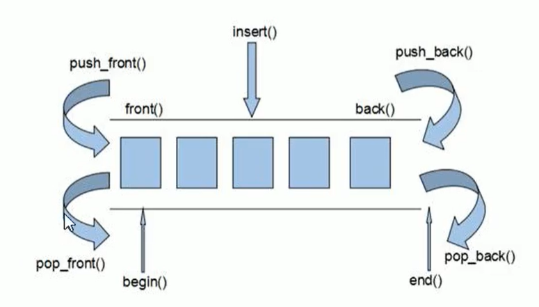

deque内部工作原理:

deque内部有个**中控器**，维护每段缓冲区中的内容，缓冲区中存放真实数据

中控器维护的是每个缓冲区的地址，使得使用deque时像一片连续的内存空间

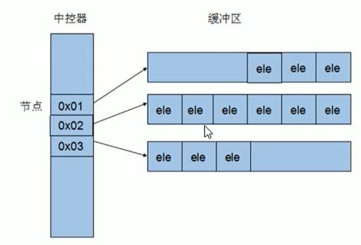

- deque容器的迭代器也是支持随机访问的

#### deque构造函数

**功能描述：**

- deque容器构造

**函数原型：**

- `deque<T>` deqT; //默认构造形式
- `deque(beg, end);` //构造函数将[beg, end)区间中的元素拷贝给本身。
- `deque(n, elem);` //构造函数将n个elem拷贝给本身。
- `deque(const deque &deq);` //拷贝构造函数

```Cpp

//deque构造
void test01() {

	deque<int> d1; //无参构造函数
	for (int i = 0; i < 10; i++)
	{
		d1.push_back(i);
	}
	printDeque(d1);
	deque<int> d2(d1.begin(),d1.end());
	printDeque(d2);

	deque<int>d3(10,100);
	printDeque(d3);

	deque<int>d4 = d3;
	printDeque(d4);
}

int main() {

	test01();

	system("pause");

	return 0;
}
```

迭代器要分普通迭代器和const迭代器，如果传入的容器是const的，那么对应迭代器也要const的。

#### deque赋值操作

**功能描述：**

- 给deque容器进行赋值

**函数原型：**

- `deque& operator=(const deque &deq);` //重载等号操作符
- `assign(beg, end);` //将[beg, end)区间中的数据拷贝赋值给本身。
- `assign(n, elem);` //将n个elem拷贝赋值给本身。

```Cpp
	cout << *it << " ";

	}
	cout << endl;
}
//赋值操作
void test01()
{
	deque<int> d1;
	for (int i = 0; i < 10; i++)
	{
		d1.push_back(i);
	}
	printDeque(d1);

	deque<int>d2;
	d2 = d1;
	printDeque(d2);

	deque<int>d3;
	d3.assign(d1.begin(), d1.end());
	printDeque(d3);

	deque<int>d4;
	d4.assign(10, 100);
	printDeque(d4);

}

int main() {

	test01();

	system("pause");

	return 0;
}
```

#### deque大小操作

**功能描述：**

- 对deque容器的大小进行操作

**函数原型：**

- `deque.empty();` //判断容器是否为空

- `deque.size();` //返回容器中元素的个数

- `deque.resize(num);` //重新指定容器的长度为num,若容器变长，则以默认值填充新位置。

   //如果容器变短，则末尾超出容器长度的元素被删除。

- `deque.resize(num, elem);` //重新指定容器的长度为num,若容器变长，则以elem值填充新位置。

   //如果容器变短，则末尾超出容器长度的元素被删除。

```Cpp
#include <deque>

void printDeque(const deque<int>& d) 
{
	for (deque<int>::const_iterator it = d.begin(); it != d.end(); it++) {
		cout << *it << " ";

	}
	cout << endl;
}

//大小操作
void test01()
{
	deque<int> d1;
	for (int i = 0; i < 10; i++)
	{
		d1.push_back(i);
	}
	printDeque(d1);

	//判断容器是否为空
	if (d1.empty()) {
		cout << "d1为空!" << endl;
	}
	else {
		cout << "d1不为空!" << endl;
		//统计大小
		cout << "d1的大小为：" << d1.size() << endl;
	}

	//重新指定大小
	d1.resize(15, 1);
	printDeque(d1);

	d1.resize(5);
	printDeque(d1);
}

int main() {

	test01();

	system("pause");

	return 0;
}
```

总结：

- deque没有容量的概念
- 判断是否为空 — empty
- 返回元素个数 — size
- 重新指定个数 — resize

#### deque插入和删除

**功能描述：**

- 向deque容器中插入和删除数据

**函数原型：**

两端插入操作：

- `push_back(elem);` //在容器尾部添加一个数据
- `push_front(elem);` //在容器头部插入一个数据
- `pop_back();` //删除容器最后一个数据
- `pop_front();` //删除容器第一个数据

指定位置操作：

- `insert(pos,elem);` //在pos位置插入一个elem元素的拷贝，返回新数据的位置。
- `insert(pos,n,elem);` //在pos位置插入n个elem数据，无返回值。
- `insert(pos,beg,end);` //在pos位置插入[beg,end)区间的数据，无返回值。
- `clear();` //清空容器的所有数据
- `erase(beg,end);` //删除[beg,end)区间的数据，返回下一个数据的位置。
- `erase(pos);` //删除pos位置的数据，返回下一个数据的位置。

```Cpp
#include <deque>

void printDeque(const deque<int>& d) 
{
	for (deque<int>::const_iterator it = d.begin(); it != d.end(); it++) {
		cout << *it << " ";

	}
	cout << endl;
}
//两端操作
void test01()
{
	deque<int> d;
	//尾插
	d.push_back(10);
	d.push_back(20);
	//头插
	d.push_front(100);
	d.push_front(200);

	printDeque(d);

	//尾删
	d.pop_back();
	//头删
	d.pop_front();
	printDeque(d);
}

//插入
void test02()
{
	deque<int> d;
	d.push_back(10);
	d.push_back(20);
	d.push_front(100);
	d.push_front(200);
	printDeque(d);

	d.insert(d.begin(), 1000);
	printDeque(d);

	d.insert(d.begin(), 2,10000);
	printDeque(d);

	deque<int>d2;
	d2.push_back(1);
	d2.push_back(2);
	d2.push_back(3);

	d.insert(d.begin(), d2.begin(), d2.end());
	printDeque(d);

}

//删除
void test03()
{
	deque<int> d;
	d.push_back(10);
	d.push_back(20);
	d.push_front(100);
	d.push_front(200);
	printDeque(d);

	d.erase(d.begin());
	printDeque(d);

	d.erase(d.begin(), d.end());
	d.clear();
	printDeque(d);
}

int main() {

	//test01();

	//test02();

    test03();
    
	system("pause");

	return 0;
}
```

总结：

- 插入和删除提供的位置是迭代器！
- 尾插 — push_back
- 尾删 — pop_back
- 头插 — push_front
- 头删 — pop_front

#### deque数据存取

**功能描述：**

- 对deque 中的数据的存取操作

**函数原型：**

- `at(int idx);` //返回索引idx所指的数据
- `operator[];` //返回索引idx所指的数据
- `front();` //返回容器中第一个数据元素
- `back();` //返回容器中最后一个数据元素

```Cpp
#include <deque>

void printDeque(const deque<int>& d) 
{
	for (deque<int>::const_iterator it = d.begin(); it != d.end(); it++) {
		cout << *it << " ";

	}
	cout << endl;
}

//数据存取
void test01()
{

	deque<int> d;
	d.push_back(10);
	d.push_back(20);
	d.push_front(100);
	d.push_front(200);

	for (int i = 0; i < d.size(); i++) {
		cout << d[i] << " ";
	}
	cout << endl;


	for (int i = 0; i < d.size(); i++) {
		cout << d.at(i) << " ";
	}
	cout << endl;

	cout << "front:" << d.front() << endl;

	cout << "back:" << d.back() << endl;

}

int main() {

	test01();

	system("pause");

	return 0;
}
```

总结：

- 除了用迭代器获取deque容器中元素，[ ]和at也可以
- front返回容器第一个元素
- back返回容器最后一个元素

#### deque排序

**功能描述：**

- 利用算法实现对deque容器进行排序

**算法：**

- `sort(iterator beg, iterator end)` //对beg和end区间内元素进行排序

```Cpp
#include <deque>
#include <algorithm>

void printDeque(const deque<int>& d) 
{
	for (deque<int>::const_iterator it = d.begin(); it != d.end(); it++) {
		cout << *it << " ";

	}
	cout << endl;
}

void test01()
{

	deque<int> d;
	d.push_back(10);
	d.push_back(20);
	d.push_front(100);
	d.push_front(200);

	printDeque(d);
	sort(d.begin(), d.end());
	printDeque(d);

}

int main() {

	test01();

	system("pause");

	return 0;
}
```

总结：sort算法非常实用，使用时包含头文件 algorithm即可

### stack容器

#### stack 基本概念

**概念：**stack是一种**先进后出**(First In Last Out,FILO)的数据结构，它只有一个出口

栈中只有顶端的元素才可以被外界使用，因此栈不允许有遍历行为

栈中进入数据称为 — **入栈** `push`

栈中弹出数据称为 — **出栈** `pop`

#### stack 常用接口

功能描述：栈容器常用的对外接口

构造函数：

- `stack<T> stk;` //stack采用模板类实现， stack对象的默认构造形式
- `stack(const stack &stk);` //拷贝构造函数

赋值操作：

- `stack& operator=(const stack &stk);` //重载等号操作符

数据存取：

- `push(elem);` //向栈顶添加元素
- `pop();` //从栈顶移除第一个元素
- `top();` //返回栈顶元素

大小操作：

- `empty();` //判断堆栈是否为空
- `size();` //返回栈的大小

**示例：**

```C++
#include <stack>

//栈容器常用接口
void test01()
{
	//创建栈容器 栈容器必须符合先进后出
	stack<int> s;

	//向栈中添加元素，叫做 压栈 入栈
	s.push(10);
	s.push(20);
	s.push(30);

	while (!s.empty()) {
		//输出栈顶元素
		cout << "栈顶元素为： " << s.top() << endl;
		//弹出栈顶元素
		s.pop();
	}
	cout << "栈的大小为：" << s.size() << endl;

}

int main() {

	test01();

	system("pause");

	return 0;
}
```

总结：

- 入栈 — push
- 出栈 — pop
- 返回栈顶 — top
- 判断栈是否为空 — empty
- 返回栈大小 — size

### queue容器

#### queue 基本概念

**概念：**Queue是一种**先进先出**(First In First Out,FIFO)的数据结构，它有两个出口

队列容器允许从一端新增元素，从另一端移除元素

队列中只有队头和队尾才可以被外界使用，因此队列不允许有遍历行为

队列中进数据称为 — **入队** `push`

队列中出数据称为 — **出队** `pop`

#### queue 常用接口

功能描述：栈容器常用的对外接口

构造函数：

- `queue<T> que;` //queue采用模板类实现，queue对象的默认构造形式
- `queue(const queue &que);` //拷贝构造函数

赋值操作：

- `queue& operator=(const queue &que);` //重载等号操作符

数据存取：

- `push(elem);` //往队尾添加元素
- `pop();` //从队头移除第一个元素
- `back();` //返回最后一个元素
- `front();` //返回第一个元素

大小操作：

- `empty();` //判断堆栈是否为空
- `size();` //返回栈的大小

**示例：**

```C++
#include <queue>
#include <string>
class Person
{
public:
	Person(string name, int age)
	{
		this->m_Name = name;
		this->m_Age = age;
	}

	string m_Name;
	int m_Age;
};

void test01() {

	//创建队列
	queue<Person> q;

	//准备数据
	Person p1("唐僧", 30);
	Person p2("孙悟空", 1000);
	Person p3("猪八戒", 900);
	Person p4("沙僧", 800);

	//向队列中添加元素  入队操作
	q.push(p1);
	q.push(p2);
	q.push(p3);
	q.push(p4);

	//队列不提供迭代器，更不支持随机访问	
	while (!q.empty()) {
		//输出队头元素
		cout << "队头元素-- 姓名： " << q.front().m_Name 
              << " 年龄： "<< q.front().m_Age << endl;
        
		cout << "队尾元素-- 姓名： " << q.back().m_Name  
              << " 年龄： " << q.back().m_Age << endl;
        
		cout << endl;
		//弹出队头元素
		q.pop();
	}

	cout << "队列大小为：" << q.size() << endl;
}

int main() {

	test01();

	system("pause");

	return 0;
}
```

总结：

- 入队 — push
- 出队 — pop
- 返回队头元素 — front
- 返回队尾元素 — back
- 判断队是否为空 — empty
- 返回队列大小 — size

### list容器

#### list基本概念

**功能：**将数据进行链式存储

**链表**（list）是一种物理存储单元上非连续的存储结构，数据元素的逻辑顺序是通过链表中的指针链接实现的

链表的组成：链表由一系列**结点**组成

结点的组成：一个是存储数据元素的**数据域**，另一个是存储下一个结点地址的**指针域**

STL中的链表是一个双向循环链表，由于链表的存储方式并不是连续的内存空间，因此链表list中的迭代器只支持前移和后移，属于**双向迭代器**：

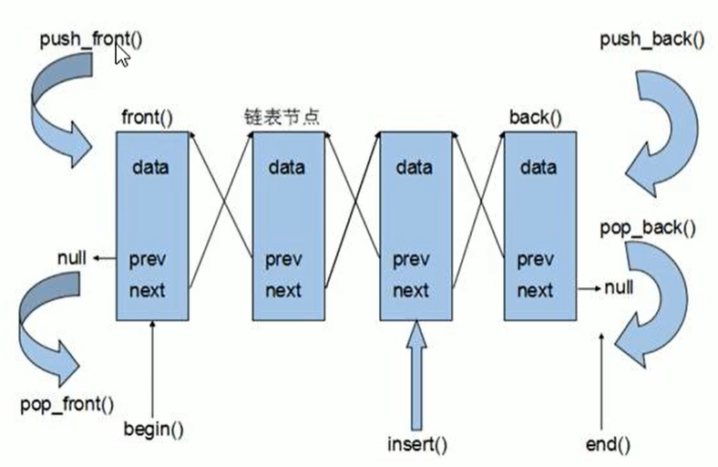

list的优点：

- 采用动态存储分配，不会造成内存浪费和溢出
- 链表执行插入和删除操作十分方便，修改指针即可，不需要移动大量元素

list的缺点：

- 链表灵活，但是空间(指针域) 和 时间（遍历）额外耗费较大

List有一个重要的性质，插入操作和删除操作都不会造成原有list迭代器的失效，这在vector是不成立的。

总结：STL中**List和vector是两个最常被使用的容器**，各有优缺点

*如何理解list中添加或删除元素后迭代器不失效而vector会失效：list每一个节点是由数据域和指针域组成，增加或者删除元素只会改变指针域里的指针而不会改变节点位置，但vector增加元素会重新分配内存拷贝数据，因此原有的迭代器失效（将迭代器理解为指针）*

#### list构造函数

**功能描述：**

- 创建list容器

**函数原型：**

- `list<T> lst;` //list采用采用模板类实现,对象的默认构造形式：
- `list(beg,end);` //构造函数将[beg, end)区间中的元素拷贝给本身。
- `list(n,elem);` //构造函数将n个elem拷贝给本身。
- `list(const list &lst);` //拷贝构造函数。

**示例：**

```C++
#include <list>

void printList(const list<int>& L) {

	for (list<int>::const_iterator it = L.begin(); it != L.end(); it++) {
		cout << *it << " ";
	}
	cout << endl;
}

void test01()
{
	list<int>L1;
	L1.push_back(10);
	L1.push_back(20);
	L1.push_back(30);
	L1.push_back(40);

	printList(L1);

	list<int>L2(L1.begin(),L1.end());
	printList(L2);

	list<int>L3(L2);
	printList(L3);

	list<int>L4(10, 1000);
	printList(L4);
}

int main() {

	test01();

	system("pause");

	return 0;
}
```

总结：list构造方式同其他几个STL常用容器，熟练掌握即可

#### list 赋值和交换

**功能描述：**

- 给list容器进行赋值，以及交换list容器

**函数原型：**

- `assign(beg, end);` //将[beg, end)区间中的数据拷贝赋值给本身。
- `assign(n, elem);` //将n个elem拷贝赋值给本身。
- `list& operator=(const list &lst);` //重载等号操作符
- `swap(lst);` //将lst与本身的元素互换。

**示例：**

```C++
#include <list>

void printList(const list<int>& L) {

	for (list<int>::const_iterator it = L.begin(); it != L.end(); it++) {
		cout << *it << " ";
	}
	cout << endl;
}

//赋值和交换
void test01()
{
	list<int>L1;
	L1.push_back(10);
	L1.push_back(20);
	L1.push_back(30);
	L1.push_back(40);
	printList(L1);

	//赋值
	list<int>L2;
	L2 = L1;
	printList(L2);

	list<int>L3;
	L3.assign(L2.begin(), L2.end());
	printList(L3);

	list<int>L4;
	L4.assign(10, 100);
	printList(L4);

}

//交换
void test02()
{

	list<int>L1;
	L1.push_back(10);
	L1.push_back(20);
	L1.push_back(30);
	L1.push_back(40);

	list<int>L2;
	L2.assign(10, 100);

	cout << "交换前： " << endl;
	printList(L1);
	printList(L2);

	cout << endl;

	L1.swap(L2);

	cout << "交换后： " << endl;
	printList(L1);
	printList(L2);

}

int main() {

	//test01();

	test02();

	system("pause");

	return 0;
}
```

总结：list赋值和交换操作能够灵活运用即可

#### list 大小操作

**功能描述：**

- 对list容器的大小进行操作

**函数原型：**

- `size();` //返回容器中元素的个数

- `empty();` //判断容器是否为空

- `resize(num);` //重新指定容器的长度为num，若容器变长，则以默认值填充新位置。

   //如果容器变短，则末尾超出容器长度的元素被删除。

- `resize(num, elem);` //重新指定容器的长度为num，若容器变长，则以elem值填充新位置。

  ```
  //如果容器变短，则末尾超出容器长度的元素被删除。
  ```

**示例：**

```C++
#include <list>

void printList(const list<int>& L) {

	for (list<int>::const_iterator it = L.begin(); it != L.end(); it++) {
		cout << *it << " ";
	}
	cout << endl;
}

//大小操作
void test01()
{
	list<int>L1;
	L1.push_back(10);
	L1.push_back(20);
	L1.push_back(30);
	L1.push_back(40);

	if (L1.empty())
	{
		cout << "L1为空" << endl;
	}
	else
	{
		cout << "L1不为空" << endl;
		cout << "L1的大小为： " << L1.size() << endl;
	}

	//重新指定大小
	L1.resize(10);
	printList(L1);

	L1.resize(2);
	printList(L1);
}

int main() {

	test01();

	system("pause");

	return 0;
}
```

总结：

- 判断是否为空 — empty
- 返回元素个数 — size
- 重新指定个数 — resize

#### list 插入和删除

**功能描述：**

- 对list容器进行数据的插入和删除

**函数原型：**

- push_back(elem);//在容器尾部加入一个元素
- pop_back();//删除容器中最后一个元素
- push_front(elem);//在容器开头插入一个元素
- pop_front();//从容器开头移除第一个元素
- insert(pos,elem);//在pos位置插elem元素的拷贝，返回新数据的位置。
- insert(pos,n,elem);//在pos位置插入n个elem数据，无返回值。
- insert(pos,beg,end);//在pos位置插入[beg,end)区间的数据，无返回值。
- clear();//移除容器的所有数据
- erase(beg,end);//删除[beg,end)区间的数据，返回下一个数据的位置。
- erase(pos);//删除pos位置的数据，返回下一个数据的位置。
- remove(elem);//删除容器中<strong style="color:#126bae;">所有</strong>与elem值匹配的元素。

**示例：**

```C++
#include <list>

void printList(const list<int>& L) {

	for (list<int>::const_iterator it = L.begin(); it != L.end(); it++) {
		cout << *it << " ";
	}
	cout << endl;
}

//插入和删除
void test01()
{
	list<int> L;
	//尾插
	L.push_back(10);
	L.push_back(20);
	L.push_back(30);
	//头插
	L.push_front(100);
	L.push_front(200);
	L.push_front(300);

	printList(L);

	//尾删
	L.pop_back();
	printList(L);

	//头删
	L.pop_front();
	printList(L);

	//插入
	list<int>::iterator it = L.begin();
	L.insert(++it, 1000);
	printList(L);

	//删除
	it = L.begin();
	L.erase(++it);
	printList(L);

	//移除
	L.push_back(10000);
	L.push_back(10000);
	L.push_back(10000);
	printList(L);
	L.remove(10000);
	printList(L);
    
    //清空
	L.clear();
	printList(L);
}

int main() {

	test01();

	system("pause");

	return 0;
}
```

#### list数据存取

list不能通过[]或者at来访问元素，因为它的实现原理是链表，而不是连续的存储空间，它的迭代器也不支持随机访问。

**功能描述：**

- 对list容器中数据进行存取

**函数原型：**

- `front();` //返回第一个元素。
- `back();` //返回最后一个元素。

**示例：**

```C++
#include <list>

//数据存取
void test01()
{
	list<int>L1;
	L1.push_back(10);
	L1.push_back(20);
	L1.push_back(30);
	L1.push_back(40);

	
	//cout << L1.at(0) << endl;//错误 不支持at访问数据
	//cout << L1[0] << endl; //错误  不支持[]方式访问数据
	cout << "第一个元素为： " << L1.front() << endl;
	cout << "最后一个元素为： " << L1.back() << endl;

	//list容器的迭代器是双向迭代器，不支持随机访问
	list<int>::iterator it = L1.begin();
	//it = it + 1;//错误，不可以跳跃访问，即使是+1
}

int main() {

	test01();

	system("pause");

	return 0;
}
```

总结：

- list容器中不可以通过[]或者at方式访问数据
- 返回第一个元素 — front
- 返回最后一个元素 — back

#### list 反转和排序

**功能描述：**

- 将容器中的元素反转，以及将容器中的数据进行排序

**函数原型：**

- `reverse();` //反转链表
- `sort();` //链表排序

**示例：**

```C++
void printList(const list<int>& L) {

	for (list<int>::const_iterator it = L.begin(); it != L.end(); it++) {
		cout << *it << " ";
	}
	cout << endl;
}

bool myCompare(int val1 , int val2)
{
	return val1 > val2;
}

//反转和排序
void test01()
{
	list<int> L;
	L.push_back(90);
	L.push_back(30);
	L.push_back(20);
	L.push_back(70);
	printList(L);

	//反转容器的元素
	L.reverse();
	printList(L);

	//排序
	L.sort(); //默认的排序规则 从小到大
	printList(L);

	L.sort(myCompare); //指定规则，从大到小
	printList(L);
}

int main() {

	test01();

	system("pause");

	return 0;
}
```

总结：

- 反转 — reverse
- 排序 — sort （<strong style="color:#126bae;">成员函数</strong>，不是algorithm中的全局函数）

#### 排序案例

案例描述：将Person自定义数据类型进行排序，Person中属性有姓名、年龄、身高

排序规则：按照年龄进行升序，如果年龄相同按照身高进行降序

**示例：**

```C++
#include <list>
#include <string>
class Person {
public:
	Person(string name, int age , int height) {
		m_Name = name;
		m_Age = age;
		m_Height = height;
	}

public:
	string m_Name;  //姓名
	int m_Age;      //年龄
	int m_Height;   //身高
};


bool ComparePerson(Person& p1, Person& p2) {    // 高级排序

	if (p1.m_Age == p2.m_Age) {
		return p1.m_Height  > p2.m_Height;
	}
	else
	{
		return  p1.m_Age < p2.m_Age;
	}

}

void test01() {

	list<Person> L;

	Person p1("刘备", 35 , 175);
	Person p2("曹操", 45 , 180);
	Person p3("孙权", 40 , 170);
	Person p4("赵云", 25 , 190);
	Person p5("张飞", 35 , 160);
	Person p6("关羽", 35 , 200);

	L.push_back(p1);
	L.push_back(p2);
	L.push_back(p3);
	L.push_back(p4);
	L.push_back(p5);
	L.push_back(p6);

	for (list<Person>::iterator it = L.begin(); it != L.end(); it++) {
		cout << "姓名： " << it->m_Name << " 年龄： " << it->m_Age 
              << " 身高： " << it->m_Height << endl;
	}

	cout << "---------------------------------" << endl;
	L.sort(ComparePerson); //排序

	for (list<Person>::iterator it = L.begin(); it != L.end(); it++) {
		cout << "姓名： " << it->m_Name << " 年龄： " << it->m_Age 
              << " 身高： " << it->m_Height << endl;
	}
}

int main() {

	test01();

	system("pause");

	return 0;
}
```

总结：

- 对于自定义数据类型，必须要指定排序规则，否则编译器不知道如何进行排序
- <strong style="color:#126bae;">高级排序</strong>只是在排序规则上再进行一次逻辑规则制定，并不复杂

### set/ multiset 容器

#### set基本概念

**简介：**

- 所有元素都会在插入时自动被排序

**本质：**

- set/multiset属于**关联式容器**，底层结构是用**二叉树**实现。

**set和multiset区别**：

- set不允许容器中有重复的元素
- multiset允许容器中有重复的元素

#### set构造和赋值

功能描述：创建set容器以及赋值

构造：

- `set<T> st;` //默认构造函数：
- `set(const set &st);` //拷贝构造函数

赋值：

- `set& operator=(const set &st);` //重载等号操作符

**示例：**

```C++
#include <set>

void printSet(set<int> & s)
{
	for (set<int>::iterator it = s.begin(); it != s.end(); it++)
	{
		cout << *it << " ";
	}
	cout << endl;
}

//构造和赋值
void test01()
{
	set<int> s1;

	s1.insert(10);
	s1.insert(30);
	s1.insert(20);
	s1.insert(40);
	printSet(s1);

	//拷贝构造
	set<int>s2(s1);
	printSet(s2);

	//赋值
	set<int>s3;
	s3 = s2;
	printSet(s3);
}

int main() {

	test01();

	system("pause");

	return 0;
}
```

总结：

- set容器插入数据时用insert
- set容器插入数据的数据会自动排序

#### set大小和交换

**功能描述：**

- 统计set容器大小以及交换set容器

**函数原型：**

- `size();` //返回容器中元素的数目
- `empty();` //判断容器是否为空
- `swap(st);` //交换两个集合容器

**示例：**

```C++
#include <set>

void printSet(set<int> & s)
{
	for (set<int>::iterator it = s.begin(); it != s.end(); it++)
	{
		cout << *it << " ";
	}
	cout << endl;
}

//大小
void test01()
{

	set<int> s1;
	
	s1.insert(10);
	s1.insert(30);
	s1.insert(20);
	s1.insert(40);

	if (s1.empty())
	{
		cout << "s1为空" << endl;
	}
	else
	{
		cout << "s1不为空" << endl;
		cout << "s1的大小为： " << s1.size() << endl;
	}

}

//交换
void test02()
{
	set<int> s1;

	s1.insert(10);
	s1.insert(30);
	s1.insert(20);
	s1.insert(40);

	set<int> s2;

	s2.insert(100);
	s2.insert(300);
	s2.insert(200);
	s2.insert(400);

	cout << "交换前" << endl;
	printSet(s1);
	printSet(s2);
	cout << endl;

	cout << "交换后" << endl;
	s1.swap(s2);
	printSet(s1);
	printSet(s2);
}

int main() {

	//test01();

	test02();

	system("pause");

	return 0;
}
```

总结：

- 统计大小 — size
- 判断是否为空 — empty
- 交换容器 — swap

#### set插入和删除

**功能描述：**

- set容器进行插入数据和删除数据

**函数原型：**

- `insert(elem);` //在容器中插入元素。
- `clear();` //清除所有元素
- `erase(pos);` //删除pos迭代器所指的元素，返回下一个元素的迭代器。
- `erase(beg, end);` //删除区间[beg,end)的所有元素 ，返回下一个元素的迭代器。
- `erase(elem);` //删除容器中值为elem的元素。

**示例：**

```C++
#include <set>

void printSet(set<int> & s)
{
	for (set<int>::iterator it = s.begin(); it != s.end(); it++)
	{
		cout << *it << " ";
	}
	cout << endl;
}

//插入和删除
void test01()
{
	set<int> s1;
	//插入
	s1.insert(10);
	s1.insert(30);
	s1.insert(20);
	s1.insert(40);
	printSet(s1);

	//删除
	s1.erase(s1.begin());
	printSet(s1);

	s1.erase(30);
	printSet(s1);

	//清空
	//s1.erase(s1.begin(), s1.end());
	s1.clear();
	printSet(s1);
}

int main() {

	test01();

	system("pause");

	return 0;
}
```

总结：

- 插入 — insert
- 删除 — erase
- 清空 — clear

#### set查找和统计

**功能描述：**

- 对set容器进行查找数据以及统计数据

**函数原型：**

- `find(key);` //查找key是否存在,若存在，返回该键的元素的迭代器；若不存在，返回set.end();
- `count(key);` //统计key的元素个数

**示例：**

```C++
#include <set>

//查找和统计
void test01()
{
	set<int> s1;
	//插入
	s1.insert(10);
	s1.insert(30);
	s1.insert(20);
	s1.insert(40);
	
	//查找
	set<int>::iterator pos = s1.find(30);

	if (pos != s1.end())
	{
		cout << "找到了元素 ： " << *pos << endl;
	}
	else
	{
		cout << "未找到元素" << endl;
	}

	//统计
	int num = s1.count(30);
	cout << "num = " << num << endl;
}

int main() {

	test01();

	system("pause");

	return 0;
}
```

总结：

- 查找 — find （返回的是迭代器）
- 统计 — count （对于set，结果为0或者1）

#### set和multiset区别

**学习目标：**

- 掌握set和multiset的区别

**区别：**

- set不可以插入重复数据，而multiset可以
- set插入数据的同时会返回插入结果，表示插入是否成功
- multiset不会检测数据，因此可以插入重复数据

**示例：**

```C++
#include <set>

//set和multiset区别
void test01()
{
	set<int> s;
	pair<set<int>::iterator, bool>  ret = s.insert(10);
	if (ret.second) {
		cout << "第一次插入成功!" << endl;
	}
	else {
		cout << "第一次插入失败!" << endl;
	}

	ret = s.insert(10);
	if (ret.second) {
		cout << "第二次插入成功!" << endl;
	}
	else {
		cout << "第二次插入失败!" << endl;
	}
    
	//multiset
	multiset<int> ms;
	ms.insert(10);
	ms.insert(10);

	for (multiset<int>::iterator it = ms.begin(); it != ms.end(); it++) {
		cout << *it << " ";
	}
	cout << endl;
}

int main() {

	test01();

	system("pause");

	return 0;
}
```

总结：

- 如果不允许插入重复数据可以利用set
- 如果需要插入重复数据利用multiset

#### pair对组创建

**功能描述：**

- 成对出现的数据，利用对组可以返回两个数据

**两种创建方式：**

- `pair<type, type> p ( value1, value2 );`
- `pair<type, type> p = make_pair( value1, value2 );`

**示例：**

```C++
#include <string>

//对组创建
void test01()
{
	pair<string, int> p(string("Tom"), 20);
	cout << "姓名： " <<  p.first << " 年龄： " << p.second << endl;

	pair<string, int> p2 = make_pair("Jerry", 10);
	cout << "姓名： " << p2.first << " 年龄： " << p2.second << endl;
}

int main() {

	test01();

	system("pause");

	return 0;
}
```

总结：

两种方式都可以创建对组，记住一种即可

#### set容器排序

学习目标：

- set容器默认排序规则为从小到大，掌握如何改变排序规则

主要技术点：

- 利用仿函数，可以改变排序规则

**示例一** set存放内置数据类型

```C++
#include <set>

class MyCompare 
{
public:
	bool operator()(int v1, int v2) {
		return v1 > v2;
	}
};
void test01() 
{    
	set<int> s1;
	s1.insert(10);
	s1.insert(40);
	s1.insert(20);
	s1.insert(30);
	s1.insert(50);

	//默认从小到大
	for (set<int>::iterator it = s1.begin(); it != s1.end(); it++) {
		cout << *it << " ";
	}
	cout << endl;

	//指定排序规则
	set<int,MyCompare> s2;
	s2.insert(10);
	s2.insert(40);
	s2.insert(20);
	s2.insert(30);
	s2.insert(50);

	for (set<int, MyCompare>::iterator it = s2.begin(); it != s2.end(); it++) {
		cout << *it << " ";
	}
	cout << endl;
}

int main() {

	test01();

	system("pause");

	return 0;
}
```

总结：利用仿函数可以指定set容器的排序规则

**但是利用仿函数写法还是不够简洁，建议直接在被装入set的类中重新实现 `<`符号：**

**这里需要注意operator < 重载时两个const一定不能省略！**

```cpp
#include <bits/stdc++.h>
using namespace std;

typedef class Node {
public:
    Node(int v) : val(v) {}
    int val;
    bool operator < (const Node& rhs) const { // 两个const不能省略 否则编译不过
        return val < rhs.val;
    }
} Node;


int main()
{
    set<Node> st;
    st.insert(Node(2));
    st.insert(Node(4));
    st.insert(Node(1));
    cout << (*st.begin()).val << endl;
    return 0;
}
```

打印：1

**示例二** set存放自定义数据类型

```C++
#include <set>
#include <string>

class Person
{
public:
	Person(string name, int age)
	{
		this->m_Name = name;
		this->m_Age = age;
	}

	string m_Name;
	int m_Age;

};
class comparePerson
{
public:
	bool operator()(const Person& p1, const Person &p2)
	{
		//按照年龄进行排序  降序
		return p1.m_Age > p2.m_Age;
	}
};

void test01()
{
	set<Person, comparePerson> s;

	Person p1("刘备", 23);
	Person p2("关羽", 27);
	Person p3("张飞", 25);
	Person p4("赵云", 21);

	s.insert(p1);
	s.insert(p2);
	s.insert(p3);
	s.insert(p4);

	for (set<Person, comparePerson>::iterator it = s.begin(); it != s.end(); it++)
	{
		cout << "姓名： " << it->m_Name << " 年龄： " << it->m_Age << endl;
	}
}
int main() {

	test01();

	system("pause");

	return 0;
}
```

总结：

对于自定义数据类型，set必须指定排序规则才可以插入数据

#### unordered_set

底层基于hash，unordered_set可以用来记录某个元素**曾经是否被记录过**：

```Cpp
#include<unordered_set>
#include<iostream>
using namespace std;
int main(int argc, char* argv[])
{
	unordered_set<char> occ;
	occ.insert('a');
	cout << (occ.find('a')!=occ.end()) << endl;
}
```

**去重：**

```Cpp
int main() {

	unordered_set<int> s;
	vector<int> v = { 1,1,2,3 };
	s = unordered_set<int>(v.begin(), v.end()); 
	
	for (auto it = s.begin(); it != s.end(); ++it) {
		cout << *it << endl;
	}
	return 0;
}
```


### map/ multimap容器

#### map基本概念

**简介：**

- map中所有元素都是pair
- pair中第一个元素为key（键值），起到索引作用，第二个元素为value（实值）
- 所有元素都会根据元素的键值自动排序

**本质：**

- map/multimap属于**关联式容器**，底层结构是用二叉树实现。

**优点：**

- 可以根据key值快速找到value值

map和multimap**区别**：

- map不允许容器中有重复key值元素
- multimap允许容器中有重复key值元素

#### map构造和赋值

**功能描述：**

- 对map容器进行构造和赋值操作

**函数原型：**

**构造：**

- `map<T1, T2> mp;` //map默认构造函数:
- `map(const map &mp);` //拷贝构造函数

**赋值：**

- `map& operator=(const map &mp);` //重载等号操作符

**示例：**

```C++
#include <map>

void printMap(map<int,int>&m)
{
	for (map<int, int>::iterator it = m.begin(); it != m.end(); it++)
	{
		cout << "key = " << it->first << " value = " << it->second << endl;
	}
	cout << endl;
}

void test01()
{
	map<int,int>m; //默认构造
	m.insert(pair<int, int>(1, 10));
	m.insert(pair<int, int>(2, 20));
	m.insert(pair<int, int>(3, 30));
	printMap(m);

	map<int, int>m2(m); //拷贝构造
	printMap(m2);

	map<int, int>m3;
	m3 = m2; //赋值
	printMap(m3);
}

int main() {

	test01();

	system("pause");

	return 0;
}
```

总结：map中所有元素都是成对出现，插入数据时候要使用对组

#### map大小和交换

**功能描述：**

- 统计map容器大小以及交换map容器

函数原型：

- `size();` //返回容器中元素的数目
- `empty();` //判断容器是否为空
- `swap(st);` //交换两个集合容器

**示例：**

```C++
#include <map>

void printMap(map<int,int>&m)
{
	for (map<int, int>::iterator it = m.begin(); it != m.end(); it++)
	{
		cout << "key = " << it->first << " value = " << it->second << endl;
	}
	cout << endl;
}

void test01()
{
	map<int, int>m;
	m.insert(pair<int, int>(1, 10));
	m.insert(pair<int, int>(2, 20));
	m.insert(pair<int, int>(3, 30));

	if (m.empty())
	{
		cout << "m为空" << endl;
	}
	else
	{
		cout << "m不为空" << endl;
		cout << "m的大小为： " << m.size() << endl;
	}
}


//交换
void test02()
{
	map<int, int>m;
	m.insert(pair<int, int>(1, 10));
	m.insert(pair<int, int>(2, 20));
	m.insert(pair<int, int>(3, 30));

	map<int, int>m2;
	m2.insert(pair<int, int>(4, 100));
	m2.insert(pair<int, int>(5, 200));
	m2.insert(pair<int, int>(6, 300));

	cout << "交换前" << endl;
	printMap(m);
	printMap(m2);

	cout << "交换后" << endl;
	m.swap(m2);
	printMap(m);
	printMap(m2);
}

int main() {

	test01();

	test02();

	system("pause");

	return 0;
}
```

总结：

- 统计大小 — size
- 判断是否为空 — empty
- 交换容器 — swap

#### map插入和删除

**功能描述：**

- map容器进行插入数据和删除数据

**函数原型：**

- `insert(elem);` //在容器中插入元素。
- `clear();` //清除所有元素
- `erase(pos);` //删除pos迭代器所指的元素，返回下一个元素的迭代器。
- `erase(beg, end);` //删除区间[beg,end)的所有元素 ，返回下一个元素的迭代器。
- `erase(key);` //删除容器中值为key的元素。

**示例：**

```C++
#include <map>

void printMap(map<int,int>&m)
{
	for (map<int, int>::iterator it = m.begin(); it != m.end(); it++)
	{
		cout << "key = " << it->first << " value = " << it->second << endl;
	}
	cout << endl;
}

void test01()
{
	//插入
	map<int, int> m;
	//第一种插入方式
	m.insert(pair<int, int>(1, 10));
	//第二种插入方式
	m.insert(make_pair(2, 20));
	//第三种插入方式
	m.insert(map<int, int>::value_type(3, 30));
	//第四种插入方式
	m[4] = 40; 
	printMap(m);

	//删除
	m.erase(m.begin());
	printMap(m);

	m.erase(3);
	printMap(m);

	//清空
	m.erase(m.begin(),m.end());
	m.clear();
	printMap(m);
}

int main() {

	test01();

	system("pause");

	return 0;
}
```

总结：

- map插入方式很多，记住其一即可

- 插入 — insert
- 删除 — erase
- 清空 — clear
- 不建议用[]插入数据，但是可以用[]访问数据

#### map查找和统计

**功能描述：**

- 对map容器进行查找数据以及统计数据

**函数原型：**

- `find(key);` //查找key是否存在,若存在，返回该键的元素的迭代器；若不存在，返回set.end();
- `count(key);` //统计key的元素个数

**示例：**

```C++
#include <map>

//查找和统计
void test01()
{
	map<int, int>m; 
	m.insert(pair<int, int>(1, 10));
	m.insert(pair<int, int>(2, 20));
	m.insert(pair<int, int>(3, 30));

	//查找
	map<int, int>::iterator pos = m.find(3);

	if (pos != m.end())
	{
		cout << "找到了元素 key = " << (*pos).first << " value = " << (*pos).second << endl;
	}
	else
	{
		cout << "未找到元素" << endl;
	}

	//统计
	int num = m.count(3);
	cout << "num = " << num << endl;
}

int main() {

	test01();

	system("pause");

	return 0;
}
```

总结：

- 查找 — find （返回的是迭代器）
- 统计 — count （对于map，结果为0或者1）

#### map容器排序

**学习目标：**

- map容器默认排序规则为 按照key值进行 从小到大排序，掌握如何改变排序规则

**主要技术点:**

- 利用仿函数，可以改变排序规则

**示例：**

```C++
#include <map>

class MyCompare {
public:
	bool operator()(int v1, int v2) {
		return v1 > v2;
	}
};

void test01() 
{
	//默认从小到大排序
	//利用仿函数实现从大到小排序
	map<int, int, MyCompare> m;

	m.insert(make_pair(1, 10));
	m.insert(make_pair(2, 20));
	m.insert(make_pair(3, 30));
	m.insert(make_pair(4, 40));
	m.insert(make_pair(5, 50));

	for (map<int, int, MyCompare>::iterator it = m.begin(); it != m.end(); it++) {
		cout << "key:" << it->first << " value:" << it->second << endl;
	}
}
int main() {

	test01();

	system("pause");

	return 0;
}
```

总结：

- 利用仿函数可以指定map容器的排序规则
- 对于自定义数据类型，map必须要指定排序规则,同set容器

#### unordered_map

map内部实现红黑树，因此自带排序，而unordered_map是散列表，$O(1)$查找复杂度。

```Cpp
#include<unordered_map>
unordered_map<int,int> m; // 默认构造
```

可以通过如下方式进行插入：

```Cpp
m[2] = 3;
```

如果有2的键，则赋值，没有2则插入；另外m[2]一开始为0！一次用unordered_map做元素计数是不错的选择：`m[element] += 1`

遍历的话和map基本一致：

```Cpp
for (auto it = m.begin();it!=m.end();++it){
    cout<<it->first<<" "<<it->second<<endl;
}
```

当然遍历还有一种更简洁的方式：

```cpp
for (pair<int, int> p : m) { // z
//.........
}
```


**这里补充一个关于unordered_map的天坑：只要在程序中出现了m[key]，无论在判断语句还是哪，map会默认初始化一个key-value键值对，相当于size+1了。坑就是你可能之前删除了这个key但是后面突然又用这个key来判断，然后map又自动增加了这个key。**

<strong style="color:#c04851;">下面这个点注意：</strong>

<strong style="color:red;">如果一个key存在， operator[] 对这个key-value进行重写</strong>
<strong style="color:red;">如果一个key存在， insert 不会对原来的key-value进行重写</strong>

```Cpp
int main()
{
	
	unordered_map<int, int> m;
	m[2] = 1;
	m.insert(pair<int, int>(2, 3));
	cout << m.count(2) << endl;
	cout << m[2] << endl;
	return 0;
}
```

打印结果为：1   1

想找一个key到底在没在map中，可以用count方法结果是否大于0判断：

```Cpp
if (umap.count(num]) > 0)
```

### priority_queue优先队列

普通的队列是一种先进先出的数据结构，元素在队列尾追加，而从队列头删除。

在优先队列中，元素被赋予优先级。当访问元素时，具有最高优先级的元素最先删除。优先队列具有最高级先出 （first in, largest out）的行为特征。

**首先要包含头文件`#include<queue>`**, 他和`queue`不同的就在于我们可以自定义其中数据的优先级, 让优先级高的排在队列前面,优先出队。

优先队列具有队列的所有特性，包括队列的基本操作，只是在这基础上添加了内部的一个排序，它本质是一个堆实现的。

> 和队列基本操作相同:
>
> - top 访问队头元素
> - empty 队列是否为空
> - size 返回队列内元素个数
> - push 插入元素到队尾 (并排序)
> - emplace 原地构造一个元素并插入队列
> - pop 弹出队头元素
> - swap 交换内容

定义：`priority_queue<Type, Container, Functional>`
Type 就是数据类型，Container 就是容器类型（Container必须是用数组实现的容器，比如vector,deque等等，但不能用 list。STL里面默认用的是vector），Functional 就是比较的方式。

当需要用自定义的数据类型时才需要传入这三个参数，使用基本数据类型时，只需要传入数据类型，默认是大顶堆。

```Cpp
//升序队列，小顶堆
priority_queue <int,vector<int>,greater<int> > q;
//降序队列，大顶堆
priority_queue <int,vector<int>,less<int> >q;

//greater和less是std实现的两个仿函数（就是使一个类的使用看上去像一个函数。其实现就是类中实现一个operator()，这个类就有了类似函数的行为，就是一个仿函数类了）
```

#### 基本类型优先队列的例子

```Cpp
#include<iostream>
#include <queue>
using namespace std;
int main()
{
    //对于基础类型 默认是大顶堆
    priority_queue<int> a;
    //等同于 priority_queue<int, vector<int>, less<int> > a;

    //      这里一定要有空格，不然成了右移运算符↓↓
    priority_queue<int, vector<int>, greater<int> > c;  //这样就是小顶堆
    priority_queue<string> b;

    for (int i = 0; i < 5; i++)
    {
        a.push(i);
        c.push(i);
    }
    while (!a.empty())
    {
        cout << a.top() << ' ';
        a.pop();
    }
    cout << endl;

    while (!c.empty())
    {
        cout << c.top() << ' ';
        c.pop();
    }
    cout << endl;

    b.push("abc");
    b.push("abcd");
    b.push("cbd");
    while (!b.empty())
    {
        cout << b.top() << ' ';
        b.pop();
    }
    cout << endl;
    return 0;
}
```

运行结果：

```
4 3 2 1 0
0 1 2 3 4
cbd abcd abc
请按任意键继续. . .
```

#### 用pair做优先队列元素的例子

规则：pair的比较，先比较第一个元素，第一个相等比较第二个。

```Cpp
#include <iostream>
#include <queue>
#include <vector>
using namespace std;
int main()
{
    priority_queue<pair<int, int> > a;
    pair<int, int> b(1, 2);
    pair<int, int> c(1, 3);
    pair<int, int> d(2, 5);
    a.push(d);
    a.push(c);
    a.push(b);
    while (!a.empty())
    {
        cout << a.top().first << ' ' << a.top().second << '\n';
        a.pop();
    }
}
```

运行结果：

```
2 5
1 3
1 2
请按任意键继续. . .
```

这里pair的第二个值完全也可以是自定义类型，那么第一个值就是优先权重。

#### 用自定义类型做优先队列元素的例子

```Cpp
#include <bits/stdc++.h>
using namespace std;

typedef struct {
    string name;
    int w;
} node;

static bool cmp(node& left, node& right) {
    return left.w < right.w;
}

int main() {
    priority_queue<node, vector<node>, decltype(&cmp)> pq(cmp); // key!
    
    pq.push(node{"y", 2});
    pq.push(node{"z", 3});
    pq.push(node{"f", 1});

    while (!pq.empty()) {
        cout << pq.top().name << endl;
        pq.pop();
    }  
    return 0;
}
```

运行结果：

```
z
y
f
```

**这里decltype里面需要加&，但是可以用lambda函数，这样就不需要加&。**

也可以通过重写类的<符号，这样不需要写cmp函数了：

```cpp
#include <bits/stdc++.h>
using namespace std;

class Data {
public:
    int a;
    bool operator<(const Data& right) const{
        return a < right.a; // 这里如果想要成为小顶堆，写成a > right.a即可
    }
};

int main() {
    priority_queue<Data> pq; // 这里通过greater<Data>来调整大小顶堆会编译错误，不知为何
    Data d1, d2;
    d1.a = 1;
    d2.a = 3;
    pq.push(d1);
    pq.push(d2);
    Data c = pq.top();
    cout << c.a; 
    return 0;
}
```


再给出一个例子，这个例子中加入每个人的名称和年龄，利用优先队列自动对年龄排序：

```Cpp
class Compare {
public:
	bool operator()(pair<string, int>& p1, pair<string, int>& p2) {
		return p1.second < p2.second;
	}
};

int main() {
	priority_queue<pair<string, int>, vector<pair<string, int>>, Compare> a;
	a.push(make_pair<string, int>("Zyf",12));
	a.push(make_pair<string, int>("Job", 14));
	a.push(make_pair<string, int>("Bob", 10));

	while (!a.empty()) {
		cout << a.top().first << endl;
		a.pop();
	}

	return 0;
}
```

```Cpp
打印结果：
Job
Zyf
Bob
```

**这里需要注意，我们创建的堆的顶是在“右边”，在写谓词的时候，如果形式是left->val < right->val ，那么意味着左边小右边大，那么就是大顶堆，否则为小顶堆。**

### STL- 函数对象

#### 函数对象

#### 函数对象概念

**概念：**

- 重载**函数调用操作符**的类，其对象常称为**函数对象**
- **函数对象**使用重载的()时，行为类似函数调用，也叫**仿函数**

**本质：**

函数对象(仿函数)是一个**类**，不是一个函数

#### 函数对象使用

**特点：**

- 函数对象在使用时，可以像普通函数那样调用, 可以有参数，可以有返回值
- 函数对象超出普通函数的概念，函数对象可以有自己的状态
- 函数对象可以作为参数传递

**示例:**

```C++
#include <string>

//1、函数对象在使用时，可以像普通函数那样调用, 可以有参数，可以有返回值
class MyAdd
{
public :
	int operator()(int v1,int v2)
	{
		return v1 + v2;
	}
};

void test01()
{
	MyAdd myAdd;
	cout << myAdd(10, 10) << endl;
}

//2、函数对象可以有自己的状态
class MyPrint
{
public:
	MyPrint()
	{
		count = 0;
	}
	void operator()(string test)
	{
		cout << test << endl;
		count++; //统计使用次数
	}

	int count; //内部自己的状态
};
void test02()
{
	MyPrint myPrint;
	myPrint("hello world");
	myPrint("hello world");
	myPrint("hello world");
	cout << "myPrint调用次数为： " << myPrint.count << endl;
}

//3、函数对象可以作为参数传递
void doPrint(MyPrint &mp , string test)
{
	mp(test);
}

void test03()
{
	MyPrint myPrint;
	doPrint(myPrint, "Hello C++");
}

int main() {

	//test01();
	//test02();
	test03();

	system("pause");

	return 0;
}
```

总结：

- 仿函数写法非常灵活，可以作为参数进行传递。

### 谓词

#### 谓词概念

**概念：**

- 返回bool类型的仿函数称为**谓词**
- 如果operator()接受一个参数，那么叫做一元谓词
- 如果operator()接受两个参数，那么叫做二元谓词

#### 一元谓词

**示例：**

```C++
#include <vector>
#include <algorithm>

//1.一元谓词
struct GreaterFive{
	bool operator()(int val) {
		return val > 5;
	}
};

void test01() {

	vector<int> v;
	for (int i = 0; i < 10; i++)
	{
		v.push_back(i);
	}

	vector<int>::iterator it = find_if(v.begin(), v.end(), GreaterFive());
	if (it == v.end()) {
		cout << "没找到!" << endl;
	}
	else {
		cout << "找到:" << *it << endl;
	}

}

int main() {

	test01();

	system("pause");

	return 0;
}
```

总结：参数只有一个的谓词，称为一元谓词

#### 二元谓词

**示例：**

```C++
#include <vector>
#include <algorithm>
//二元谓词
class MyCompare
{
public: // 必须public!
	bool operator()(int num1, int num2)
	{
		return num1 > num2;
	}
};

void test01()
{
	vector<int> v;
	v.push_back(10);
	v.push_back(40);
	v.push_back(20);
	v.push_back(30);
	v.push_back(50);

	//默认从小到大
	sort(v.begin(), v.end());
	for (vector<int>::iterator it = v.begin(); it != v.end(); it++)
	{
		cout << *it << " ";
	}
	cout << endl;
	cout << "----------------------------" << endl;

	//使用函数对象改变算法策略，排序从大到小
	sort(v.begin(), v.end(), MyCompare());
	for (vector<int>::iterator it = v.begin(); it != v.end(); it++)
	{
		cout << *it << " ";
	}
	cout << endl;
}

int main() {

	test01();

	system("pause");

	return 0;
}
```

总结：参数只有两个的谓词，称为二元谓词

### 内建函数对象

#### 内建函数对象意义

**概念：**

- STL内建了一些函数对象

**分类:**

- 算术仿函数
- 关系仿函数
- 逻辑仿函数

**用法：**

- 这些仿函数所产生的对象，用法和一般函数完全相同
- 使用内建函数对象，需要引入头文件 `#include<functional>`

####  算术仿函数

**功能描述：**

- 实现四则运算
- 其中negate是一元运算，其他都是二元运算

**仿函数原型：**

- `template<class T> T plus<T>` //加法仿函数
- `template<class T> T minus<T>` //减法仿函数
- `template<class T> T multiplies<T>` //乘法仿函数
- `template<class T> T divides<T>` //除法仿函数
- `template<class T> T modulus<T>` //取模仿函数
- `template<class T> T negate<T>` //取反仿函数

**示例：**

```C++
#include <functional>
//negate
void test01()
{
	negate<int> n;
	cout << n(50) << endl;
}

//plus
void test02()
{
	plus<int> p;
	cout << p(10, 20) << endl;
}

int main() {

	test01();
	test02();

	system("pause");

	return 0;
}
```

总结：使用内建函数对象时，需要引入头文件 `#include <functional>`

#### 关系仿函数

**功能描述：**

- 实现关系对比

**仿函数原型：**

- `template<class T> bool equal_to<T>` //等于
- `template<class T> bool not_equal_to<T>` //不等于
- `template<class T> bool greater<T>` //大于
- `template<class T> bool greater_equal<T>` //大于等于
- `template<class T> bool less<T>` //小于
- `template<class T> bool less_equal<T>` //小于等于

**示例：**

```C++
#include <functional>
#include <vector>
#include <algorithm>

class MyCompare
{
public:
	bool operator()(int v1,int v2)
	{
		return v1 > v2;
	}
};
void test01()
{
	vector<int> v;

	v.push_back(10);
	v.push_back(30);
	v.push_back(50);
	v.push_back(40);
	v.push_back(20);

	for (vector<int>::iterator it = v.begin(); it != v.end(); it++) {
		cout << *it << " ";
	}
	cout << endl;

	//自己实现仿函数
	//sort(v.begin(), v.end(), MyCompare());
	//STL内建仿函数  大于仿函数
	sort(v.begin(), v.end(), greater<int>());

	for (vector<int>::iterator it = v.begin(); it != v.end(); it++) {
		cout << *it << " ";
	}
	cout << endl;
}

int main() {

	test01();

	system("pause");

	return 0;
}
```

总结：关系仿函数中最常用的就是greater<>大于

#### 逻辑仿函数

**功能描述：**

- 实现逻辑运算

**函数原型：**

- `template<class T> bool logical_and<T>` //逻辑与
- `template<class T> bool logical_or<T>` //逻辑或
- `template<class T> bool logical_not<T>` //逻辑非

**示例：**

```C++
#include <vector>
#include <functional>
#include <algorithm>
void test01()
{
	vector<bool> v;
	v.push_back(true);
	v.push_back(false);
	v.push_back(true);
	v.push_back(false);

	for (vector<bool>::iterator it = v.begin();it!= v.end();it++)
	{
		cout << *it << " ";
	}
	cout << endl;

	//逻辑非  将v容器搬运到v2中，并执行逻辑非运算
	vector<bool> v2;
	v2.resize(v.size());
	transform(v.begin(), v.end(),  v2.begin(), logical_not<bool>());
	for (vector<bool>::iterator it = v2.begin(); it != v2.end(); it++)
	{
		cout << *it << " ";
	}
	cout << endl;
}

int main() {

	test01();

	system("pause");

	return 0;
}
```

总结：逻辑仿函数实际应用较少，了解即可

### STL- 常用算法

**概述**:

- 算法主要是由头文件`<algorithm>` `<functional>` `<numeric>`组成。
- `<algorithm>`是所有STL头文件中最大的一个，范围涉及到比较、 交换、查找、遍历操作、复制、修改等等
- `<numeric>`体积很小，只包括几个在序列上面进行简单数学运算的模板函数
- `<functional>`定义了一些模板类,用以声明函数对象。

#### 常用遍历算法

**学习目标：**

- 掌握常用的遍历算法

**算法简介：**

- `for_each` //遍历容器
- `transform` //搬运容器到另一个容器中

#### for_each

**功能描述：**

- 实现遍历容器

**函数原型：**

- `for_each(iterator beg, iterator end, _func);`

  // 遍历算法 遍历容器元素

  // beg 开始迭代器

  // end 结束迭代器

  // _func 函数或者函数对象

**示例：**

```C++
#include <algorithm>
#include <vector>

//普通函数
void print01(int val) 
{
	cout << val << " ";
}
//函数对象
class print02 
{
 public:
	void operator()(int val) 
	{
		cout << val << " ";
	}
};

//for_each算法基本用法
void test01() {

	vector<int> v;
	for (int i = 0; i < 10; i++) 
	{
		v.push_back(i);
	}

	//遍历算法
	for_each(v.begin(), v.end(), print01);
	cout << endl;

	for_each(v.begin(), v.end(), print02());
	cout << endl;
}

int main() {

	test01();

	system("pause");

	return 0;
}
```

**总结：**for_each在实际开发中是最常用遍历算法，需要熟练掌握

#### transform

**功能描述：**

- 搬运容器到另一个容器中

**函数原型：**

- `transform(iterator beg1, iterator end1, iterator beg2, _func);`

//beg1 源容器开始迭代器

//end1 源容器结束迭代器

//beg2 目标容器开始迭代器

//_func 函数或者函数对象

**示例：**

```C++
#include<vector>
#include<algorithm>

//常用遍历算法  搬运 transform

class TransForm
{
public:
	int operator()(int val)
	{
		return val;
	}

};

class MyPrint
{
public:
	void operator()(int val)
	{
		cout << val << " ";
	}
};

void test01()
{
	vector<int>v;
	for (int i = 0; i < 10; i++)
	{
		v.push_back(i);
	}

	vector<int>vTarget; //目标容器

	vTarget.resize(v.size()); // 目标容器需要提前开辟空间

	transform(v.begin(), v.end(), vTarget.begin(), TransForm());

	for_each(vTarget.begin(), vTarget.end(), MyPrint());
}

int main() {

	test01();

	system("pause");

	return 0;
}
```

**总结：** 搬运的目标容器必须要提前开辟空间，否则无法正常搬运

#### unique

该函数的作用是“去除”容器或者数组中相邻元素的重复出现的元素，注意
(1) 这里的去除并非真正意义的erase，而是将重复的元素放到容器的末尾，返回值是去重之后的尾地址。
(2) unique针对的是相邻元素，所以对于顺序顺序错乱的数组成员，或者容器成员，需要先进行排序，可以调用std::sort()函数

使用示例如下:

```cpp
#include <iostream>
#include <algorithm>

int main(void)
{
    int a[8] = {2, 2, 2, 4, 4, 6, 7, 8};
    int c;

    //std::sort(a, a + 8);  //对于无序的数组需要先排序

    c = (std::unique(a, a + 8) - a );

    std::cout<< "c = " << c << std::endl;

    //打印去重后的数组成员
    for (int i = 0; i < c; i++)
        std::cout<< "a = [" << i << "] = " << a[i] << std::endl;

    return 0;
}
```

运行结果：

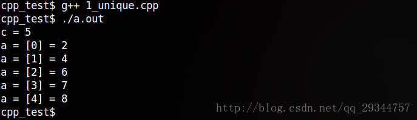

**应用案例**  可用在vector去重上：

```cpp
std::vector<int> ModuleArr;
//......
//排序
std::sort(ModuleArr.begin(), ModuleArr.end());
//去重
ModuleArr.erase(unique(ModuleArr.begin(), ModuleArr.end()), ModuleArr.end());
```


#### 常用查找算法

学习目标：

- 掌握常用的查找算法

**算法简介：**

- `find` //查找元素
- `find_if` //按条件查找元素
- `adjacent_find` //查找相邻重复元素
- `binary_search` //二分查找法
- `count` //统计元素个数
- `count_if` //按条件统计元素个数

##### find

**功能描述：**

- 查找指定元素，找到返回指定元素的迭代器，找不到返回结束迭代器end()

**函数原型：**

- `find(iterator beg, iterator end, value);`

  // 按值查找元素，找到返回指定位置迭代器，找不到返回结束迭代器位置

  // beg 开始迭代器

  // end 结束迭代器

  // value 查找的元素

**示例：**

```C++
#include <algorithm>
#include <vector>
#include <string>
void test01() {

	vector<int> v;
	for (int i = 0; i < 10; i++) {
		v.push_back(i + 1);
	}
	//查找容器中是否有 5 这个元素
	vector<int>::iterator it = find(v.begin(), v.end(), 5);
	if (it == v.end()) 
	{
		cout << "没有找到!" << endl;
	}
	else 
	{
		cout << "找到:" << *it << endl;
	}
}

class Person {
public:
	Person(string name, int age) 
	{
		this->m_Name = name;
		this->m_Age = age;
	}
	//重载==
	bool operator==(const Person& p) 
	{
		if (this->m_Name == p.m_Name && this->m_Age == p.m_Age) 
		{
			return true;
		}
		return false;
	}

public:
	string m_Name;
	int m_Age;
};

void test02() {

	vector<Person> v;

	//创建数据
	Person p1("aaa", 10);
	Person p2("bbb", 20);
	Person p3("ccc", 30);
	Person p4("ddd", 40);

	v.push_back(p1);
	v.push_back(p2);
	v.push_back(p3);
	v.push_back(p4);

	vector<Person>::iterator it = find(v.begin(), v.end(), p2);
	if (it == v.end()) 
	{
		cout << "没有找到!" << endl;
	}
	else 
	{
		cout << "找到姓名:" << it->m_Name << " 年龄: " << it->m_Age << endl;
	}
}
```

总结： 利用find可以在容器中找指定的元素，返回值是**迭代器**

##### find_if

**功能描述：**

- 按条件查找元素

**函数原型：**

- `find_if(iterator beg, iterator end, _Pred);`

  // 按值查找元素，找到返回指定位置迭代器，找不到返回结束迭代器位置

  // beg 开始迭代器

  // end 结束迭代器

  // _Pred 函数或者谓词（返回bool类型的仿函数）

**示例：**

```C++
#include <algorithm>
#include <vector>
#include <string>

//内置数据类型
class GreaterFive
{
public:
	bool operator()(int val)
	{
		return val > 5;
	}
};

void test01() {

	vector<int> v;
	for (int i = 0; i < 10; i++) {
		v.push_back(i + 1);
	}

	vector<int>::iterator it = find_if(v.begin(), v.end(), GreaterFive());
	if (it == v.end()) {
		cout << "没有找到!" << endl;
	}
	else {
		cout << "找到大于5的数字:" << *it << endl;
	}
}

//自定义数据类型
class Person {
public:
	Person(string name, int age)
	{
		this->m_Name = name;
		this->m_Age = age;
	}
public:
	string m_Name;
	int m_Age;
};

class Greater20
{
public:
	bool operator()(Person &p)
	{
		return p.m_Age > 20;
	}

};

void test02() {

	vector<Person> v;

	//创建数据
	Person p1("aaa", 10);
	Person p2("bbb", 20);
	Person p3("ccc", 30);
	Person p4("ddd", 40);

	v.push_back(p1);
	v.push_back(p2);
	v.push_back(p3);
	v.push_back(p4);

	vector<Person>::iterator it = find_if(v.begin(), v.end(), Greater20());
	if (it == v.end())
	{
		cout << "没有找到!" << endl;
	}
	else
	{
		cout << "找到姓名:" << it->m_Name << " 年龄: " << it->m_Age << endl;
	}
}

int main() {

	//test01();

	test02();

	system("pause");

	return 0;
}
```

总结：find_if按条件查找使查找更加灵活，提供的仿函数可以改变不同的策略

##### adjacent_find

**功能描述：**

- 查找相邻重复元素

**函数原型：**

- `adjacent_find(iterator beg, iterator end);`

  // 查找相邻重复元素,返回相邻元素的第一个位置的迭代器

  // beg 开始迭代器

  // end 结束迭代器

  

**示例：**

```C++
#include <algorithm>
#include <vector>

void test01()
{
	vector<int> v;
	v.push_back(1);
	v.push_back(2);
	v.push_back(5);
	v.push_back(2);
	v.push_back(4);
	v.push_back(4);
	v.push_back(3);

	//查找相邻重复元素
	vector<int>::iterator it = adjacent_find(v.begin(), v.end());
	if (it == v.end()) {
		cout << "找不到!" << endl;
	}
	else {
		cout << "找到相邻重复元素为:" << *it << endl;
	}
}
```

总结：面试题中如果出现查找相邻重复元素，记得用STL中的adjacent_find算法

##### binary_search

**功能描述：**

- 查找指定元素是否存在

**函数原型：**

- `bool binary_search(iterator beg, iterator end, value);`

  // 查找指定的元素，查到 返回true 否则false

  // 注意: 在<strong style="color:red;">**无序序列中不可用，必须是[1,2,4,6,8...]**</strong>

  // beg 开始迭代器

  // end 结束迭代器

  // value 查找的元素

**示例：**

```C++
#include <algorithm>
#include <vector>

void test01()
{
	vector<int>v;

	for (int i = 0; i < 10; i++)
	{
		v.push_back(i);
	}
	//二分查找
	bool ret = binary_search(v.begin(), v.end(),2);
	if (ret)
	{
		cout << "找到了" << endl;
	}
	else
	{
		cout << "未找到" << endl;
	}
}

int main() {

	test01();

	system("pause");

	return 0;
}
```

**总结：**二分查找法查找效率很高，值得注意的是查找的容器中元素必须的有序序列

##### count

**功能描述：**

- 统计元素个数

**函数原型：**

- `count(iterator beg, iterator end, value);`

  // 统计元素出现次数

  // beg 开始迭代器

  // end 结束迭代器

  // value 统计的元素

**示例：**

```C++
#include <algorithm>
#include <vector>

//内置数据类型
void test01()
{
	vector<int> v;
	v.push_back(1);
	v.push_back(2);
	v.push_back(4);
	v.push_back(5);
	v.push_back(3);
	v.push_back(4);
	v.push_back(4);

	int num = count(v.begin(), v.end(), 4);

	cout << "4的个数为： " << num << endl;
}

//自定义数据类型
class Person
{
public:
	Person(string name, int age)
	{
		this->m_Name = name;
		this->m_Age = age;
	}
	bool operator==(const Person & p)
	{
		if (this->m_Age == p.m_Age)
		{
			return true;
		}
		else
		{
			return false;
		}
	}
	string m_Name;
	int m_Age;
};

void test02()
{
	vector<Person> v;

	Person p1("刘备", 35);
	Person p2("关羽", 35);
	Person p3("张飞", 35);
	Person p4("赵云", 30);
	Person p5("曹操", 25);

	v.push_back(p1);
	v.push_back(p2);
	v.push_back(p3);
	v.push_back(p4);
	v.push_back(p5);
    
    Person p("诸葛亮",35);

	int num = count(v.begin(), v.end(), p);
	cout << "num = " << num << endl;
}
int main() {

	//test01();

	test02();

	system("pause");

	return 0;
}
```

**总结：** 统计自定义数据类型时候，需要配合重载 `operator==`

##### count_if

**功能描述：**

- 按条件统计元素个数

**函数原型：**

- `count_if(iterator beg, iterator end, _Pred);`

  // 按条件统计元素出现次数

  // beg 开始迭代器

  // end 结束迭代器

  // _Pred 谓词

  

**示例：**

```C++
#include <algorithm>
#include <vector>

class Greater4
{
public:
	bool operator()(int val)
	{
		return val >= 4;
	}
};

//内置数据类型
void test01()
{
	vector<int> v;
	v.push_back(1);
	v.push_back(2);
	v.push_back(4);
	v.push_back(5);
	v.push_back(3);
	v.push_back(4);
	v.push_back(4);

	int num = count_if(v.begin(), v.end(), Greater4());

	cout << "大于4的个数为： " << num << endl;
}

//自定义数据类型
class Person
{
public:
	Person(string name, int age)
	{
		this->m_Name = name;
		this->m_Age = age;
	}

	string m_Name;
	int m_Age;
};

class AgeLess35
{
public:
	bool operator()(const Person &p)
	{
		return p.m_Age < 35;
	}
};
void test02()
{
	vector<Person> v;

	Person p1("刘备", 35);
	Person p2("关羽", 35);
	Person p3("张飞", 35);
	Person p4("赵云", 30);
	Person p5("曹操", 25);

	v.push_back(p1);
	v.push_back(p2);
	v.push_back(p3);
	v.push_back(p4);
	v.push_back(p5);

	int num = count_if(v.begin(), v.end(), AgeLess35());
	cout << "小于35岁的个数：" << num << endl;
}


int main() {

	//test01();

	test02();

	system("pause");

	return 0;
}
```

**总结：**按值统计用count，按条件统计用count_if

#### 常用排序算法

**学习目标：**

- 掌握常用的排序算法

**算法简介：**

- `sort` //对容器内元素进行排序
- `random_shuffle` //洗牌 指定范围内的元素随机调整次序
- `merge` // 容器元素合并，并存储到另一容器中
- `reverse` // 反转指定范围的元素

##### sort

**功能描述：**

- 对容器内元素进行排序

**函数原型：**

- `sort(iterator beg, iterator end, _Pred);`

  // 按值查找元素，找到返回指定位置迭代器，找不到返回结束迭代器位置

  // beg 开始迭代器

  // end 结束迭代器

  // _Pred 谓词

**示例：**

```c++
#include <algorithm>
#include <vector>

void myPrint(int val)
{
	cout << val << " ";
}

void test01() {
	vector<int> v;
	v.push_back(10);
	v.push_back(30);
	v.push_back(50);
	v.push_back(20);
	v.push_back(40);

	//sort默认从小到大排序
	sort(v.begin(), v.end());
	for_each(v.begin(), v.end(), myPrint);
	cout << endl;

	//从大到小排序
	sort(v.begin(), v.end(), greater<int>());
	for_each(v.begin(), v.end(), myPrint);
	cout << endl;
}

int main() {

	test01();

	system("pause");

	return 0;
}
```

**总结：**sort属于开发中最常用的算法之一，需熟练掌握

##### 自定义sort

```c++
#include <bits/stdc++.h>
using namespace std;

typedef class A {
public:
    A(int idx, int value) {
        this->idx_ = idx;
        this->value_ = value;
    }
    int idx_;
    int value_;
    bool operator<(const A& right) const {
        return this->value_ < right.value_;
    }
};

bool cmp(const A& left, const A& right) {
    return left.value_ < right.value_;
}

int main() {
    // 第一种方法 实现比较函数
    vector<A> v = {
        A(1, 2),
        A(3, 0),
        A(7, 10)
    };
    sort(v.begin(), v.end(), cmp);
    for (auto &a : v) {
        cout << a.idx_ << endl;
    }
    cout << "-----------" << endl;
    // 第二种方法 重载类A小于号
    v = {
        A(1, 2),
        A(3, 0),
        A(7, 10)
    };
    sort(v.begin(), v.end());
    for (auto &a : v) {
        cout << a.idx_ << endl;
    }
    cout << "-----------" << endl;
    // 第三种方法 lambda表达式
    v = {
        A(1, 2),
        A(3, 0),
        A(7, 10)
    };
    sort(v.begin(), v.end(), [](A& left, A& right){
        return left.value_ < right.value_;
    });
    for (auto &a : v) {
        cout << a.idx_ << endl;
    }
    return 0;
}
```


##### random_shuffle

**功能描述：**

- 洗牌 指定范围内的元素随机调整次序

**函数原型：**

- `random_shuffle(iterator beg, iterator end);`

  // 指定范围内的元素随机调整次序

  // beg 开始迭代器

  // end 结束迭代器

  

**示例：**

```c++
#include <algorithm>
#include <vector>
#include <ctime>

class myPrint
{
public:
	void operator()(int val)
	{
		cout << val << " ";
	}
};

void test01()
{
	srand((unsigned int)time(NULL));
	vector<int> v;
	for(int i = 0 ; i < 10;i++)
	{
		v.push_back(i);
	}
	for_each(v.begin(), v.end(), myPrint());
	cout << endl;

	//打乱顺序
	random_shuffle(v.begin(), v.end());
	for_each(v.begin(), v.end(), myPrint());
	cout << endl;
}

int main() {

	test01();

	system("pause");

	return 0;
}
```

**总结：**random_shuffle洗牌算法比较实用，使用时记得加随机数种子

##### merge

**功能描述：**

- 两个容器元素合并，并存储到另一容器中

**函数原型：**

- `merge(iterator beg1, iterator end1, iterator beg2, iterator end2, iterator dest);`

  // 容器元素合并，并存储到另一容器中

  // 注意: 两个容器必须是**有序的**

  // beg1 容器1开始迭代器
  // end1 容器1结束迭代器
  // beg2 容器2开始迭代器
  // end2 容器2结束迭代器
  // dest 目标容器开始迭代器

  

**示例：**

```c++
#include <algorithm>
#include <vector>

class myPrint
{
public:
	void operator()(int val)
	{
		cout << val << " ";
	}
};

void test01()
{
	vector<int> v1;
	vector<int> v2;
	for (int i = 0; i < 10 ; i++) 
    {
		v1.push_back(i);
		v2.push_back(i + 1);
	}

	vector<int> vtarget;
	//目标容器需要提前开辟空间
	vtarget.resize(v1.size() + v2.size());
	//合并  需要两个有序序列
	merge(v1.begin(), v1.end(), v2.begin(), v2.end(), vtarget.begin());
	for_each(vtarget.begin(), vtarget.end(), myPrint());
	cout << endl;
}

int main() {

	test01();

	system("pause");

	return 0;
}
```

**总结：**merge合并的两个容器必须的有序序列

##### reverse

**功能描述：**

- 将容器内元素进行反转

**函数原型：**

- `reverse(iterator beg, iterator end);`

  // 反转指定范围的元素

  // beg 开始迭代器

  // end 结束迭代器

  

**示例：**

```c++
#include <algorithm>
#include <vector>

class myPrint
{
public:
	void operator()(int val)
	{
		cout << val << " ";
	}
};

void test01()
{
	vector<int> v;
	v.push_back(10);
	v.push_back(30);
	v.push_back(50);
	v.push_back(20);
	v.push_back(40);

	cout << "反转前： " << endl;
	for_each(v.begin(), v.end(), myPrint());
	cout << endl;

	cout << "反转后： " << endl;

	reverse(v.begin(), v.end());
	for_each(v.begin(), v.end(), myPrint());
	cout << endl;
}

int main() {

	test01();

	system("pause");

	return 0;
}
```

**总结：**reverse反转区间内元素，面试题可能涉及到

#### 常用拷贝和替换算法

**学习目标：**

- 掌握常用的拷贝和替换算法

**算法简介：**

- `copy` // 容器内指定范围的元素拷贝到另一容器中
- `replace` // 将容器内指定范围的旧元素修改为新元素
- `replace_if` // 容器内指定范围满足条件的元素替换为新元素
- `swap` // 互换两个容器的元素

##### copy

**功能描述：**

- 容器内指定范围的元素拷贝到另一容器中

**函数原型：**

- `copy(iterator beg, iterator end, iterator dest);`

  // 按值查找元素，找到返回指定位置迭代器，找不到返回结束迭代器位置

  // beg 开始迭代器

  // end 结束迭代器

  // dest 目标起始迭代器

**示例：**

```c++
#include <algorithm>
#include <vector>

class myPrint
{
public:
	void operator()(int val)
	{
		cout << val << " ";
	}
};

void test01()
{
	vector<int> v1;
	for (int i = 0; i < 10; i++) {
		v1.push_back(i + 1);
	}
	vector<int> v2;
	v2.resize(v1.size());
	copy(v1.begin(), v1.end(), v2.begin());

	for_each(v2.begin(), v2.end(), myPrint());
	cout << endl;
}

int main() {

	test01();

	system("pause");

	return 0;
}
```

**总结：**利用copy算法在拷贝时，目标容器记得提前开辟空间

#### 常用算术生成算法

**学习目标：**

- 掌握常用的算术生成算法

**注意：**

- 算术生成算法属于小型算法，使用时包含的头文件为 `#include <numeric>`

**算法简介：**

- `accumulate` // 计算容器元素累计总和

- `fill` // 向容器中添加元素

  

##### accumulate

**功能描述：**

- 计算区间内 容器元素累计总和

**函数原型：**

- `accumulate(iterator beg, iterator end, value);`

  // 计算容器元素累计总和

  // beg 开始迭代器

  // end 结束迭代器

  // value 起始值

**示例：**

```c++
#include <numeric>
#include <vector>
void test01()
{
	vector<int> v;
	for (int i = 0; i <= 100; i++) {
		v.push_back(i);
	}

	int total = accumulate(v.begin(), v.end(), 0);

	cout << "total = " << total << endl;
}

int main() {

	test01();

	system("pause");

	return 0;
}
```

**总结：**accumulate使用时头文件注意是 numeric，这个算法很实用

##### fill

**功能描述：**

- 向容器中填充指定的元素

**函数原型：**

- `fill(iterator beg, iterator end, value);`

  // 向容器中填充元素

  // beg 开始迭代器

  // end 结束迭代器

  // value 填充的值

**示例：**

```c++
#include <numeric>
#include <vector>
#include <algorithm>

class myPrint
{
public:
	void operator()(int val)
	{
		cout << val << " ";
	}
};

void test01()
{

	vector<int> v;
	v.resize(10);
	//填充
	fill(v.begin(), v.end(), 100);

	for_each(v.begin(), v.end(), myPrint());
	cout << endl;
}

int main() {

	test01();

	system("pause");

	return 0;
}
```

**总结：**利用fill可以将容器区间内元素填充为 指定的值

#### 常用集合算法

**学习目标：**

- 掌握常用的集合算法

**算法简介：**

- `set_intersection` // 求两个容器的交集

- `set_union` // 求两个容器的并集

- `set_difference` // 求两个容器的差集

  

##### set_intersection

**功能描述：**

- 求两个容器的交集

**函数原型：**

- `set_intersection(iterator beg1, iterator end1, iterator beg2, iterator end2, iterator dest);`

  // 求两个集合的交集

  // **注意:两个集合必须是有序序列**

  // beg1 容器1开始迭代器
  // end1 容器1结束迭代器
  // beg2 容器2开始迭代器
  // end2 容器2结束迭代器
  // dest 目标容器开始迭代器

**示例：**

```C++
#include <vector>
#include <algorithm>

class myPrint
{
public:
	void operator()(int val)
	{
		cout << val << " ";
	}
};

void test01()
{
	vector<int> v1;
	vector<int> v2;
	for (int i = 0; i < 10; i++)
    {
		v1.push_back(i);
		v2.push_back(i+5);
	}

	vector<int> vTarget;
	//取两个里面较小的值给目标容器开辟空间
	vTarget.resize(min(v1.size(), v2.size()));

	//返回目标容器的最后一个元素的迭代器地址
	vector<int>::iterator itEnd = 
        set_intersection(v1.begin(), v1.end(), v2.begin(), v2.end(), vTarget.begin());

	for_each(vTarget.begin(), itEnd, myPrint());
	cout << endl;
}

int main() {

	test01();

	system("pause");

	return 0;
}
```

**总结：**

- 求交集的两个集合必须的有序序列
- 目标容器开辟空间需要从**两个容器中取小值**
- set_intersection返回值既是交集中最后一个元素的位置

##### set_union

**功能描述：**

- 求两个集合的并集

**函数原型：**

- `set_union(iterator beg1, iterator end1, iterator beg2, iterator end2, iterator dest);`

  // 求两个集合的并集

  // **注意:两个集合必须是有序序列**

  // beg1 容器1开始迭代器
  // end1 容器1结束迭代器
  // beg2 容器2开始迭代器
  // end2 容器2结束迭代器
  // dest 目标容器开始迭代器

  

**示例：**

```C++
#include <vector>
#include <algorithm>

class myPrint
{
public:
	void operator()(int val)
	{
		cout << val << " ";
	}
};

void test01()
{
	vector<int> v1;
	vector<int> v2;
	for (int i = 0; i < 10; i++) {
		v1.push_back(i);
		v2.push_back(i+5);
	}

	vector<int> vTarget;
	//取两个容器的和给目标容器开辟空间
	vTarget.resize(v1.size() + v2.size());

	//返回目标容器的最后一个元素的迭代器地址
	vector<int>::iterator itEnd = 
        set_union(v1.begin(), v1.end(), v2.begin(), v2.end(), vTarget.begin());

	for_each(vTarget.begin(), itEnd, myPrint());
	cout << endl;
}

int main() {

	test01();

	system("pause");

	return 0;
}
```

**总结：**

- 求并集的两个集合必须的有序序列
- 目标容器开辟空间需要**两个容器相加**
- set_union返回值既是并集中最后一个元素的位置

#####  set_difference

**功能描述：**

- 求两个集合的差集

**函数原型：**

- `set_difference(iterator beg1, iterator end1, iterator beg2, iterator end2, iterator dest);`

  // 求两个集合的差集

  // **注意:两个集合必须是有序序列**

  // beg1 容器1开始迭代器
  // end1 容器1结束迭代器
  // beg2 容器2开始迭代器
  // end2 容器2结束迭代器
  // dest 目标容器开始迭代器

**示例：**

```C++
#include <vector>
#include <algorithm>

class myPrint
{
public:
	void operator()(int val)
	{
		cout << val << " ";
	}
};

void test01()
{
	vector<int> v1;
	vector<int> v2;
	for (int i = 0; i < 10; i++) {
		v1.push_back(i);
		v2.push_back(i+5);
	}

	vector<int> vTarget;
	//取两个里面较大的值给目标容器开辟空间
	vTarget.resize( max(v1.size() , v2.size()));

	//返回目标容器的最后一个元素的迭代器地址
	cout << "v1与v2的差集为： " << endl;
	vector<int>::iterator itEnd = 
        set_difference(v1.begin(), v1.end(), v2.begin(), v2.end(), vTarget.begin());
	for_each(vTarget.begin(), itEnd, myPrint());
	cout << endl;


	cout << "v2与v1的差集为： " << endl;
	itEnd = set_difference(v2.begin(), v2.end(), v1.begin(), v1.end(), vTarget.begin());
	for_each(vTarget.begin(), itEnd, myPrint());
	cout << endl;
}

int main() {

	test01();

	system("pause");

	return 0;
}
```

#### 最大值算法max_element

```Cpp
int main() {
	vector<int> v = { 2,3,4 };
	cout << *max_element(v.begin(), v.end());
	return 0;
}
```

`max_element`返回迭代器，解引用即可。


# C++17

## std::variant

c++17中引入了std::variant。std::variant类似union，那么使用std::variant会带来什么样的编程体验呢。

### 基本的使用

```cpp
using IntFloatString = std::variant<int, float, std::string>; // 定义支持int、float、string三个类型，并取一个别名
//初始化一个variant
TEST_F(InitVariant) {

    IntFloatString i = 10;
    ASSERT_EQ(10, std::get<int>(i) );

    IntFloatString f = 20.0f;
    ASSERT_EQ(20.0f, std::get<float>(f) );

    IntFloatString s = "hello world";
    ASSERT_EQ("hello world", std::get<std::string>(s));
}
```

### 使用 visit 的方式访问

```cpp
struct AddVisitor {
    void operator() (int &i) const {
        i += 1;
    }
    void operator() (float &f) const {
        f += 1.0f;
    }
    void operator() (std::string &s) const {
        s += " !!!";
    }
};

struct PrintVisitor  {
    template <class T>
    void operator() (T t) const {
        std::cout << t << std::endl;
    }
};

TEST_F(UseVisitor) {
    IntFloatString v = 100;

    std::visit(AddVisitor(), v);
    ASSERT_EQ(101, std::get<int>(v));
    std::visit(PrintVisitor(), v);

    v = 200.0f;
    std::visit(AddVisitor(),  v);
    ASSERT_EQ(201.0f, std::get<float>(v));
    std::visit(PrintVisitor(), v);

    v = "hello world";
    std::visit(AddVisitor(),  v);
    ASSERT_EQ("hello world !!!", std::get<std::string>(v));
    std::visit(PrintVisitor(), v);
}
```

### 应用场景

1、同一个函数，可能返回不同类型的返回值。

例如：一元二次方程的求根公式，根可能是一个，也有可能是两个，也有可能没有根

```cpp
using Two = std::pair<double, double>;
using Roots = std::variant<Two, double, void*>;

Roots FindRoots(double a, double b, double c)
{
    auto d = b*b-4*a*c;

    if (d > 0.0)
    {
        auto p = sqrt(d);
        return std::make_pair((-b + p) / 2 * a, (-b - p) / 2 * a);
    }
    else if (d == 0.0)
        return (-1*b)/(2*a);
    return nullptr;
}

struct RootPrinterVisitor
{
    void operator()(const Two& roots) const
    {
        std::cout << "2 roots: " << roots.first << " " << roots.second << '\n';
    }
    void operator()(double root) const
    {
        std::cout << "1 root: " << root << '\n';
    }
    void operator()(void *) const
    {
        std::cout << "No real roots found.\n";
    }
};

TEST_F(TestFindRoot) {
    std::visit(RootPrinterVisitor(), FindRoots(1, -2, 1)); //(x-1)*(x-1)=0
    std::visit(RootPrinterVisitor(), FindRoots(1, -3, 2)); //(x-2)*(x-1)=0
    std::visit(RootPrinterVisitor(), FindRoots(1, 0, 2));  //x*x - 2 = 0
}
```

2、多态

```cpp
struct Triangle {
    void Draw() const {
        std::cout << "△" << std::endl;
    }
};

struct Circle {
    void Draw() const {
        std::cout << "○" << std::endl;
    }
};

TEST_F(Polymorphism) {
    using Draw = std::variant<Triangle, Circle>;
    Draw draw;
    std::vector<Draw> draw_list {Triangle{}, Circle{}, Triangle{}};
    auto DrawVisitor = [](const auto &t) { t.Draw(); };
    for (const auto &item : draw_list) {
        std::visit(DrawVisitor, item);
    }
}
```

std::visit获取到std::variant实际存储的类型的时间复杂度为O(1)，性能不会随着std::varant中类型的增多而降低。

## std::any

摘自：https://zh-blog.logan.tw/2021/10/31/cxx-17-std-any-usage/

本文要介紹 C++ 17 新增的 `std::any` 類別。它能儲存所有「可以被複製建構（Copy Constructible）」的數值。以下我們會先介紹 `std::any` 的基本用法，接著介紹實際的[使用情境](https://zh-blog.logan.tw/2021/10/31/cxx-17-std-any-usage/#id4)。

### 建構物件

`std::any` 類別定義於 `<any>` 標頭檔。以下是幾種建構 `std::any` 物件的方法：

```c++
#include <any>

int main() {
  std::any a;  // #1
  std::any i(1);  // #2
  std::any c = std::make_any<double>(1.0);  // #3
}
```

1. 以「預設建構式（Default Constructor）」建構一個沒有數值的 `std::any` 物件。
2. 將數值傳給 `std::any` 的建構式，使其儲存該數值。
3. 以 `std::make_any<ValueType>` 函式建構一個「帶有 `ValueType` 數值」的 `std::any` 物件。 `std::make_any` 的參數會被傳給 `ValueType` 的建構式。

不論以何種方式建構 `std::any` 物件，其儲存的數值必須是「可以被複製建構的（Copy Constructible）」。舉例來說，如果我們試著將不能被複製的 `std::unique_ptr` 物件傳入 `std::any` 的建構式，我們會得到編譯錯誤：

```c++
#include <any>
#include <memory>

int main() {
  std::any a(std::make_unique<int>(5));  // Compilation error.
}
```

### 指派運算子

我們能透過指派運算子更換 `std::any` 儲存的數值。數值的型別也可以隨意更換：

```c++
#include <any>

int main() {
  std::any x;
  x = 1;
  x = "hello world";
  x = 42.0;
}
```

我們也能將一個 `std::any` 物件指派給另一個 `std::any` 物件：

```c++
#include <any>

int main() {
  std::any x(42);
  std::any y;
  y = x;
}
```

### any_cast 函式

`std::any` 儲存的數值必須以 `std::any_cast` 樣版函式讀取。因為我們必須傳入 `std::any_cast` 的樣版參數，因此我們必須知道 `std::any` 儲存數值的型別。如果樣版參數的型別與 `std::any` 儲存數值的型別不同，`std::any_cast` 會拋出 `std::bad_any_cast` 例外：

```c++
#include <any>
#include <iostream>

int main() {
  std::any x(42);

  std::cout << std::any_cast<int>(x) << std::endl;

  try {
    std::cout << std::any_cast<double>(x) << std::endl;
  } catch (std::bad_any_cast &exc) {
    std::cout << "exception: " << exc.what() << std::endl;
  }
}
```

如果傳入給 `std::any_cast` 的 `std::any` 物件是參考型別，`std::any_cast` 會回傳儲存數值的**複本**。

如果我們要**直接存取** `std::any` 物件裡面的數值，`std::any_cast` 的參數型別必須是 `std::any *`（指標型別）。例如：

```c++
#include <any>
#include <iostream>

int main() {
  std::any x(42);

  int &i = *std::any_cast<int>(&x);
  std::cout << i << std::endl;  // Prints 42

  ++i;
  std::cout << std::any_cast<int>(x) << std::endl;  // Prints 43

#if 0
  int &j = std::any_cast<int>(x);  // Compilation error.
  std::cout << j << std::endl;
#endif
}
```

### has_value 成員函式

`has_value` 成員函式會回傳 `std::any` 是否擁有數值：

```c++
#include <any>
#include <iostream>

int main() {
  std::any x(42);
  std::any y;
  std::cout << "x.has_value(): " << x.has_value() << std::endl;  // 1
  std::cout << "y.has_value(): " << y.has_value() << std::endl;  // 0
}
```

### reset 成員函式

`reset` 成員函式會清除 `std::any` 儲存的數值：

```c++
#include <any>
#include <iostream>

int main() {
  std::any x(42);
  std::cout << "before: " << x.has_value() << std::endl;  // 1
  x.reset();
  std::cout << "after: " << x.has_value() << std::endl;  // 0
}
```

### emplace 成員函式

`emplace<ValueType>(...)` 成員函式會在 `std::any` 物件內建構一個型別為 `ValueType` 的數值。其中 `emplace` 的參數會成為 `ValueType` 建構式的參數。如果 `std::any` 物件已經擁有一個數值，現有的數值會先被解構。

```c++
#include <any>
#include <complex>
#include <iostream>

int main() {
  std::any x(42);
  x.emplace<std::complex<double>>(0, 1);
  std::cout << std::any_cast<std::complex<double>>(x) << std::endl;
}
```

雖然 `emplace<ValueType>(...)` 與 `operator=(ValueType(...))` 功能相似，但是如果 `ValueType` 的 Copy Constructor（或 Move Constructor）必須花費較長的執行時間，`emplace<ValueType>(...)` 能為我們節省從 `ValueType` 暫時物件複製（或搬移）物件的執行時間。

### type 成員函式

`type` 成員函式會回傳數值型別的「執行期型別資訊（Run-Time Type Information, RTTI）」。我們能透過 `type` 成員函式與 `typeid` 關鍵字在執行期選擇合適的 `std::any_cast` 函式樣版參數。如果 `std::any` 物件沒有數值，`type` 成員函式會回傳 `typeid(void)`。

```c++
#include <any>
#include <iostream>
#include <typeinfo>

void print(const std::any &x) {
  if (x.type() == typeid(int)) {
    std::cout << "int: " << std::any_cast<int>(x) << std::endl;
  } else if (x.type() == typeid(double)) {
    std::cout << "double: " << std::any_cast<double>(x) << std::endl;
  } else if (x.type() == typeid(void)) {
    std::cout << "no value" << std::endl;
  } else {
    std::cout << "unhandled type: " << x.type().name() << std::endl;
  }
}

int main() {
  print(std::any(42));
  print(std::any(1.0));
  print(std::any());
}
```

# C++判断主机字节序

利用union来鉴别：

```cpp
#include <bits/stdc++.h>
#include <iostream>
using namespace std;

union test {
    int a;
    char b;
} c;

int main(int argc, char const *argv[])
{
    c.a = 1;
    cout << (c.b & 1 ? "小端" : "大端") << endl;
    return 0;
}
```

一般是小端，值得注意的是，网络字节序默认为大端。

# 面经

## C++内存分区

<strong style="color:red;">C++ 内存分区：栈、堆、全局/静态存储区、常量存储区、代码区。</strong>

**栈：** 存放函数的局部变量、函数参数、返回地址等，由编译器自动分配和释放。

**堆：** 动态申请的内存空间，就是由 malloc 分配的内存块，由程序员控制它的分配和释放，如果程序执行结束还没有释放，操作系统会自动回收。

**全局区/静态存储区（.bss 段和 .data 段）：** 存放全局变量和静态变量，程序运行结束操作系统自动释放，在 C 语言中，未初始化的放在 .bss 段中，初始化的放在 .data 段中，C++ 中不再区分了。

**常量存储区（.data 段）：** 存放的是常量，不允许修改，程序运行结束自动释放。

**代码区（.text 段）：** 存放代码，不允许修改，但可以执行。编译后的二进制文件存放在这里。

## new的底层

new的底层是malloc，这个问题可以考虑换成malloc底层。

https://blog.csdn.net/mmshixing/article/details/51679571

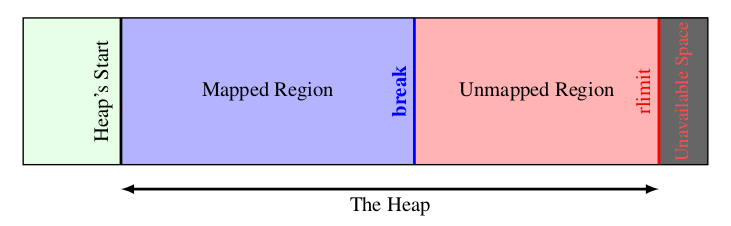

获取了break地址，也就是内存申请的初始地址，下面是malloc的整体实现方案：

malloc 函数的实质是它有一个将可用的内存块连接为一个长长的列表的所谓空闲链表。 调用 malloc（）函数时，它沿着连接表寻找一个大到足以满足用户请求所需要的内存块。 然后，将该内存块一分为二（一块的大小与用户申请的大小相等，另一块的大小就是剩下来的字节）。 接下来，将分配给用户的那块内存存储区域传给用户，并将剩下的那块（如果有的话）返回到连接表上。 调用 free 函数时，它将用户释放的内存块连接到空闲链表上。 到最后，空闲链会被切成很多的小内存片段，如果这时用户申请一个大的内存片段， 那么空闲链表上可能没有可以满足用户要求的片段了。于是，malloc（）函数请求延时，并开始在空闲链表上检查各内存片段，对它们进行内存整理，将相邻的小空闲块合并成较大的内存块。

**free如何知道要free多大空间？**

在malloc的同时，系统会多分配一段空间用于存储malloc出来的空间的元数据，其中就有这段给用户的空间的大小，在free的时候就知道要free多大的空间了。

## 内存对齐

看一个例子：

```Cpp
struct CommandHeader
{
	// 节点ID，-1为全部
	
	int code;
	char ID;
};

int main()
{
	cout << sizeof CommandHeader << endl;
	return 0;
}
```

输出为8，按理说是5才对，这就是因为内存对齐现象。现代计算机中内存空间都是按照 byte 划分的，从理论上讲似乎对任何类型的变量的访问可以从任何地址开始，但是实际的计算机系统对基本类型数据在内存中存放的位置有限制，它们会要求这些数据的首地址的值是某个数k（通常它为4或8）的倍数，这就是所谓的内存对齐。

尽管内存是以字节为单位，但是大部分处理器并不是按字节块来存取内存的.它一般会以双字节,四字节,8字节,16字节甚至32字节为单位来存取内存，我们将上述这些存取单位称为内存存取粒度。

假如没有内存对齐机制，数据可以任意存放，现在一个int变量存放在从地址1开始的联系四个字节地址中，该处理器去取数据时，要先从0地址开始读取第一个4字节块,剔除不想要的字节（0地址）,然后从地址4开始读取下一个4字节块,同样剔除不要的数据（5，6，7地址）,最后留下的两块数据合并放入寄存器.这需要做很多工作。

现在有了内存对齐的，int类型数据只能存放在按照对齐规则的内存中，比如说0地址开始的内存。那么现在该处理器在取数据时一次性就能将数据读出来了，而且不需要做额外的操作，提高了效率。

**规则：**

(1) 结构体第一个成员的**偏移量（offset）**为0，以后每个成员相对于结构体首地址的 offset 都是**该成员大小与有效对齐值中较小那个**的整数倍，如有需要编译器会在成员之间加上填充字节。

(2) **结构体的总大小**为 有效对齐值 的**整数倍**，如有需要编译器会在最末一个成员之后加上填充字节。

还是上面的例子，我们添加一行：`#pragma pack(1)`

```Cpp
#pragma pack(1)
#include <iostream>
using namespace std;
struct CommandHeader
{
	// 节点ID，-1为全部
	
	int code;
	char ID;
};

int main()
{
	cout << sizeof CommandHeader << endl;
	return 0;
}
```

输出5。如果改为：`#pragma pack(2)`，那就输出6。

## 完美转发

> 完美转发实现了参数在传递过程中保持其值属性的功能，即若是左值，则传递之后仍然是左值，若是右值，则传递之后仍然是右值。

首先理解完美转发要知晓两个模板推导规则：

**规则1**（引用折叠规则）：如果间接的创建一个引用的引用，则这些引用就会“折叠”。在所有情况下（除了一个例外），引用折叠成一个普通的左值引用类型。一种特殊情况下，引用会折叠成右值引用，即右值引用的右值引用， T&& &&。即

- X& &、X& &&、X&& &都折叠成X&
- X&& &&折叠为X&&

**规则2**（右值引用的特殊类型推断规则）：当将一个左值传递给一个参数是右值引用的函数，且此右值引用指向模板类型参数(T&&)时，编译器推断模板参数类型为实参的左值引用，如

```cpp
template<typename T> 
void f(T&&);

int i = 42;
f(i)
```

上述的模板参数类型T将推断为int&类型，而非int。

> 若将规则1和规则2结合起来，则意味着可以传递一个左值`int i`给f，编译器将推断出T的类型为int&。再根据引用折叠规则 void f(int& &&)将推断为void f(int&)，因此，f将被实例化为: void f<int&>(int&)。
>

请看下面这段代码：

```Cpp
class Foo
{
public:
    std::string member;

    template<typename T>
    Foo(T&& member): member{std::forward<T>(member)} {}
};
```

传递一个lvalue或者传递一个const lvaue

- 传递一个lvalue，模板推导之后 `T = std::string&`
- 传递一个const lvaue, 模板推导之后`T = const std::string&`
- `T& &&`将折叠为`T&`，即`std::string& && 折叠为 std::string&`
- 最终函数为: `Foo(string& member): member{std::forward<string&>(member)} {}`
- `std::forward<string&>(member)`将返回一个左值，最终调用拷贝构造函数

传递一个rvalue

- 传递一个rvalue，模板推导之后 `T = std::string`
- 最终函数为: `Foo(string&& member): member{std::forward<string>(member)} {}`
- `std::forward<string>(member)` 将返回一个右值，最终调用移动构造函数；

再看下面这段代码：

```Cpp
struct A
{
    A(int&& n)
    {
        cout << "rvalue overload, n=" << n << endl;
    }
    A(int& n)
    {
        cout << "lvalue overload, n=" << n << endl;
    }
};

class B
{
public:
    template<class T1, class T2, class T3>
    B(T1 && t1, T2 && t2, T3 && t3) :
        a1_(std::forward<T1>(t1)),
        a2_(std::forward<T2>(t2)),
        a3_(std::forward<T3>(t3))
    {

    }
private:
    A a1_, a2_, a3_;
};
```

在B的构造过程中，如果传入B构造函数的是临时对象A，那么根据模板推导规则和forward，A的构造函数传入的也是右值，那么将调用A的移动构造函数。而当传入B构造函数的是左值对象A，那么根据推导规则和forward，A的构造函数传入的也是左值，就去调用拷贝构造函数了。

相反地，如果我们没有这样写B的构造函数，而是：

```Cpp
B(A t1, A t2, A t3) :
        a1_(t1),
        a2_(t2),
        a3_(t3)
        {}
```

这样无论你传入的是左值A还是右值A，在构造a1_的时候都将传入左值，都将调用拷贝构造函数，没有实现完美转发。

## 预处理、编译、汇编、链接

我们的代码会经过这4个环节，从而形成最终文件：

预处理， 展开头文件/宏替换/去掉注释/条件编译                      （test.i main .i）
编译，    检查语法，生成汇编                                                      （ test.s  main .s）
汇编，   汇编代码转换机器码                                                         (test.o main.o)
链接，    链接到一起生成可执行程序                                              a.out

具体文章：https://blog.csdn.net/weixin_41143631/article/details/81221777  真的超级超级推荐~

## 静态链接和动态链接

这两个概念很重要，单独说说（其实就是lib和dll的区别）:

> 静态链接是由链接器在链接时将库的内容加入到可执行程序中的做法。链接器是一个独立程序，将一个或多个库或目标文件（先前由编译器或汇编器生成）链接到一块生成可执行程序。静态链接是指把要调用的函数或者过程链接到可执行文件中，成为可执行文件的一部分。
>
> 动态链接所调用的函数代码并没有被拷贝到应用程序的可执行文件中去，而是仅仅在其中加入了所调用函数的描述信息（往往是一些重定位信息）。仅当应用程序被装入内存开始运行时，在Windows的管理下，才在应用程序与相应的DLL之间建立链接关系。当要执行所调用DLL中的函数时，根据链接产生的重定位信息，Windows才转去执行DLL中相应的函数代码。

将源文件中用到的库函数与汇编生成的目标文件.o合并生成可执行文件。该可执行文件会变大很多，一般是调用自己电脑上的。静态库和应用程序编译在一起，在任何情况下都能运行，而动态库是动态链接，文件生效时才会调用。


## RTTI

> **RTTI**是“Runtime Type Information”的缩写，意思是：运行时类型信息。它提供了运行时确定对象类型的方法。

C++提供了两个关键字typeid和dynamic_cast和一个type_info类来支持RTTI：

1. dynamic_cast操作符：它允许在运行时刻进行类型转换，从而使程序能够在一个类层次结构安全地转换类型。dynamic_cast提供了两种转换方式，把基类指针转换成派生类指针，或者把指向基类的左值转换成派生类的引用。
2. typeid操作符：它指出指针或引用指向的对象的实际派生类型。主要作用就是让用户知道当前的变量是什么类型的。

```Cpp
#include <iostream>
using namespace std;

class A {
private:
	int a;
};

class B :public A {
public:
	virtual void f() { cout << "HelloWorld\n"; }
private:
	int b;
};

class C :public B {
public:
	virtual void f() { cout << "HelloWorld++\n"; }
private:
	int c;
};

class D :public A {
public:
	virtual void f() { cout << "HelloWorld--\n"; }
private:
	int d;
};
int main()
{
	int a = 2;
	cout << typeid(a).name() << endl;
	A objA;
	//打印出class A  
	cout << typeid(objA).name() << endl;
	B objB;
	//打印出class B  
	cout << typeid(objB).name() << endl;
	C objC;
	//打印出class C  
	cout << typeid(objC).name() << endl;

	//以下是多态在VC 6.0编译器不支持，但是在GCC以及微软更高版本的编译器却都是
	//支持的，且是在运行时候来确定类型的，而不是在编译器,会打印出class c
	B *ptrB = new C();
	cout << typeid(*ptrB).name() << endl;

	A *ptrA = new D();
	//打印出class A而不是class D  因为A没有虚函数
	cout << typeid(*ptrA).name() << endl;
	return 0;
}
```

## class类的内存是怎样分布的

1. 如果实例化一个空类，内存中只占用一个字节，作为标识。
2. 包含成员变量，不包含成员函数时，根据**内存对齐原则**，将各个成员变量分布进内存。
3. 就算包括成员函数，成员函数是不占用类的内存空间的，所以此时类的内存空间仍然和只包含成员变量的时候一样。而成员函数因为是公共的，一个类只有一份，一般根据编译器的不同保存在代码区或者只读区。
4. 如果有虚函数的话，前四个字节会有一个虚函数表指针指向虚函数。（上一节面经有讲到），注意子类的虚函数表会先拷贝父类的表，然后替换和父类中一样函数的，最后补上子类自身的函数。

面试的时候问到多个子类，每个子类实例化都有一张虚函数表么？

> 是的，**多态中每个类都有一张虚函数表**。

父类和子类都有各自的内存空间。父类的内存空间就是它成员变量根据字节对齐占用的空间。而子类的空间注意了，首先要继承父类的空间，其次自己定义的变量放在父类空间的下面，如果子类定义了和父类同名的变量，调用的时候该变量会覆盖掉父类的变量，但是该变量的位置仍然是在父类空间的下面。

## 单例模式

这篇菜鸟教程写得不错：https://www.runoob.com/design-pattern/singleton-pattern.html

涵盖了饿汉模式、懒汉模式、线程是否安全等问题。

### 饿汉模式

饿汉模式意思就是在拿到实例之前就有该实例对象了（在get_instance之前就初始化好instance了）。值得注意的是，单例模式的饿汉实现是**线程安全**的！因为一开始就已经new好资源了。

```Cpp
#include <iostream>
using namespace std;

class A {
public:
	static A* get_instance() {
		return instance_;
	}
	void test() {
		cout << "ok" << endl;
	}
private:
	A() {}
	static A* instance_;
};

A* A::instance_ = new A;

int main(int argc, char* argv[])
{
	A* a = A::get_instance();
	a->test();
	return 0;
} 
```

### 懒汉模式

顾名思义，在get_instance的时候再new，先给出一个线程不安全的实现：

```c++
#include <iostream>
using namespace std;

class A {
private:
	static A* instance_;
	A() {}
public:
	static A* get_instance() {
		if (instance_ == nullptr) {
			instance_ = new A;
		}
		return instance_;
	}
	void test() {
		cout << "ok" << endl;
	}
};
A* A::instance_ = nullptr;

int main(int argc, char* argv[])
{
	A* a = A::get_instance();
	a->test();
	return 0;
} 
```

如果多个线程get_instance，很有可能同时进入  `instance_ = new A;`这样就会在堆上申请多个A，但只有一个instance_。解决方案：加锁。

```c++
#include <iostream>
#include <mutex>
using namespace std;

class A {
private:
	static A* instance_;
	static mutex lock_;
	A() {}
public:
	static A* get_instance() {
		lock_guard<mutex> locker(lock_);
		if (instance_ == nullptr) {
			instance_ = new A;
		}
		return instance_;
	}
	void test() {
		cout << "ok" << endl;
	}
};

A* A::instance_ = nullptr;
mutex A::lock_;

int main(int argc, char* argv[])
{
	A* a = A::get_instance();
	a->test();
	return 0;
} 
```

还有一种局部静态变量的懒汉实现方式：

```c++
#include <iostream>
using namespace std;

class A {
private:
	A() {}
public:
	static A* get_instance() {
		static A a;
		return &a;
	}
	void test() {
		cout << "ok" << endl;
	}
};

int main(int argc, char* argv[])
{
	A* a = A::get_instance();
	a->test();
	return 0;
} 
```

局部静态变量只会在第一次声明的时候初始化，在c++11以及之后的版本可以做到线程安全 

1. 变量在代码第一次执行到变量声明的地方时初始化。
2.初始化过程中发生异常的话视为未完成初始化，未完成初始化的话，需要下次有代码执行到相同位置时再次初始化。
3.在当前线程执行到需要初始化变量的地方时，如果有其他线程正在初始化该变量，则阻塞当前线程，直到初始化完成为止。
4.如果初始化过程中发生了对初始化的递归调用，则视为未定义行为。


这里给出double-check的饿汉模式线程安全代码最佳实现：

```cpp
// thread-safe Lazy Man Mode
class SingletonLazy {
private:
    static SingletonLazy* instance_;
    static mutex mtx_;
    SingletonLazy(){};
public:
    static SingletonLazy* getInstance() {
        if (instance_ == nullptr) {
            {
                lock_guard<mutex> lk(mtx_);
                if (instance_ == nullptr) { // double-check
                    instance_ = new SingletonLazy;
                }
            }
        }
        return instance_;
    }
};
SingletonLazy* SingletonLazy::instance_ = nullptr;
mutex SingletonLazy::mtx_;
```


c
